<center>


**UNIVERSIDAD PRIVADA DE TACNA**

**FACULTAD DE INGENIERÍA**

**Escuela Profesional de Ingeniería de Sistemas**

**Informe de Especificación de Requerimientos**

**Plataforma de Modelado y Sincronización de Diagramas (FluxSQL)**

Curso: *Base de Datos II*

Docente: *Mag. Patrick Cuadros Quiroga*

Integrantes:

***Zapana Murillo, Kiara Holly (2023077087)***

***Vargas Espinoza, Jefferson Alfonso (2023076820)***

**Tacna - Perú**

***2026***

</center>

<div style="page-break-after: always; visibility: hidden">\pagebreak</div>

Sistema *Plataforma de Modelado y Sincronización de Diagramas (FluxSQL)*

Informe de Especificación de Requerimientos

Versión *2.1*

| CONTROL DE VERSIONES |           |              |               |            |                 |
|:--------------------:|:----------|:-------------|:--------------|:-----------|:----------------|
|       Versión        | Hecha por | Revisada por | Aprobada por  | Fecha      | Motivo          |
|         1.0          | KHZM, JAVE| KHZM, JAVE   | P. Cuadros Q. | 2026-04-22 | Versión inicial (DBCanvas) |
|         2.0          | KHZM, JAVE| KHZM, JAVE   | P. Cuadros Q. | 2026-06-25 | Actualización de arquitectura (Sidecar / Cloud) |
|         2.1          | KHZM, JAVE| KHZM, JAVE   | P. Cuadros Q. | 2026-07-04 | Unificación a nuevo formato institucional BDD |

# ÍNDICE GENERAL

1. [Introducción](#1-introducción)
2. [Generalidades de la Empresa](#2-generalidades-de-la-empresa)
    1. [Nombre de la Empresa](#21-nombre-de-la-empresa)
    2. [Visión](#22-visión)
    3. [Misión](#23-misión)
    4. [Organigrama](#24-organigrama)
3. [Visionamiento de la Empresa](#3-visionamiento-de-la-empresa)
    1. [Descripcion del problema](#31-descripcion-del-problema)
    2. [Objetivo de Negocios](#32-objetivo-de-negocios)
    3. [Objetivo de diseño](#33-objetivo-de-diseño)
    4. [Alcance del proyecto](#34-alcance-del-proyecto)
    5. [Viabilidad del sistema](#35-viabilidad-del-sistema)
    6. [Informacion obtenida del Levantamiento de informacion](#36-informacion-obtenida-del-levantamiento-de-informacion)
4. [Analisis de procesos](#4-analisis-de-procesos)
    1. [Diagrama de Procesos Actual](#41-diagrama-de-procesos-actual)
    2. [Diagrama de Procesos Propuesto](#42-diagrama-de-procesos-propuesto)
5. [Especificacion de Requerimientos de Software](#5-especificacion-de-requerimientos-de-software)
    1. [Cuadro de Requerimientos funcionales Inicial](#51-cuadro-de-requerimientos-funcionales-inicial)
    2. [Cuadro de Requerimientos no funcionales](#52-cuadro-de-requerimientos-no-funcionales)
    3. [Cuadro de Requerimientos funcionales Final](#53-cuadro-de-requerimientos-funcionales-final)
    4. [Regla de Negocio](#54-regla-de-negocio)
6. [Fase de Desarrollo](#6-fase-de-desarrollo)
    1. [Perfil del Usuario](#61-perfil-del-usuario)
    2. [Modelo Conceptual](#62-modelo-conceptual)
        1. [Diagrama de paquetes](#621-diagrama-de-paquetes)
        2. [Diagrama de casos de uso](#622-diagrama-de-casos-de-uso)
        3. [Escenarios de casos de uso (narrativas)](#623-escenarios-de-casos-de-uso-narrativas)
    3. [Modelo Lógico](#63-modelo-lógico)
        1. [Analisis de Objetos](#631-analisis-de-objetos)
        2. [Diagrama de Actividades con objetos](#632-diagrama-de-actividades-con-objetos)
        3. [Diagrama de secuencia](#633-diagrama-de-secuencia)
        4. [Diagrama de clases](#634-diagrama-de-clases)
7. [Conclusiones](#7-conclusiones)
8. [Recomendaciones](#8-recomendaciones)
9. [Bibliografia](#9-bibliografia)
10. [Webgrafia](#10-webgrafia)
11. [Historias de Usuario, Criterios y Escenarios BDD](#11-historias-de-usuario-criterios-y-escenarios-bdd)

<div style="page-break-after: always; visibility: hidden">\pagebreak</div>

# 1. Introducción

El presente Informe de Especificación de Requerimientos de Software (ERS) define, de manera verificable, las capacidades
funcionales y no funcionales del sistema **FluxSQL**. Este documento integra la visión académica del proyecto (FD02), la factibilidad evaluada (FD01) y el estado actual del código fuente en el monorepo para asegurar la trazabilidad real entre requisitos e implementación.

FluxSQL es una plataforma orientada al modelado de bases de datos que permite la creación manual de diagramas mediante código DDL o la extracción automatizada de esquemas directamente desde motores locales (PostgreSQL, MySQL, SQLite, etc.) utilizando un Sidecar en Python. El sistema garantiza un entorno híbrido donde los artefactos seguros se sincronizan con la nube (NestJS), mientras que las credenciales permanecen estrictamente cifradas en el equipo del usuario (Tauri).

# 2. Generalidades de la Empresa

## 2.1 Nombre de la empresa

Universidad Privada de Tacna – Facultad de Ingeniería – Escuela Profesional de Ingeniería de Sistemas.

## 2.2 Visión

Formar profesionales líderes, innovadores y comprometidos con la calidad, capaces de desarrollar soluciones tecnológicas
aplicadas a problemas reales del entorno.

## 2.3 Misión

Brindar formación integral en ingeniería de software, promoviendo investigación aplicada, ética profesional y producción
de software de calidad con impacto académico y social.

## 2.4 Organigrama

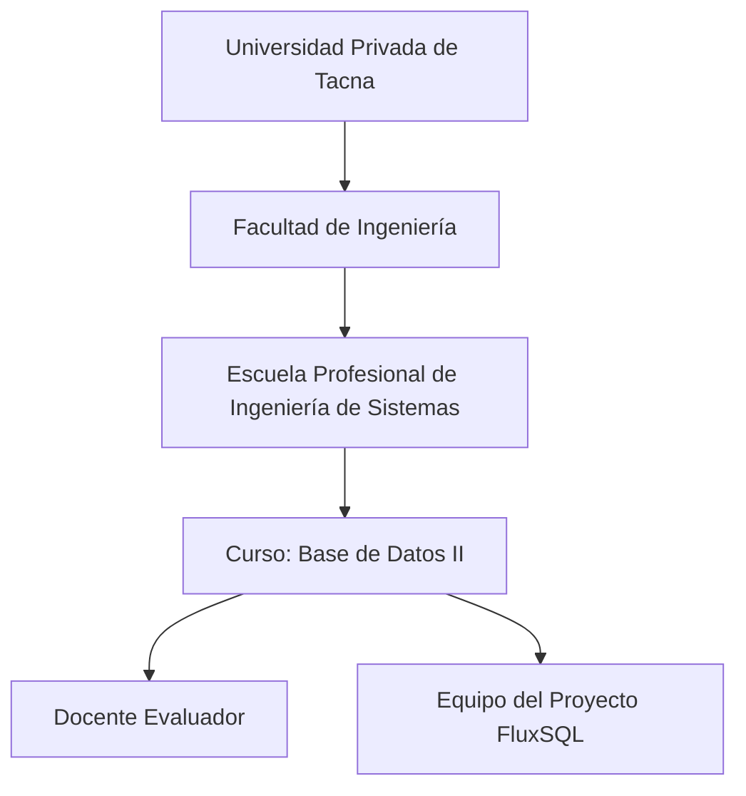

# 3. Visionamiento de la Empresa

## 3.1 Descripcion del problema

En el ámbito del diseño de bases de datos, los equipos técnicos enfrentan dificultades significativas para documentar esquemas heredados y mantener sincronizados los diagramas relacionales o de grafos con la base de datos real. Las soluciones existentes en la nube obligan a exponer cadenas de conexión, usuarios y puertos sensibles directamente en internet, comprometiendo gravemente la seguridad corporativa IT (violación del principio Zero-Trust). Además, muchas herramientas se limitan a motores SQL tradicionales, dejando de lado ecosistemas NoSQL modernos (MongoDB, Neo4j).

## 3.2 Objetivo de negocios

Proveer a analistas de datos, DBAs y desarrolladores una plataforma de modelado visual segura y de próxima generación que reduzca drásticamente el tiempo de documentación de esquemas híbridos (SQL/NoSQL). El sistema debe garantizar que las credenciales corporativas nunca abandonen la máquina local, habilitando al mismo tiempo una colaboración fluida en equipo mediante la sincronización selectiva de artefactos de diseño (JSON) hacia un Cloud seguro.

## 3.3 Objetivo de diseño

Diseñar una arquitectura políglota, modular y orientada a eventos estructurada en un monorepo:
- **Web App (Next.js / React Flow):** Lienzo altamente interactivo y colaborativo para el diseño manual o importado de diagramas relacionales, documentales y de grafos.
- **Cloud API (NestJS):** Backend robusto y seguro para la orquestación de usuarios, gestión de proyectos y persistencia del modelo estandarizado *SchemaModel*.
- **Desktop Sidecar (Tauri + FastAPI / Python):** Componente ejecutable local que abstrae la complejidad de la red para realizar la introspección (extracción profunda) en bases de datos internas, almacenando los secretos de conexión en el Keyring cifrado del sistema operativo.
- **MCP Bridge:** Fundaciones para futuras interacciones de agentes de Inteligencia Artificial que auditen y editen el modelo (Model Context Protocol).

## 3.4 Alcance del proyecto

**Incluido en la versión actual:**
- Extracción automatizada de metadatos locales (Information Schema) mediante *Sidecar FastAPI*.
- Soporte extendido para múltiples dialectos de bases de datos: PostgreSQL, MySQL, SQL Server, MongoDB (Documental) y Neo4j (Grafos).
- Lienzo visual interactivo potenciado por **React Flow** para arrastrar, redimensionar y enrutar nodos y aristas heurísticamente (ortogonal, bezier, step).
- Parseo bidireccional en tiempo real de SQL DDL y JSON Schema en el cliente (TypeScript Parsers).
- Sincronización híbrida Push/Pull entre Tauri UI y el Cloud API (NestJS).
- Gestión segura de identidades (JWT) y perfiles de conexión locales (SO Keyring).

**Fuera de alcance en la versión actual:**
- Ejecución directa de mutaciones (`ALTER TABLE`) en bases de datos en producción desde el lienzo.
- Integración nativa de Large Language Models (LLMs) como agentes autónomos (planeado para futuras versiones vía MCP).

## 3.5 Viabilidad del sistema

El sistema es altamente **viable**. La unificación de herramientas open-source consolidadas (React Flow, NestJS, FastAPI, Tauri) minimiza la deuda técnica. La decisión arquitectónica de usar un patrón *Sidecar* resuelve de raíz el obstáculo de seguridad IT empresarial, eliminando la necesidad de VPNs perimetrales complejas o túneles SSH para la extracción de metadatos.

## 3.6 Informacion obtenida del Levantamiento de informacion

- **Documento de Factibilidad (FD01):** Validó la transición a arquitecturas Zero-Trust y las restricciones de infraestructura.
- **Documento de Visión (FD02):** Justificó la urgente migración de Mermaid.js a React Flow para soportar grafos jerárquicos masivos (Neo4j/MongoDB).
- **Entrevistas y Análisis de Dominio:** Evidenciaron la necesidad de incluir análisis de consultas (QueryAnalysisReport) para auditorías.

# 4. Analisis de procesos

## 4.1 Diagrama de Procesos Actual

Modelado y documentación manual sin integración híbrida ni soporte poli-dialecto.

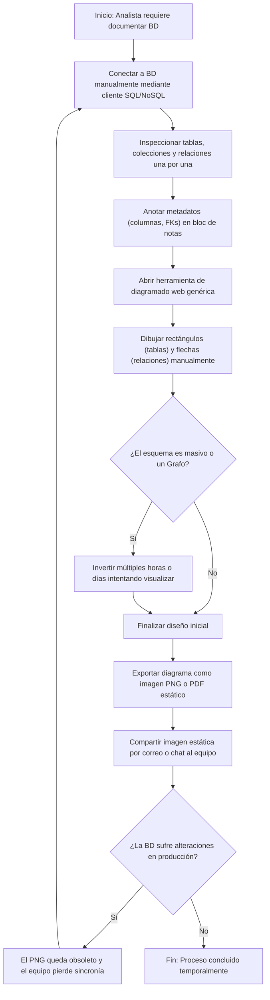

## 4.2 Diagrama de Procesos Propuesto

Modelado híbrido inteligente, multidialecto y automatizado con FluxSQL.

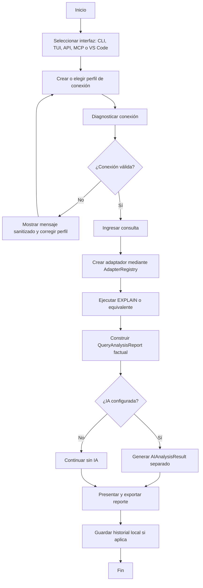

# 5. Especificacion de Requerimientos de Software

## 5.1 Cuadro de Requerimientos funcionales Inicial

| ID     | Requerimiento funcional inicial             | Criterio general de aceptación                                                               |
|--------|---------------------------------------------|----------------------------------------------------------------------------------------------|
| RFI-01 | Diseño por Código (DDL / JSON)              | El usuario redacta `CREATE TABLE` o JSON y el UI renderiza el lienzo interactivo al vuelo. |
| RFI-02 | Extracción Local Zero-Trust                 | El Sidecar acepta credenciales locales y se conecta al motor de BD sin exponer redes.        |
| RFI-03 | Soporte Multi-Dialecto                      | El sistema soporta la extracción desde MySQL, Postgres, MongoDB y Neo4j.                     |
| RFI-04 | Normalización de Modelos                    | Los parsers unifican cualquier dialecto a la interfaz genérica `SchemaModel`.              |
| RFI-05 | Visor de Grafo Interactivo                  | El sistema utiliza React Flow para posicionar y enrutar esquemas lógicos visualmente.        |
| RFI-06 | Control de Proyectos Híbrido                | Sincronización a demanda de diseños al Cloud API para visualización del equipo de trabajo.   |

## 5.2 Cuadro de Requerimientos no funcionales

| ID     | Requerimiento no funcional | Métrica / Umbral                                               | Evidencia esperada                                              |
|--------|----------------------------|----------------------------------------------------------------|-----------------------------------------------------------------|
| RNF-01 | **Seguridad Aislada**      | Cero (0) contraseñas enviadas en los payloads de red hacia el Cloud | Análisis de tráfico HTTP (Network Tab) / Auditoría de Base de datos |
| RNF-02 | **Respuesta del Lienzo UI**| Redibujado de grafo masivo (<200 nodos) en < 500 ms            | Lighthouse / React Profiler Trace                               |
| RNF-03 | **Robustez Desktop**       | Ejecutable binario nativo (Rust/Tauri) autocontenido           | Despliegue CI/CD para binarios de Windows, Mac y Linux          |
| RNF-04 | **Compatibilidad Extensible**| El esquema `SchemaModel` debe estar validado estructuralmente    | Pruebas unitarias de Zod o ClassValidator                       |

## 5.3 Cuadro de Requerimientos funcionales Final

| ID    | Requerimiento funcional final                                                             | Prioridad | Trazabilidad técnica (módulo/código)                                    |
|-------|-------------------------------------------------------------------------------------------|-----------|-------------------------------------------------------------------------|
| RF-01 | Registrar, autenticar y emitir JWT seguros mediante NestJS AuthGuard                      | Alta      | `apps/backend-api/auth`                                                 |
| RF-02 | Parsear SQL DDL, Neo4j Cypher y MongoDB JSON dinámicamente en el cliente UI               | Alta      | `packages/parsers/dialects` (`mongodb.ts`, `neo4j.ts`)                  |
| RF-03 | Administrar Keyring de credenciales y perfiles de conexión local en escritorio            | Alta      | `apps/desktop/backend-python/connection_manager.py`                     |
| RF-04 | Iniciar *Introspección* usando extractores especializados (AdapterRegistry)               | Alta      | `apps/desktop/backend-python/extractors`                                |
| RF-05 | Consolidar DTOs heterogéneos al contrato universal `SchemaModel`                          | Alta      | `packages/parsers/SchemaModel.ts`                                       |
| RF-06 | Renderizar, arrastrar y editar diagramas utilizando `@xyflow/react`                       | Alta      | `packages/ui/components/editor`                                         |
| RF-07 | Sincronizar `SchemaModel` (Push/Pull) hacia `diagrams.controller.ts` (NestJS Cloud)       | Alta      | `packages/sync/CloudSyncService.ts`                                     |
| RF-08 | Puente Integrado MCP para agentes de IA que requieran análisis del diagrama               | Media     | `apps/desktop/backend-python/mcp_bridge.py`                             |

## 5.4 Regla de Negocio

| ID    | Regla de negocio                                                                                               | Aplicación                                         |
|-------|----------------------------------------------------------------------------------------------------------------|----------------------------------------------------|
| RN-01 | **Dominio Zero-Trust**: Está terminantemente prohibido que el cliente envíe parámetros sensibles (Host, Puerto, Usuario, Contraseña) al Cloud API NestJS bajo cualquier circunstancia. | DTO Validation NestJS / Interceptor Axios |
| RN-02 | El motor `React Flow` no posee lógica de negocio de modelado. Todas las relaciones, tipos de bordes (`step`, `smoothstep`) y semántica posicional dependen estrictamente de los Parsers y el `useEditorStore`. | Flujo arquitectónico del UI (`EditorLayout`) |
| RN-03 | Las credenciales persistidas localmente en Tauri nunca pueden exportarse a texto plano; dependen siempre del mecanismo seguro nativo del sistema operativo (Windows Credential Manager / Keychain). | `CryptoService.py` en FastAPI Sidecar            |

# 6. Fase de Desarrollo

## 6.1 Perfil del usuario

| Perfil                      | Características                           | Necesidades principales                       |
|-----------------------------|-------------------------------------------|-----------------------------------------------|
| Analista de Datos / DBA     | Conoce credenciales de conexión interna   | Generar diagramas ERD sin exponer IPs locales |
| Desarrollador Backend       | Escribe esquemas SQL frecuentemente       | Ver los cambios de su DDL en tiempo real      |
| Desarrollador Frontend      | Consume diagramas documentados            | Consultar el proyecto online sin instalar nada|
| Administrador (Team Lead)   | Organiza espacios de trabajo y accesos    | Dashboard centralizado en la nube (Web App)   |

## 6.2 Modelo Conceptual

### 6.2.1 Diagrama de paquetes

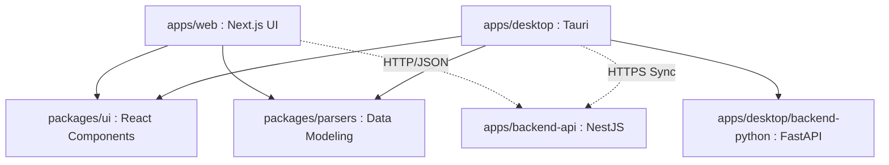

### 6.2.2 Inventario de Casos de Uso (20 CUs)

Para abarcar exhaustivamente el sistema implementado en la arquitectura híbrida (Tauri, Next.js, NestJS y FastAPI), se han definido **20 Casos de Uso** reales agrupados por módulos funcionales.

#### Módulo I: Autenticación y Nube (NestJS API)
1. **CU-01:** Iniciar sesión de usuario (JWT).
2. **CU-02:** Registrar nueva cuenta de usuario.
3. **CU-03:** Cerrar sesión de usuario.
4. **CU-04:** Visualizar galería de proyectos guardados.
5. **CU-05:** Crear nuevo proyecto de modelado en blanco.
6. **CU-06:** Guardar / Sincronizar estado del diagrama (Push).
7. **CU-07:** Cargar / Restaurar diagrama desde la nube (Pull).
8. **CU-08:** Eliminar proyecto de la nube.

#### Módulo II: Modelado Manual (Parsers TypeScript)
9. **CU-09:** Ingresar script SQL DDL manualmente.
10. **CU-10:** Parsear script DDL a diagrama en tiempo real.
11. **CU-11:** Ingresar estructura mediante JSON Schema.
12. **CU-12:** Parsear JSON Schema a diagrama.

#### Módulo III: Interacción y Exportación (React Flow + Mermaid exportable)
13. **CU-13:** Ampliar o reducir lienzo (Zoom In/Out).
14. **CU-14:** Desplazarse por el diagrama (Paneo).
15. **CU-15:** Exportar diagrama a imagen PNG.
16. **CU-16:** Exportar diagrama a vector SVG.
17. **CU-17:** Exportar diagrama a código Mermaid nativo.

#### Módulo IV: Extracción Local (Sidecar FastAPI)
18. **CU-18:** Registrar credenciales de Base de Datos local.
19. **CU-19:** Ejecutar introspección de Base de Datos local.
20. **CU-20:** Transformar metadatos crudos a `SchemaModel`.

### 6.2.3 Escenarios de casos de uso (narrativas)

A continuación, se detallan las narrativas de los 20 Casos de Uso del sistema, describiendo el flujo principal de eventos.

**Módulo I: Autenticación y Nube**

**CU-01: Iniciar sesión de usuario**
- **Actor:** Usuario
- **Descripción:** El usuario se autentica en la plataforma para acceder a sus proyectos sincronizados.
- **Precondición:** El usuario debe estar registrado.
- **Flujo Principal:** 1) El usuario ingresa email y contraseña. 2) El sistema valida credenciales contra el Cloud API. 3) Se genera y almacena el JWT localmente. 4) Se redirige al Dashboard.
- **Postcondición:** El usuario tiene una sesión activa.

**CU-02: Registrar nueva cuenta de usuario**
- **Actor:** Usuario
- **Descripción:** Creación de una nueva identidad en la base de datos de usuarios.
- **Precondición:** El email no debe existir en el sistema.
- **Flujo Principal:** 1) El usuario completa el formulario. 2) El sistema cifra la contraseña. 3) Se guarda el registro en la BD Cloud. 4) Se envía confirmación al usuario.
- **Postcondición:** El usuario está registrado y listo para iniciar sesión.

**CU-03: Cerrar sesión de usuario**
- **Actor:** Usuario
- **Descripción:** Finaliza la sesión actual por seguridad.
- **Precondición:** El usuario debe tener sesión activa.
- **Flujo Principal:** 1) El usuario selecciona "Cerrar sesión". 2) El sistema destruye el JWT local. 3) Se redirige a la pantalla de login.
- **Postcondición:** El usuario ya no tiene acceso a funciones autenticadas.

**CU-04: Visualizar galería de proyectos guardados**
- **Actor:** Usuario Autenticado
- **Descripción:** Muestra todos los diagramas asociados al usuario.
- **Precondición:** Tener sesión activa.
- **Flujo Principal:** 1) El usuario entra al Dashboard. 2) El sistema solicita proyectos al API. 3) El sistema renderiza una cuadrícula con tarjetas de proyectos.
- **Postcondición:** El usuario visualiza sus proyectos.

**CU-05: Crear nuevo proyecto de modelado**
- **Actor:** Usuario Autenticado
- **Descripción:** Inicializa un lienzo en blanco para un diagrama.
- **Precondición:** Sesión activa.
- **Flujo Principal:** 1) El usuario hace clic en "Nuevo Proyecto". 2) El sistema genera un ID temporal y un `SchemaModel` vacío. 3) Se abre el editor interactivo.
- **Postcondición:** Lienzo listo para edición.

**CU-06: Guardar / Sincronizar estado del diagrama (Push)**
- **Actor:** Usuario Autenticado
- **Descripción:** Sincroniza el JSON del diagrama actual hacia el backend NestJS.
- **Precondición:** Proyecto abierto y con cambios.
- **Flujo Principal:** 1) Clic en "Guardar". 2) El sistema extrae el `SchemaModel`. 3) Se envía vía PUT/POST al API Cloud. 4) Se notifica éxito.
- **Postcondición:** El diagrama está salvaguardado en la nube.

**CU-07: Cargar / Restaurar diagrama desde la nube (Pull)**
- **Actor:** Usuario Autenticado
- **Descripción:** Descarga un diagrama guardado y lo renderiza.
- **Precondición:** Proyecto existente.
- **Flujo Principal:** 1) Selección de proyecto en la galería. 2) El sistema obtiene el JSON del API. 3) El lienzo React Flow renderiza el esquema.
- **Postcondición:** El diagrama es visible y editable.

**CU-08: Eliminar proyecto de la nube**
- **Actor:** Usuario Autenticado
- **Descripción:** Eliminación de un proyecto.
- **Precondición:** Ser dueño del proyecto.
- **Flujo Principal:** 1) Clic en eliminar. 2) Confirmación de seguridad. 3) API borra el registro. 4) Se actualiza la galería local.
- **Postcondición:** El proyecto se elimina permanentemente.

**Módulo II: Modelado Manual**

**CU-09: Ingresar script SQL DDL manualmente**
- **Actor:** Usuario (Frontend)
- **Descripción:** Uso del editor de código para sentencias SQL.
- **Precondición:** Lienzo de proyecto abierto.
- **Flujo Principal:** 1) El usuario activa la pestaña "DDL". 2) Ingresa comandos `CREATE TABLE`. 3) El editor resalta la sintaxis.
- **Postcondición:** Texto DDL listo en memoria.

**CU-10: Parsear script DDL a diagrama**
- **Actor:** Sistema (Parser Automático)
- **Descripción:** Compila el SQL a un modelo visual.
- **Precondición:** Texto DDL modificado.
- **Flujo Principal:** 1) Se dispara evento de cambio (Debounce). 2) El parser compila DDL a `SchemaModel`. 3) React Flow actualiza el lienzo.
- **Postcondición:** Diagrama visual sincronizado con código DDL.

**CU-11: Ingresar estructura mediante JSON Schema**
- **Actor:** Usuario (Frontend)
- **Descripción:** Uso del editor para colecciones NoSQL.
- **Precondición:** Lienzo abierto.
- **Flujo Principal:** 1) Activar pestaña "JSON". 2) Ingresar objetos JSON. 3) Editor valida sintaxis.
- **Postcondición:** Estructura JSON lista.

**CU-12: Parsear JSON Schema a diagrama**
- **Actor:** Sistema (Parser Automático)
- **Descripción:** Transforma JSON jerárquico a modelo visual.
- **Precondición:** JSON válido.
- **Flujo Principal:** 1) Evento de cambio. 2) Parser lee nodos y genera relaciones implícitas. 3) React Flow actualiza el lienzo.
- **Postcondición:** Diagrama visual actualizado.

**Módulo III: Interacción Visual**

**CU-13: Ampliar o reducir lienzo (Zoom)**
- **Actor:** Usuario
- **Descripción:** Acerca o aleja el ERD.
- **Precondición:** Diagrama visible.
- **Flujo Principal:** 1) Usuario usa rueda del ratón o botones +/-. 2) El módulo D3.js escala el `viewBox` del SVG.
- **Postcondición:** Nivel de zoom actualizado.

**CU-14: Desplazarse por el diagrama (Paneo)**
- **Actor:** Usuario
- **Descripción:** Arrastra el lienzo para explorar.
- **Precondición:** Diagrama mayor al área visible.
- **Flujo Principal:** 1) Usuario mantiene clic y arrastra. 2) Módulo D3.js traslada coordenadas X,Y del `viewBox`.
- **Postcondición:** Nueva área del diagrama es visible.

**CU-15: Exportar diagrama a imagen PNG**
- **Actor:** Usuario
- **Descripción:** Descarga el diagrama como PNG.
- **Precondición:** Diagrama generado.
- **Flujo Principal:** 1) Clic en "Exportar PNG". 2) Sistema dibuja el SVG en un Canvas HTML5. 3) Transforma a base64 y fuerza descarga.
- **Postcondición:** Archivo `.png` descargado.

**CU-16: Exportar diagrama a vector SVG**
- **Actor:** Usuario
- **Descripción:** Descarga limpia del SVG.
- **Precondición:** Diagrama generado.
- **Flujo Principal:** 1) Clic en "Exportar SVG". 2) Extrae tag `<svg>`. 3) Fuerza descarga de Blob.
- **Postcondición:** Archivo `.svg` descargado.

**CU-17: Exportar diagrama a código Mermaid**
- **Actor:** Usuario
- **Descripción:** Recupera el texto plano nativo.
- **Precondición:** Diagrama generado.
- **Flujo Principal:** 1) Clic en "Exportar Mermaid". 2) Extrae el string subyacente. 3) Fuerza descarga de Blob.
- **Postcondición:** Archivo `.mmd` descargado.

**Módulo IV: Extracción Local**

**CU-18: Registrar credenciales de Base de Datos local**
- **Actor:** Usuario Técnico (DBA)
- **Descripción:** Guarda de forma segura las credenciales locales.
- **Precondición:** App Desktop abierta.
- **Flujo Principal:** 1) DBA ingresa Host, User, Pass. 2) Interfaz Tauri envía Pass al SO Keyring. 3) Guarda metadatos en LocalStorage.
- **Postcondición:** Perfil de conexión listo y seguro.

**CU-19: Ejecutar introspección de Base de Datos local**
- **Actor:** Sistema (Python Sidecar)
- **Descripción:** Consulta metadatos físicos de una BD.
- **Precondición:** Credenciales registradas.
- **Flujo Principal:** 1) UI solicita extracción. 2) Sidecar se conecta a la BD. 3) Sidecar ejecuta sentencias `SELECT * FROM information_schema`. 4) Retorna array de tablas y columnas crudas.
- **Postcondición:** Información estructural extraída de la BD física.

**CU-20: Transformar metadatos crudos a SchemaModel**
- **Actor:** Sistema (Python Sidecar)
- **Descripción:** Estandariza la salida de bases heterogéneas.
- **Precondición:** Metadatos extraídos (CU-19).
- **Flujo Principal:** 1) Transformador mapea tipos específicos (e.g. `VARCHAR` a `string`). 2) Serializa a JSON estructurado (`SchemaModel`). 3) Devuelve al Frontend para graficado.
- **Postcondición:** El Frontend recibe un JSON universal procesable.

## 6.3 Modelo Lógico

### 6.3.1 Análisis de objetos por caso de uso

A continuación se identifican, para cada caso de uso, los objetos participantes clasificados según el patrón BCE (Boundary – Control – Entity).

**CU-01: Iniciar sesión de usuario**

| Tipo     | Objeto              | Responsabilidad                                      |
|----------|----------------------|------------------------------------------------------|
| Boundary | LoginForm            | Interfaz de entrada de email y contraseña             |
| Control  | AuthController       | Valida credenciales y genera JWT                      |
| Entity   | Usuario              | Registro persistente en BD Cloud                      |

**Gráfico de objetos:**

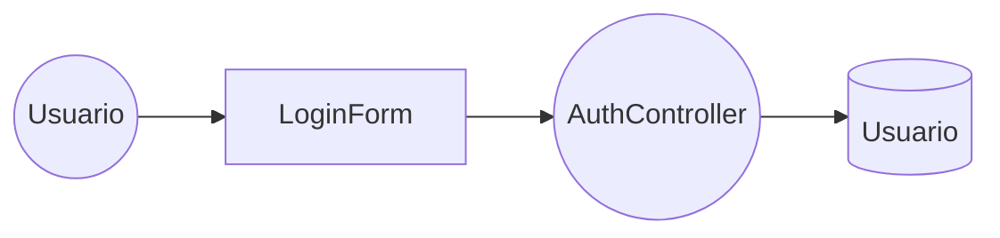


**CU-02: Registrar nueva cuenta de usuario**

| Tipo     | Objeto              | Responsabilidad                                      |
|----------|----------------------|------------------------------------------------------|
| Boundary | RegisterForm         | Formulario de registro de datos personales            |
| Control  | AuthController       | Cifra contraseña y crea registro                      |
| Entity   | Usuario              | Nuevo registro en la tabla de usuarios                |

**Gráfico de objetos:**

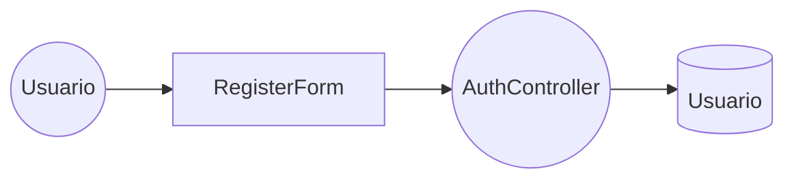


**CU-03: Cerrar sesión de usuario**

| Tipo     | Objeto              | Responsabilidad                                      |
|----------|----------------------|------------------------------------------------------|
| Boundary | NavBar               | Botón de cierre de sesión en la barra de navegación   |
| Control  | SessionManager       | Destruye token JWT del almacenamiento local           |
| Entity   | TokenStore           | Almacenamiento local del JWT (LocalStorage)           |

**Gráfico de objetos:**

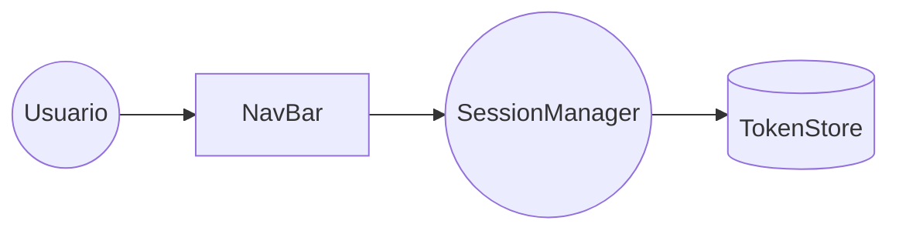


**CU-04: Visualizar galería de proyectos guardados**

| Tipo     | Objeto              | Responsabilidad                                      |
|----------|----------------------|------------------------------------------------------|
| Boundary | DashboardView        | Cuadrícula de tarjetas de proyectos                   |
| Control  | ProjectController    | Solicita lista de proyectos al API Cloud              |
| Entity   | Proyecto             | Registro de proyecto en BD Cloud                      |

**Gráfico de objetos:**

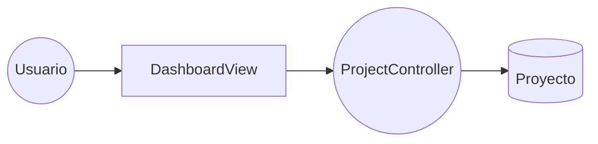


**CU-05: Crear nuevo proyecto de modelado**

| Tipo     | Objeto              | Responsabilidad                                      |
|----------|----------------------|------------------------------------------------------|
| Boundary | NewProjectButton     | Botón de creación en el Dashboard                     |
| Control  | ProjectController    | Genera UUID temporal e inicializa SchemaModel vacío   |
| Entity   | Proyecto             | Nuevo registro con estado inicial                     |
| Entity   | SchemaModel          | Modelo JSON vacío asociado al proyecto                |

**Gráfico de objetos:**

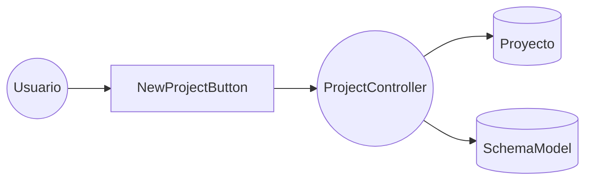


**CU-06: Guardar / Sincronizar estado del diagrama (Push)**

| Tipo     | Objeto              | Responsabilidad                                      |
|----------|----------------------|------------------------------------------------------|
| Boundary | SaveButton           | Botón "Guardar" en el editor                          |
| Control  | CloudSyncService     | Envía SchemaModel al API mediante PUT/POST            |
| Entity   | Diagrama             | Registro versionado del SchemaModel en la nube        |

**Gráfico de objetos:**


**CU-07: Cargar / Restaurar diagrama desde la nube (Pull)**

| Tipo     | Objeto              | Responsabilidad                                      |
|----------|----------------------|------------------------------------------------------|
| Boundary | ProjectCard          | Tarjeta seleccionable en la galería                   |
| Control  | CloudSyncService     | Descarga SchemaModel desde el API Cloud               |
| Entity   | Diagrama             | Registro persistido en BD Cloud                       |

**Gráfico de objetos:**

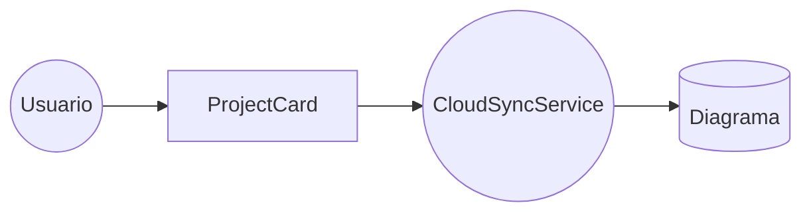


**CU-08: Eliminar proyecto de la nube**

| Tipo     | Objeto              | Responsabilidad                                      |
|----------|----------------------|------------------------------------------------------|
| Boundary | DeleteModal          | Diálogo de confirmación de eliminación                |
| Control  | ProjectController    | Envía solicitud DELETE al API                         |
| Entity   | Proyecto             | Registro eliminado de la BD                           |

**Gráfico de objetos:**

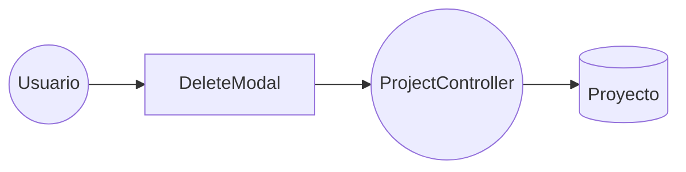


**CU-09: Ingresar script SQL DDL manualmente**

| Tipo     | Objeto              | Responsabilidad                                      |
|----------|----------------------|------------------------------------------------------|
| Boundary | MonacoEditor         | Editor de código integrado con resaltado SQL          |
| Control  | EditorController     | Gestiona estado del texto DDL en memoria              |
| Entity   | DDLBuffer            | Cadena de texto DDL almacenada temporalmente          |

**Gráfico de objetos:**

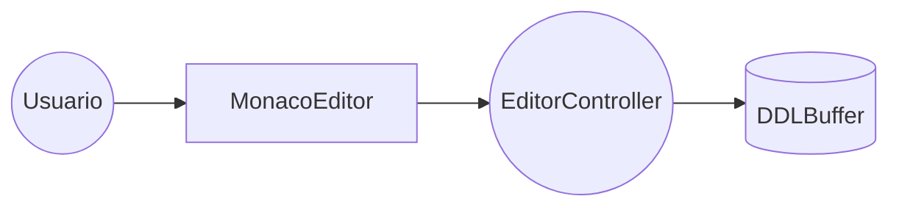


**CU-10: Parsear script DDL a diagrama**

| Tipo     | Objeto              | Responsabilidad                                      |
|----------|----------------------|------------------------------------------------------|
| Boundary | DiagramViewer        | Componente visual que muestra el ERD con React Flow   |
| Control  | SQLDDLParser         | Compila texto SQL a estructura SchemaModel            |
| Entity   | SchemaModel          | Modelo intermedio JSON generado por el parser         |

**Gráfico de objetos:**

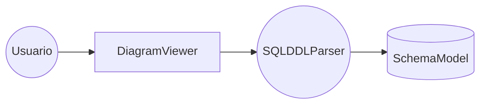


**CU-11: Ingresar estructura mediante JSON Schema**

| Tipo     | Objeto              | Responsabilidad                                      |
|----------|----------------------|------------------------------------------------------|
| Boundary | MonacoEditorJSON     | Editor de código con modo JSON activo                 |
| Control  | EditorController     | Gestiona estado del texto JSON en memoria             |
| Entity   | JSONBuffer           | Cadena de texto JSON almacenada temporalmente         |

**Gráfico de objetos:**

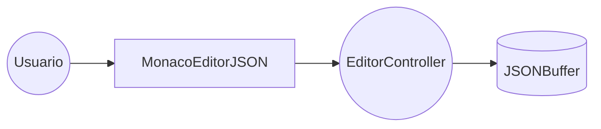


**CU-12: Parsear JSON Schema a diagrama**

| Tipo     | Objeto              | Responsabilidad                                      |
|----------|----------------------|------------------------------------------------------|
| Boundary | DiagramViewer        | Componente visual que muestra el ERD con React Flow   |
| Control  | JSONSchemaParser     | Transforma JSON jerárquico a SchemaModel              |
| Entity   | SchemaModel          | Modelo intermedio JSON generado por el parser         |

**Gráfico de objetos:**

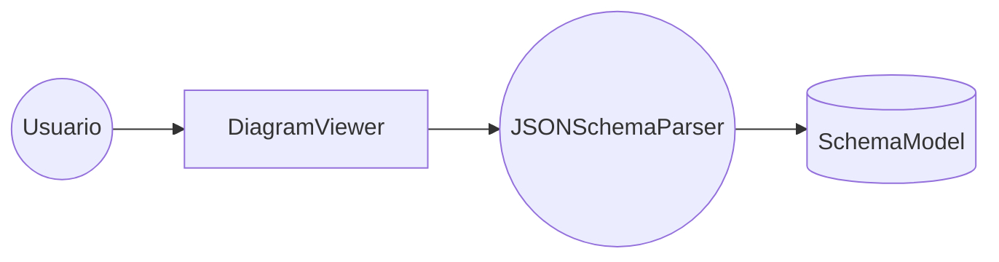


**CU-13: Ampliar o reducir lienzo (Zoom)**

| Tipo     | Objeto              | Responsabilidad                                      |
|----------|----------------------|------------------------------------------------------|
| Boundary | CanvasView           | Área visual del diagrama SVG                          |
| Control  | D3ZoomModule         | Intercepta evento de scroll y escala viewBox          |
| Entity   | ViewBoxState         | Estado actual de escala y posición del lienzo         |

**Gráfico de objetos:**

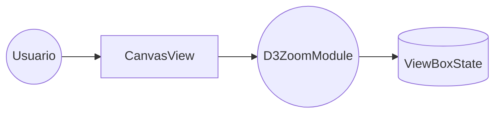


**CU-14: Desplazarse por el diagrama (Paneo)**

| Tipo     | Objeto              | Responsabilidad                                      |
|----------|----------------------|------------------------------------------------------|
| Boundary | CanvasView           | Área visual del diagrama SVG                          |
| Control  | D3PanModule          | Intercepta evento de arrastre y traslada coordenadas  |
| Entity   | ViewBoxState         | Estado actual de posición X,Y del lienzo              |

**Gráfico de objetos:**

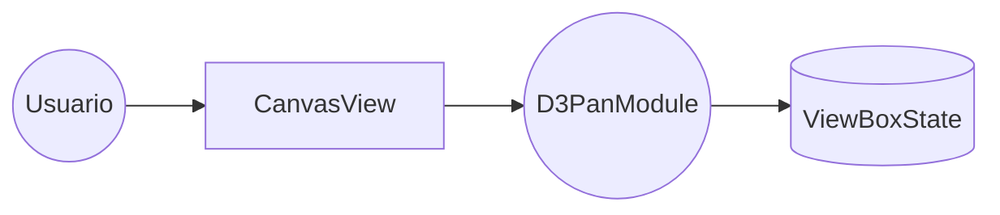


**CU-15: Exportar diagrama a imagen PNG**

| Tipo     | Objeto              | Responsabilidad                                      |
|----------|----------------------|------------------------------------------------------|
| Boundary | ExportMenu           | Menú desplegable con opciones de exportación          |
| Control  | ExportService        | Convierte SVG a Canvas y genera Blob descargable      |
| Entity   | CanvasBuffer         | Canvas HTML5 temporal con la imagen rasterizada       |

**Gráfico de objetos:**

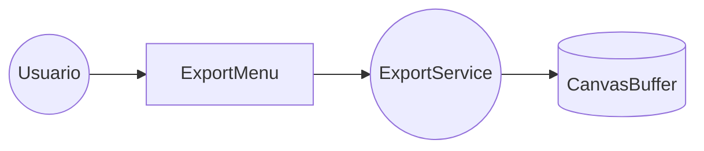


**CU-16: Exportar diagrama a vector SVG**

| Tipo     | Objeto              | Responsabilidad                                      |
|----------|----------------------|------------------------------------------------------|
| Boundary | ExportMenu           | Menú desplegable con opciones de exportación          |
| Control  | ExportService        | Extrae nodo DOM SVG y lo serializa                    |
| Entity   | SVGBlob              | Blob codificado del archivo SVG                       |

**Gráfico de objetos:**

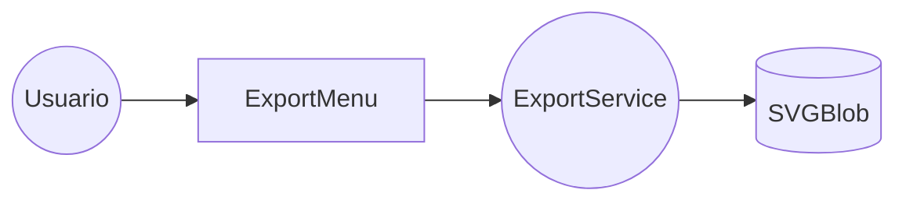


**CU-17: Exportar diagrama a código Mermaid**

| Tipo     | Objeto              | Responsabilidad                                      |
|----------|----------------------|------------------------------------------------------|
| Boundary | ExportMenu           | Menú desplegable con opciones de exportación          |
| Control  | ExportService        | Recupera string Mermaid subyacente                    |
| Entity   | MermaidBlob          | Blob de texto plano del código Mermaid                |

**Gráfico de objetos:**

```mermaid
flowchart LR
    Actor((Usuario)) --> Boundary[ExportMenu]
    Boundary --> Control((ExportService))
    Control --> Entity1[(MermaidBlob)]
```


**CU-18: Registrar credenciales de Base de Datos local**

| Tipo     | Objeto              | Responsabilidad                                      |
|----------|----------------------|------------------------------------------------------|
| Boundary | ConnectionForm       | Formulario de ingreso de Host, User, Pass             |
| Control  | ConnectionManager    | Cifra y almacena credenciales en el SO Keyring        |
| Entity   | ConnectionProfile    | Perfil de conexión persistido localmente              |

**Gráfico de objetos:**

```mermaid
flowchart LR
    Actor((Usuario)) --> Boundary[ConnectionForm]
    Boundary --> Control((ConnectionManager))
    Control --> Entity1[(ConnectionProfile)]
```


**CU-19: Ejecutar introspección de Base de Datos local**

| Tipo     | Objeto              | Responsabilidad                                      |
|----------|----------------------|------------------------------------------------------|
| Boundary | ExtractButton        | Botón de extracción en la interfaz Desktop            |
| Control  | ExtractorFactory     | Selecciona el extractor adecuado según motor de BD    |
| Entity   | RawMetadata          | Datos crudos de tablas, columnas y FKs                |

**Gráfico de objetos:**

```mermaid
flowchart LR
    Actor((Usuario)) --> Boundary[ExtractButton]
    Boundary --> Control((ExtractorFactory))
    Control --> Entity1[(RawMetadata)]
```


**CU-20: Transformar metadatos crudos a SchemaModel**

| Tipo     | Objeto              | Responsabilidad                                      |
|----------|----------------------|------------------------------------------------------|
| Boundary | DiagramViewer        | Componente que recibe y renderiza el SchemaModel      |
| Control  | SchemaTransformer    | Mapea tipos heterogéneos a formato universal          |
| Entity   | SchemaModel          | Modelo JSON estandarizado resultante                  |

**Gráfico de objetos:**

```mermaid
flowchart LR
    Actor((Usuario)) --> Boundary[DiagramViewer]
    Boundary --> Control((SchemaTransformer))
    Control --> Entity1[(SchemaModel)]
```


### 6.3.2 Diagrama de actividades con objetos

*Figura 1. Diagrama de actividades con objetos del flujo principal de FluxSQL.*

```mermaid
flowchart TD
    A(["Inicio"]) --> B["Desktop App: Usuario pide extracción local"]
    B --> C["Sidecar: ConnectionManager recupera credencial"]
    C --> D["Sidecar: Extractor se conecta a BD Local"]
    D --> E["Sidecar: Transforma metadatos a SchemaModel"]
    E --> F["Tauri UI: Recibe SchemaModel y renderiza React Flow"]
    F --> G{"¿El usuario sincroniza?"}
    G -- "Sí" --> H["CloudSyncService envía JSON a NestJS"]
    H --> I["DiagramsController lo inserta en DB de la nube"]
    G -- "No" --> J["Se preserva estado local"]
    I --> K(["Fin"])
    J --> K
```

*Nota.* Elaboración propia basada en la arquitectura híbrida de FluxSQL.

### 6.3.3 Diagramas de secuencia

A continuación se presenta un diagrama de secuencia por cada uno de los 20 Casos de Uso del sistema.

#### DS-01: Iniciar sesión de usuario

*Figura 2. Diagrama de secuencia del CU-01: Iniciar sesión de usuario.*

```mermaid
sequenceDiagram
    actor Usuario
    participant LF as LoginForm
    participant AC as AuthController
    participant BD as BD Cloud

    Usuario ->> LF: Ingresa email y contraseña
    LF ->> AC: POST /auth/login (email, password)
    AC ->> BD: SELECT usuario WHERE email = ?
    BD -->> AC: Registro de usuario
    AC ->> AC: Compara hash de contraseña
    AC -->> LF: 200 OK (JWT Token)
    LF ->> LF: Almacena JWT en LocalStorage
    LF -->> Usuario: Redirige al Dashboard
```

*Nota.* Elaboración propia.

#### DS-02: Registrar nueva cuenta de usuario

*Figura 3. Diagrama de secuencia del CU-02: Registrar nueva cuenta de usuario.*

```mermaid
sequenceDiagram
    actor Usuario
    participant RF as RegisterForm
    participant AC as AuthController
    participant BD as BD Cloud

    Usuario ->> RF: Completa formulario de registro
    RF ->> AC: POST /auth/register (datos)
    AC ->> BD: SELECT usuario WHERE email = ?
    BD -->> AC: null (no existe)
    AC ->> AC: Cifra contraseña (bcrypt)
    AC ->> BD: INSERT INTO usuarios
    BD -->> AC: 201 Created
    AC -->> RF: Registro exitoso
    RF -->> Usuario: Muestra mensaje de confirmación
```

*Nota.* Elaboración propia.

#### DS-03: Cerrar sesión de usuario

*Figura 4. Diagrama de secuencia del CU-03: Cerrar sesión de usuario.*

```mermaid
sequenceDiagram
    actor Usuario
    participant NB as NavBar
    participant SM as SessionManager
    participant LS as LocalStorage

    Usuario ->> NB: Clic en "Cerrar sesión"
    NB ->> SM: logout()
    SM ->> LS: removeItem("jwt_token")
    LS -->> SM: Token eliminado
    SM -->> NB: Sesión destruida
    NB -->> Usuario: Redirige a pantalla de login
```

*Nota.* Elaboración propia.

#### DS-04: Visualizar galería de proyectos guardados

*Figura 5. Diagrama de secuencia del CU-04: Visualizar galería de proyectos.*

```mermaid
sequenceDiagram
    actor Usuario
    participant DV as DashboardView
    participant PC as ProjectController
    participant API as NestJS Cloud API
    participant BD as BD Cloud

    Usuario ->> DV: Accede al Dashboard
    DV ->> PC: getProjects(jwt)
    PC ->> API: GET /projects (Header: Bearer JWT)
    API ->> BD: SELECT * FROM proyectos WHERE owner_id = ?
    BD -->> API: Array de proyectos
    API -->> PC: 200 OK (JSON Array)
    PC -->> DV: Lista de proyectos
    DV -->> Usuario: Renderiza cuadrícula de tarjetas
```

*Nota.* Elaboración propia.

#### DS-05: Crear nuevo proyecto de modelado

*Figura 6. Diagrama de secuencia del CU-05: Crear nuevo proyecto de modelado.*

```mermaid
sequenceDiagram
    actor Usuario
    participant NP as NewProjectButton
    participant PC as ProjectController
    participant SM as SchemaModel

    Usuario ->> NP: Clic en "Nuevo Proyecto"
    NP ->> PC: createProject()
    PC ->> PC: Genera UUID temporal
    PC ->> SM: Inicializa SchemaModel vacío
    SM -->> PC: SchemaModel { entities: [], relationships: [] }
    PC -->> NP: Proyecto creado localmente
    NP -->> Usuario: Abre editor interactivo con lienzo vacío
```

*Nota.* Elaboración propia.

#### DS-06: Guardar / Sincronizar estado del diagrama (Push)

*Figura 7. Diagrama de secuencia del CU-06: Sincronizar diagrama (Push).*

```mermaid
sequenceDiagram
    actor Usuario
    participant SB as SaveButton
    participant CS as CloudSyncService
    participant API as NestJS Cloud API
    participant BD as BD Cloud

    Usuario ->> SB: Clic en "Guardar"
    SB ->> CS: syncPush(projectId, schemaModel)
    CS ->> API: PUT /projects/{id} (SchemaModel JSON)
    API ->> BD: UPDATE diagramas SET schema_model = ? WHERE id = ?
    BD -->> API: Registro actualizado
    API -->> CS: 200 OK (Sincronizado)
    CS -->> SB: Confirmación de guardado
    SB -->> Usuario: Notificación de éxito
```

*Nota.* Elaboración propia. El payload nunca contiene credenciales de BD.

#### DS-07: Cargar / Restaurar diagrama desde la nube (Pull)

*Figura 8. Diagrama de secuencia del CU-07: Restaurar diagrama (Pull).*

```mermaid
sequenceDiagram
    actor Usuario
    participant PC as ProjectCard
    participant CS as CloudSyncService
    participant API as NestJS Cloud API
    participant DV as DiagramViewer

    Usuario ->> PC: Selecciona proyecto en galería
    PC ->> CS: syncPull(projectId)
    CS ->> API: GET /projects/{id}
    API -->> CS: 200 OK (SchemaModel JSON)
    CS ->> DV: renderDiagram(schemaModel)
    DV ->> DV: Genera código Mermaid desde SchemaModel
    DV -->> Usuario: Diagrama ERD visible y editable
```

*Nota.* Elaboración propia.

#### DS-08: Eliminar proyecto de la nube

*Figura 9. Diagrama de secuencia del CU-08: Eliminar proyecto.*

```mermaid
sequenceDiagram
    actor Usuario
    participant DM as DeleteModal
    participant PC as ProjectController
    participant API as NestJS Cloud API
    participant BD as BD Cloud

    Usuario ->> DM: Clic en eliminar proyecto
    DM ->> DM: Muestra diálogo de confirmación
    Usuario ->> DM: Confirma eliminación
    DM ->> PC: deleteProject(projectId)
    PC ->> API: DELETE /projects/{id}
    API ->> BD: DELETE FROM proyectos WHERE id = ?
    BD -->> API: Registro eliminado
    API -->> PC: 200 OK
    PC -->> DM: Proyecto eliminado
    DM -->> Usuario: Actualiza galería (remueve tarjeta)
```

*Nota.* Elaboración propia.

#### DS-09: Ingresar script SQL DDL manualmente

*Figura 10. Diagrama de secuencia del CU-09: Ingresar script SQL DDL.*

```mermaid
sequenceDiagram
    actor Usuario
    participant ME as MonacoEditor
    participant EC as EditorController
    participant DB as DDLBuffer

    Usuario ->> ME: Selecciona pestaña "DDL"
    ME -->> Usuario: Editor activo con resaltado SQL
    Usuario ->> ME: Escribe sentencias CREATE TABLE
    ME ->> EC: onChange(textoActual)
    EC ->> DB: Almacena texto DDL en buffer
    DB -->> EC: Buffer actualizado
    EC -->> ME: Resalta sintaxis en tiempo real
```

*Nota.* Elaboración propia.

#### DS-10: Parsear script DDL a diagrama

*Figura 11. Diagrama de secuencia del CU-10: Parsear DDL a diagrama.*

```mermaid
sequenceDiagram
    participant ME as MonacoEditor
    participant SP as SQLDDLParser
    participant SM as SchemaModel
    participant DV as DiagramViewer

    ME ->> SP: onChangeDebounce(ddlString, 300ms)
    SP ->> SP: Analiza tokens SQL (CREATE TABLE, FK, PK)
    SP ->> SM: Genera SchemaModel con entidades y relaciones
    SM -->> SP: SchemaModel poblado
    SP -->> DV: Retorna SchemaModel
    DV ->> DV: Traduce SchemaModel a sintaxis Mermaid
    DV ->> DV: Renderiza SVG del diagrama ERD
```

*Nota.* Elaboración propia. El parseo ocurre en el lado del cliente.

#### DS-11: Ingresar estructura mediante JSON Schema

*Figura 12. Diagrama de secuencia del CU-11: Ingresar JSON Schema.*

```mermaid
sequenceDiagram
    actor Usuario
    participant ME as MonacoEditorJSON
    participant EC as EditorController
    participant JB as JSONBuffer

    Usuario ->> ME: Selecciona pestaña "JSON"
    ME -->> Usuario: Editor activo con modo JSON
    Usuario ->> ME: Escribe objetos JSON
    ME ->> EC: onChange(textoActual)
    EC ->> JB: Almacena texto JSON en buffer
    JB -->> EC: Buffer actualizado
    EC -->> ME: Valida sintaxis JSON y resalta errores
```

*Nota.* Elaboración propia.

#### DS-12: Parsear JSON Schema a diagrama

*Figura 13. Diagrama de secuencia del CU-12: Parsear JSON Schema a diagrama.*

```mermaid
sequenceDiagram
    participant ME as MonacoEditorJSON
    participant JP as JSONSchemaParser
    participant SM as SchemaModel
    participant DV as DiagramViewer

    ME ->> JP: onChangeDebounce(jsonString, 300ms)
    JP ->> JP: Analiza jerarquía de nodos JSON
    JP ->> SM: Genera SchemaModel con colecciones y relaciones
    SM -->> JP: SchemaModel poblado
    JP -->> DV: Retorna SchemaModel
    DV ->> DV: Traduce SchemaModel a sintaxis Mermaid
    DV ->> DV: Renderiza SVG del diagrama ERD
```

*Nota.* Elaboración propia.

#### DS-13: Ampliar o reducir lienzo (Zoom)

*Figura 14. Diagrama de secuencia del CU-13: Zoom del lienzo.*

```mermaid
sequenceDiagram
    actor Usuario
    participant CV as CanvasView
    participant ZM as D3ZoomModule
    participant VS as ViewBoxState

    Usuario ->> CV: Hace scroll con rueda del ratón
    CV ->> ZM: onWheel(deltaY)
    ZM ->> VS: Calcula nueva escala
    VS -->> ZM: Escala actualizada
    ZM ->> CV: Aplica transform scale al SVG viewBox
    CV -->> Usuario: Diagrama ampliado o reducido
```

*Nota.* Elaboración propia.

#### DS-14: Desplazarse por el diagrama (Paneo)

*Figura 15. Diagrama de secuencia del CU-14: Paneo del lienzo.*

```mermaid
sequenceDiagram
    actor Usuario
    participant CV as CanvasView
    participant PM as D3PanModule
    participant VS as ViewBoxState

    Usuario ->> CV: Mantiene clic y arrastra
    CV ->> PM: onDrag(deltaX, deltaY)
    PM ->> VS: Calcula nuevas coordenadas X, Y
    VS -->> PM: Coordenadas actualizadas
    PM ->> CV: Traslada SVG viewBox
    CV -->> Usuario: Nueva área del diagrama visible
```

*Nota.* Elaboración propia.

#### DS-15: Exportar diagrama a imagen PNG

*Figura 16. Diagrama de secuencia del CU-15: Exportar a PNG.*

```mermaid
sequenceDiagram
    actor Usuario
    participant EM as ExportMenu
    participant ES as ExportService
    participant CB as CanvasBuffer

    Usuario ->> EM: Clic en "Exportar PNG"
    EM ->> ES: exportPNG()
    ES ->> ES: Obtiene nodo SVG del DOM
    ES ->> CB: Dibuja SVG en Canvas HTML5
    CB -->> ES: Canvas renderizado
    ES ->> ES: canvas.toDataURL("image/png")
    ES -->> Usuario: Fuerza descarga de archivo .png
```

*Nota.* Elaboración propia.

#### DS-16: Exportar diagrama a vector SVG

*Figura 17. Diagrama de secuencia del CU-16: Exportar a SVG.*

```mermaid
sequenceDiagram
    actor Usuario
    participant EM as ExportMenu
    participant ES as ExportService

    Usuario ->> EM: Clic en "Exportar SVG"
    EM ->> ES: exportSVG()
    ES ->> ES: Extrae nodo SVG del DOM
    ES ->> ES: Serializa a XMLSerializer
    ES ->> ES: Crea Blob de tipo "image/svg+xml"
    ES -->> Usuario: Fuerza descarga de archivo .svg
```

*Nota.* Elaboración propia.

#### DS-17: Exportar diagrama a código Mermaid

*Figura 18. Diagrama de secuencia del CU-17: Exportar a Mermaid.*

```mermaid
sequenceDiagram
    actor Usuario
    participant EM as ExportMenu
    participant ES as ExportService

    Usuario ->> EM: Clic en "Exportar Mermaid"
    EM ->> ES: exportMermaid()
    ES ->> ES: Recupera string Mermaid del estado interno
    ES ->> ES: Crea Blob de tipo "text/plain"
    ES -->> Usuario: Fuerza descarga de archivo .mmd
```

*Nota.* Elaboración propia.

#### DS-18: Registrar credenciales de Base de Datos local

*Figura 19. Diagrama de secuencia del CU-18: Registrar credenciales locales.*

```mermaid
sequenceDiagram
    actor DBA
    participant CF as ConnectionForm
    participant CM as ConnectionManager
    participant KR as OS Keyring
    participant LS as LocalStorage

    DBA ->> CF: Ingresa Host, Puerto, User, Password, Motor
    CF ->> CM: saveConnection(connectionData)
    CM ->> KR: Almacena password cifrada en Keyring del SO
    KR -->> CM: Password almacenada de forma segura
    CM ->> LS: Guarda metadatos (host, puerto, motor)
    LS -->> CM: Metadatos persistidos
    CM -->> CF: Perfil de conexión creado
    CF -->> DBA: Confirmación visual de perfil guardado
```

*Nota.* Elaboración propia. Las credenciales jamás se envían a la nube.

#### DS-19: Ejecutar introspección de Base de Datos local

*Figura 20. Diagrama de secuencia del CU-19: Introspección de BD local.*

```mermaid
sequenceDiagram
    actor DBA
    participant UI as Tauri UI
    participant SC as FastAPI Sidecar
    participant CM as ConnectionManager
    participant EF as ExtractorFactory
    participant BD as BD Local

    DBA ->> UI: Clic en "Extraer Esquema"
    UI ->> SC: POST /extract { connectionId }
    SC ->> CM: getDecryptedConnection(connectionId)
    CM -->> SC: Connection string descifrada
    SC ->> EF: create(motor)
    EF -->> SC: Instancia de PostgresExtractor o MySQLExtractor
    SC ->> BD: SELECT * FROM information_schema.tables, columns, key_column_usage
    BD -->> SC: Metadatos crudos (tablas, columnas, FKs)
    SC -->> UI: 200 OK (RawMetadata JSON)
```

*Nota.* Elaboración propia.

#### DS-20: Transformar metadatos crudos a SchemaModel

*Figura 21. Diagrama de secuencia del CU-20: Transformar a SchemaModel.*

```mermaid
sequenceDiagram
    participant SC as FastAPI Sidecar
    participant ST as SchemaTransformer
    participant SM as SchemaModel
    participant UI as Tauri UI
    participant DV as DiagramViewer

    SC ->> ST: transform(rawMetadata)
    ST ->> ST: Mapea tipos PG/MySQL a tipos universales
    ST ->> ST: Identifica relaciones FK entre tablas
    ST ->> SM: Construye SchemaModel JSON
    SM -->> ST: SchemaModel completo
    ST -->> SC: Retorna SchemaModel
    SC -->> UI: 200 OK (SchemaModel JSON)
    UI ->> DV: renderDiagram(schemaModel)
    DV -->> UI: Diagrama ERD renderizado
```

*Nota.* Elaboración propia.

### 6.3.4 Diagrama de clases

*Figura 22. Diagrama de clases del dominio de FluxSQL.*

```mermaid
classDiagram
    class SchemaModel {
        +entities: Entity[]
        +relationships: Relationship[]
    }
    class Entity {
        +name: String
        +attributes: Attribute[]
    }
    class Attribute {
        +name: String
        +type: String
        +isPrimaryKey: Boolean
    }
    class BaseExtractor {
        <<interface>>
        +extract(connString): SchemaModel
    }
    class PostgresExtractor
    class MySQLExtractor
    
    class SQLParser {
        +parseString(ddl: String): SchemaModel
    }

    SchemaModel "1" *-- "*" Entity
    Entity "1" *-- "*" Attribute
    BaseExtractor ..> SchemaModel : Produce
    BaseExtractor <|.. PostgresExtractor
    BaseExtractor <|.. MySQLExtractor
    SQLParser ..> SchemaModel : Produce
```

*Nota.* Elaboración propia.

# 7. Conclusiones

1. **Arquitectura Híbrida Zero-Trust Consolidada**: La especificación de requerimientos demuestra que FluxSQL soluciona de manera efectiva la dicotomía entre la privacidad corporativa y la colaboración en línea. La segregación de responsabilidades a través del patrón *Sidecar* (FastAPI + Tauri) garantiza que la introspección de esquemas y la gestión de credenciales nunca vulneren las políticas de seguridad IT, preservando la integridad de los datos locales sin sacrificar las ventajas del Cloud API (NestJS).
2. **Evolución Visual hacia React Flow**: El análisis confirma la madurez del proyecto al descartar motores gráficos estáticos bidimensionales (como Mermaid.js) en favor de **React Flow** (`@xyflow/react`). Este cambio estructural permite interactividad en tiempo real, redimensionamiento dinámico de nodos, relaciones SQL rectas, layouts de grafo para NoSQL y soporte integral para estructuras anidadas complejas.
3. **Escalabilidad Multi-Paradigma (SQL y NoSQL)**: La estandarización del modelo `SchemaModel` y la abstracción del *Parser Core* han validado que el sistema no solo soporta bases de datos relacionales tradicionales (PostgreSQL, MySQL, SQL Server), sino que es altamente resiliente para adaptarse a esquemas orientados a documentos (MongoDB) y bases de datos orientadas a grafos (Neo4j). Esta versatilidad convierte a FluxSQL en una herramienta políglota de modelado de datos de próxima generación.
4. **Fundación para Agentes de Inteligencia Artificial (MCP)**: El uso de estándares universales en las interfaces DTO y la separación limpia de lógica en los controladores establecen una base arquitectónica perfecta para la futura integración del *Model Context Protocol (MCP)*. Esto permitirá que asistentes de inteligencia artificial (LLMs) auditen, refactoricen e interactúen con el modelo de datos de manera autónoma y segura.

# 8. Recomendaciones

1. **Paridad de Estado Bidireccional (State Management)**: Se recomienda implementar una capa robusta de manejo de estado (utilizando *Zustand* o *Redux*) para sincronizar continuamente el objeto tipado `ParseResult` generado por los parsers de TypeScript con los nodos/aristas nativos del lienzo interactivo de React Flow. Cualquier divergencia entre el modelo de datos y el motor gráfico provocará colisiones visuales irreparables.
2. **Optimización de Extractores y Caché**: Los adaptadores de extracción (e.g., PostgreSQL y MySQL) deben optimizarse agresivamente para realizar paginación o uso de cachés en memoria durante la ejecución de las consultas a las tablas del sistema (`information_schema`). Extraer metadatos de bases de datos masivas (más de 1000 tablas) podría asfixiar los recursos del Sidecar o bloquear los hilos principales de la base de datos de producción.
3. **Cobertura de Pruebas Behavior-Driven (BDD) Extensiva**: Automatizar los flujos críticos de usuario documentados en este ERS (autenticación, parseo DDL, renderizado de grafos Neo4j, y sincronización HTTPS) utilizando frameworks modernos End-to-End como *Cypress* o *Playwright*. Esto garantizará que las futuras integraciones de dialectos de bases de datos no rompan las reglas de negocio preexistentes.
4. **Gestión Estricta del Diccionario de Tipos**: Mantener un repositorio de tipos TypeScript (interfaces, DTOs) altamente estricto y compartido en el monorepo. Dado que el `SchemaModel` es el puente de comunicación entre el Sidecar Python, la UI React y la Nube NestJS, cualquier modificación en la estructura JSON debe ser validada mediante *Zod* o *Class Validator* antes de ser procesada por el frontend o persistida en la base de datos.
5. **Auditoría de Seguridad en Persistencia Local**: Implementar auditorías periódicas al *Keyring* del sistema operativo (gestionado a través de Tauri) para garantizar que, frente a actualizaciones del SO (Windows/Linux/macOS), las cadenas de conexión y contraseñas de las bases de datos de los usuarios nunca se almacenen en texto plano en el disco local o en memorias temporales.

# 9. Bibliografia

1. Pressman, R. S., & Maxim, B. R. (2020). *Software Engineering: A Practitioner's Approach*.
2. FastAPI Official Documentation. (2026). *Building Python APIs with modern typing*.
3. NestJS Core Team. (2026). *A progressive Node.js framework for building scalable server-side applications*.
4. Tauri Studio. (2026). *Build smaller, faster, and more secure desktop applications*.

# 10. Webgrafia

- Repositorio del proyecto FluxSQL: `README.md` y estructura de directorios.
- Diagramado gráfico web: [Mermaid.js](https://mermaid.js.org/)
- Framework Frontend: [Next.js](https://nextjs.org/)
- Construcción Desktop: [Tauri](https://tauri.app/)

# 11. Historias de Usuario, Criterios y Escenarios BDD

A continuación se definen los escenarios utilizando lenguaje Gherkin orientados al núcleo híbrido de FluxSQL.

## HU-01 Extracción local segura de esquemas de BD

**Como** Ingeniero de Datos, **quiero** conectar la aplicación de escritorio a mi BD local **para** extraer su estructura gráfica sin revelar mis credenciales a internet.

**CA-01.1:** Ejecución restringida al entorno Sidecar.

- **Escenario 01:** **Dado** que el usuario ingresa su usuario y contraseña, **cuando** el Sidecar intenta la extracción, **entonces** los metadatos de estructura (tablas, columnas) se extraen exitosamente.
- **Escenario 02:** **Dado** un `SchemaModel` ya generado localmente, **cuando** la aplicación Desktop se sincroniza con el Cloud API, **entonces** el payload HTTPS enviado no contiene claves ni credenciales en absoluto.

**CA-01.2:** Soporte de motores relacionales.

- **Escenario 03:** **Dado** que se selecciona el motor MySQL, **cuando** el Sidecar es invocado, **entonces** utiliza el extractor y driver compatible para MySQL.
- **Escenario 04:** **Dado** un servidor inaccesible o apagado, **cuando** se ejecuta la conexión, **entonces** el Sidecar atrapa el timeout y el frontend muestra un error legible sin corromperse.

## HU-02 Modelado dinámico mediante texto (DDL)

**Como** Desarrollador, **quiero** escribir comandos `CREATE TABLE` en la web **para** ver el diagrama ERD reaccionar en tiempo real.

**CA-02.1:** Parseo en tiempo real (Client-side).

- **Escenario 05:** **Dado** un editor de código DDL activo, **cuando** el usuario termina de escribir un comando SQL válido, **entonces** el lienzo React Flow se actualiza visualmente en menos de 500ms.
- **Escenario 06:** **Dado** un error de sintaxis SQL en el editor, **cuando** el parser evalúa el texto, **entonces** el diagrama visual mantiene el estado previo y se resalta la línea con error.

## HU-03 Sincronización híbrida de proyectos

**Como** Team Lead, **quiero** poder ver en la nube los diagramas actualizados por mi equipo local **para** colaborar y comentar el diseño.

**CA-03.1:** Actualización de versiones en NestJS.

- **Escenario 07:** **Dado** un diagrama con el estado local modificado, **cuando** el usuario hace clic en "Sincronizar", **entonces** el API Cloud responde `201` guardando la nueva versión.
- **Escenario 08:** **Dado** un token de autenticación (JWT) vencido, **cuando** la Desktop App intenta sincronizar, **entonces** la operación falla con estado `401 Unauthorized` y se notifica al usuario.

| Historia | Escenarios | Objetivo Funcional |
|----------|------------|--------------------|
| HU-01 | 01-04 | Garantizar arquitectura Zero-Trust y uso de FastAPI Sidecar. |
| HU-02 | 05-06 | Validar el parseo cliente (Next.js/TS) e interactividad Mermaid. |
| HU-03 | 07-08 | Sincronización Cloud API (NestJS) con seguridad perimetral. |

---
*Fin del documento.*
