<center>


**UNIVERSIDAD PRIVADA DE TACNA**

**FACULTAD DE INGENIERÍA**

**Escuela Profesional de Ingeniería de Sistemas**

**Informe de Especificación de Requerimientos**

**Plataforma de Modelado y Sincronización de Diagramas (FluxSQL)**

Curso: *Base de Datos II*

Docente: *Mag. Patrick Cuadros Quiroga*

Integrantes:

***Zapana Murillo, Kiara Holly (2023077087)***

***Vargas Espinoza, Jefferson Alfonso (2023076820)***

**Tacna - Perú**

***2026***

</center>

<div style="page-break-after: always; visibility: hidden">\pagebreak</div>

Sistema *Plataforma de Modelado y Sincronización de Diagramas (FluxSQL)*

Informe de Especificación de Requerimientos

Versión *2.1*

| CONTROL DE VERSIONES |           |              |               |            |                 |
|:--------------------:|:----------|:-------------|:--------------|:-----------|:----------------|
|       Versión        | Hecha por | Revisada por | Aprobada por  | Fecha      | Motivo          |
|         1.0          | KHZM, JAVE| KHZM, JAVE   | P. Cuadros Q. | 2026-04-22 | Versión inicial (DBCanvas) |
|         2.0          | KHZM, JAVE| KHZM, JAVE   | P. Cuadros Q. | 2026-06-25 | Actualización de arquitectura (Sidecar / Cloud) |
|         2.1          | KHZM, JAVE| KHZM, JAVE   | P. Cuadros Q. | 2026-07-04 | Unificación a nuevo formato institucional BDD |

# ÍNDICE GENERAL

1. [Introducción](#1-introducción)
2. [Generalidades de la Empresa](#2-generalidades-de-la-empresa)
    1. [Nombre de la Empresa](#21-nombre-de-la-empresa)
    2. [Visión](#22-visión)
    3. [Misión](#23-misión)
    4. [Organigrama](#24-organigrama)
3. [Visionamiento de la Empresa](#3-visionamiento-de-la-empresa)
    1. [Descripcion del problema](#31-descripcion-del-problema)
    2. [Objetivo de Negocios](#32-objetivo-de-negocios)
    3. [Objetivo de diseño](#33-objetivo-de-diseño)
    4. [Alcance del proyecto](#34-alcance-del-proyecto)
    5. [Viabilidad del sistema](#35-viabilidad-del-sistema)
    6. [Informacion obtenida del Levantamiento de informacion](#36-informacion-obtenida-del-levantamiento-de-informacion)
4. [Analisis de procesos](#4-analisis-de-procesos)
    1. [Diagrama de Procesos Actual](#41-diagrama-de-procesos-actual)
    2. [Diagrama de Procesos Propuesto](#42-diagrama-de-procesos-propuesto)
5. [Especificacion de Requerimientos de Software](#5-especificacion-de-requerimientos-de-software)
    1. [Cuadro de Requerimientos funcionales Inicial](#51-cuadro-de-requerimientos-funcionales-inicial)
    2. [Cuadro de Requerimientos no funcionales](#52-cuadro-de-requerimientos-no-funcionales)
    3. [Cuadro de Requerimientos funcionales Final](#53-cuadro-de-requerimientos-funcionales-final)
    4. [Regla de Negocio](#54-regla-de-negocio)
6. [Fase de Desarrollo](#6-fase-de-desarrollo)
    1. [Perfil del Usuario](#61-perfil-del-usuario)
    2. [Modelo Conceptual](#62-modelo-conceptual)
        1. [Diagrama de paquetes](#621-diagrama-de-paquetes)
        2. [Diagrama de casos de uso](#622-diagrama-de-casos-de-uso)
        3. [Escenarios de casos de uso (narrativas)](#623-escenarios-de-casos-de-uso-narrativas)
    3. [Modelo Lógico](#63-modelo-lógico)
        1. [Analisis de Objetos](#631-analisis-de-objetos)
        2. [Diagrama de Actividades con objetos](#632-diagrama-de-actividades-con-objetos)
        3. [Diagrama de secuencia](#633-diagrama-de-secuencia)
        4. [Diagrama de clases](#634-diagrama-de-clases)
7. [Conclusiones](#7-conclusiones)
8. [Recomendaciones](#8-recomendaciones)
9. [Bibliografia](#9-bibliografia)
10. [Webgrafia](#10-webgrafia)
11. [Historias de Usuario, Criterios y Escenarios BDD](#11-historias-de-usuario-criterios-y-escenarios-bdd)

<div style="page-break-after: always; visibility: hidden">\pagebreak</div>

# 1. Introducción

El presente Informe de Especificación de Requerimientos de Software (ERS) define, de manera verificable, las capacidades
funcionales y no funcionales del sistema **FluxSQL**. Este documento integra la visión académica del proyecto (FD02), la factibilidad evaluada (FD01) y el estado actual del código fuente en el monorepo para asegurar la trazabilidad real entre requisitos e implementación.

FluxSQL es una plataforma orientada al modelado de bases de datos que permite la creación manual de diagramas mediante código DDL o la extracción automatizada de esquemas directamente desde motores locales (PostgreSQL, MySQL, SQLite, etc.) utilizando un Sidecar en Python. El sistema garantiza un entorno híbrido donde los artefactos seguros se sincronizan con la nube (NestJS), mientras que las credenciales permanecen estrictamente cifradas en el equipo del usuario (Tauri).

# 2. Generalidades de la Empresa

## 2.1 Nombre de la empresa

Universidad Privada de Tacna – Facultad de Ingeniería – Escuela Profesional de Ingeniería de Sistemas.

## 2.2 Visión

Formar profesionales líderes, innovadores y comprometidos con la calidad, capaces de desarrollar soluciones tecnológicas
aplicadas a problemas reales del entorno.

## 2.3 Misión

Brindar formación integral en ingeniería de software, promoviendo investigación aplicada, ética profesional y producción
de software de calidad con impacto académico y social.

## 2.4 Organigrama

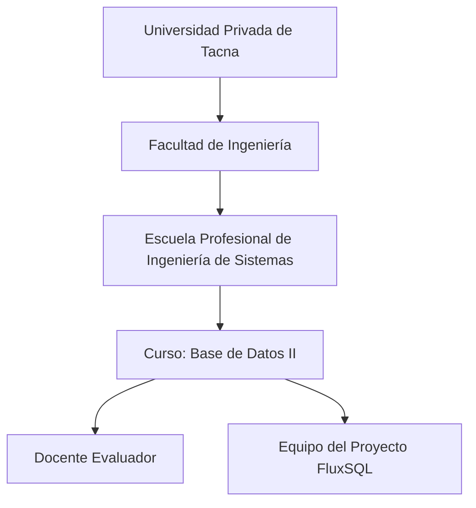

# 3. Visionamiento de la Empresa

## 3.1 Descripcion del problema

En el ámbito del diseño de bases de datos, los equipos técnicos enfrentan dificultades para documentar esquemas heredados ("legacy") y mantener sincronizados los diagramas relacionales con la base de datos real. Las soluciones existentes en la nube obligan a exponer cadenas de conexión y puertos sensibles en internet, comprometiendo la seguridad corporativa.

## 3.2 Objetivo de negocios

Proveer una herramienta de modelado visual que reduzca el tiempo de documentación de bases de datos, garantizando la seguridad de las credenciales mediante procesamiento local, y facilitando la colaboración en equipo a través de la sincronización en la nube de diagramas estandarizados.

## 3.3 Objetivo de diseño

Diseñar una solución híbrida y modular (Monorepo) que incluya:
- Una **Web App** (Next.js) para la colaboración y diseño manual mediante DDL.
- Un **Cloud API** (NestJS) para gestionar proyectos y persistir modelos estandarizados de manera segura.
- Una **Desktop App** local (Tauri + FastAPI Sidecar) que se encargue de la introspección segura de bases de datos conectadas en intranets o redes privadas sin exponer los datos sensibles.

## 3.4 Alcance del proyecto

**Incluido en la versión actual:**
- Modelado de bases de datos mediante editor de texto (DDL) y parsers.
- Extracción automatizada de esquemas mediante un ejecutable local (Sidecar FastAPI).
- Soporte para múltiples motores: PostgreSQL, MySQL, SQLite, MongoDB y SQL Server.
- Visualización interactiva de diagramas Entidad-Relación usando Mermaid.js.
- Sincronización híbrida: *SchemaModel* JSON a la nube; credenciales cifradas localmente.
- Gestión básica de proyectos, usuarios y versionado.

**Fuera de alcance en la versión actual:**
- Migraciones inversas automáticas (alterar la BD desde el diagrama interactivo).
- Reemplazo total de clientes SQL pesados (DBeaver, DataGrip).

## 3.5 Viabilidad del sistema

De acuerdo al FD01, la viabilidad del sistema es **alta**. La combinación de tecnologías open-source maduras (React, NestJS, FastAPI, Rust/Tauri) minimiza costos operativos. La estrategia de un Sidecar para conectividad elimina los obstáculos legales y de seguridad (no se requieren servidores perimetrales ni abrir puertos a internet).

## 3.6 Informacion obtenida del levantamiento de informacion

Fuentes de entrada para este ERS:
- Documento de factibilidad (`docs/formatos/FD01-Informe-Factibilidad (6).md`).
- Documento de visión (`docs/formatos/FD02-Informe-Vision (1).md`).
- Código fuente y estructura del monorepo (`apps/web`, `apps/backend-api`, `apps/desktop`).

# 4. Analisis de procesos

## 4.1 Diagrama de procesos actual

Modelado y documentación manual sin integración híbrida.

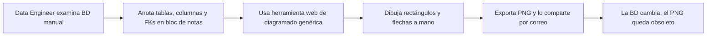

## 4.2 Diagrama de procesos propuesto

Modelado híbrido y automatizado con FluxSQL.

```mermaid
flowchart LR
    A["Usuario instala FluxSQL Desktop"] --> B["Registra credenciales seguras de BD local"]
    B --> C["Local Sidecar extrae metadatos (Information Schema)"]
    C --> D["Sidecar convierte a SchemaModel JSON"]
    D --> E["Tauri UI renderiza diagrama Mermaid automáticamente"]
    E --> F["Usuario edita el diagrama o añade notas"]
    F --> G["Sincronización a Cloud API NestJS sin enviar credenciales"]
    G --> H["Equipo consulta la versión actualizada en Web App"]
```

# 5. Especificacion de Requerimientos de Software

## 5.1 Cuadro de requerimientos funcionales inicial

| ID     | Requerimiento funcional inicial   | Criterio general de aceptación                                        |
|--------|-----------------------------------|-----------------------------------------------------------------------|
| RFI-01 | Crear diagrama manual (DDL)       | El usuario ingresa código SQL DDL y el sistema dibuja el ERD.         |
| RFI-02 | Conectar a BD Local               | El Sidecar acepta parámetros de conexión y ejecuta `ping`.            |
| RFI-03 | Extraer tablas y relaciones       | El Sidecar obtiene llaves primarias, foráneas y tipos de datos.       |
| RFI-04 | Convertir a modelo estándar       | La metadata cruda se transforma a un objeto `SchemaModel` universal.  |
| RFI-05 | Visualizar diagrama ERD           | El sistema renderiza el diagrama interactivamente usando Mermaid.     |
| RFI-06 | Gestionar proyectos y versiones   | Un diagrama puede ser versionado y asociado a un proyecto en la nube. |
| RFI-07 | Sincronización segura             | Solo el `SchemaModel` se sube al Cloud API; nunca las credenciales.   |

## 5.2 Cuadro de requerimientos no funcionales

| ID     | Requerimiento no funcional | Métrica / Umbral                                               | Evidencia esperada                                           |
|--------|----------------------------|----------------------------------------------------------------|--------------------------------------------------------------|
| RNF-01 | **Seguridad Híbrida**      | Cero (0) credenciales almacenadas en la base de datos Cloud    | Análisis de código del NestJS API y base de datos            |
| RNF-02 | **Rendimiento UI**         | Renderizado de modelos < 500 ms (hasta 100 tablas)             | Carga dinámica controlada por *debounce* en editor de código |
| RNF-03 | **Portabilidad Desktop**   | Ejecutable nativo Tauri para Windows/Linux/macOS               | Binarios cruzados compilados sin requerir Python externo     |
| RNF-04 | **Eficiencia Memoria**     | Consumo RAM en estado de reposo < 150 MB                       | Benchmark en Administrador de Tareas (vs Electron)           |
| RNF-05 | **Escalabilidad Cloud**    | Operaciones *stateless* soportando balanceo de carga           | Infraestructura Serverless/Docker en NestJS                  |

## 5.3 Cuadro de requerimientos funcionales final

| ID    | Requerimiento funcional final                                                             | Prioridad | Trazabilidad técnica (módulo/código)                                                                                |
|-------|-------------------------------------------------------------------------------------------|-----------|---------------------------------------------------------------------------------------------------------------------|
| RF-01 | Registrar y autenticar usuarios (JWT)                                                     | Alta      | `apps/backend-api` (NestJS AuthGuard)                                                                               |
| RF-02 | Parsear scripts SQL DDL y JSON Schema en el cliente                                       | Alta      | `packages/parsers/SQLDDLParser.ts`                                                                                  |
| RF-03 | Administrar múltiples perfiles de conexión local cifrada                                  | Alta      | `apps/desktop/backend-python/connection_manager.py`                                                                 |
| RF-04 | Extraer esquemas desde PostgreSQL y MySQL locales                                         | Alta      | `apps/desktop/backend-python/extractors/`                                                                           |
| RF-05 | Transformar metadata heterogénea al formato `SchemaModel`                                 | Alta      | `packages/parsers/SchemaModel.ts`                                                                                   |
| RF-06 | Renderizar diagramas usando motor gráfico dinámico Mermaid                                | Alta      | `packages/ui/DiagramViewer.tsx`                                                                                     |
| RF-07 | Sincronizar (Push/Pull) artefactos de diseño entre Local y Nube                           | Alta      | `apps/backend-api/diagrams.controller.ts`                                                                           |
| RF-08 | Integrar un puente local para Skills y agentes IA (MCP)                                   | Media     | `apps/desktop/backend-python/mcp_bridge.py`                                                                         |
| RF-09 | Exportar diagramas a formatos PNG/SVG descargables                                        | Media     | `packages/ui/ExportTools.ts`                                                                                        |

## 5.4 Regla de negocio

| ID    | Regla de negocio                                                                                    | Aplicación                                     |
|-------|-----------------------------------------------------------------------------------------------------|------------------------------------------------|
| RN-01 | **Zero-Trust Connection**: El NestJS Cloud API rechazará estructuralmente cualquier carga útil que contenga hosts, usuarios o contraseñas de bases de datos. | `CloudSyncService.ts` / DTO Validation en NestJS |
| RN-02 | El `SchemaModel` es la única fuente de verdad para el dibujado visual; el parser nunca debe graficar directamente. | Flujo de Datos Arquitectónico                  |
| RN-03 | Las contraseñas de conexión a bases de datos locales deben almacenarse en el Keyring cifrado del Sistema Operativo huésped. | `CryptoService.py` en FastAPI Sidecar          |

# 6. Fase de Desarrollo

## 6.1 Perfil del usuario

| Perfil                      | Características                           | Necesidades principales                       |
|-----------------------------|-------------------------------------------|-----------------------------------------------|
| Analista de Datos / DBA     | Conoce credenciales de conexión interna   | Generar diagramas ERD sin exponer IPs locales |
| Desarrollador Backend       | Escribe esquemas SQL frecuentemente       | Ver los cambios de su DDL en tiempo real      |
| Desarrollador Frontend      | Consume diagramas documentados            | Consultar el proyecto online sin instalar nada|
| Administrador (Team Lead)   | Organiza espacios de trabajo y accesos    | Dashboard centralizado en la nube (Web App)   |

## 6.2 Modelo Conceptual

### 6.2.1 Diagrama de paquetes

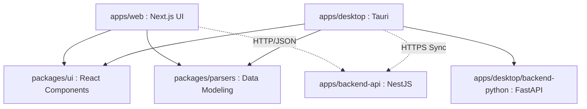

### 6.2.2 Inventario de Casos de Uso (20 CUs)

Para abarcar exhaustivamente el sistema implementado en la arquitectura híbrida (Tauri, Next.js, NestJS y FastAPI), se han definido **20 Casos de Uso** reales agrupados por módulos funcionales.

#### Módulo I: Autenticación y Nube (NestJS API)
1. **CU-01:** Iniciar sesión de usuario (JWT).
2. **CU-02:** Registrar nueva cuenta de usuario.
3. **CU-03:** Cerrar sesión de usuario.
4. **CU-04:** Visualizar galería de proyectos guardados.
5. **CU-05:** Crear nuevo proyecto de modelado en blanco.
6. **CU-06:** Guardar / Sincronizar estado del diagrama (Push).
7. **CU-07:** Cargar / Restaurar diagrama desde la nube (Pull).
8. **CU-08:** Eliminar proyecto de la nube.

#### Módulo II: Modelado Manual (Parsers TypeScript)
9. **CU-09:** Ingresar script SQL DDL manualmente.
10. **CU-10:** Parsear script DDL a diagrama en tiempo real.
11. **CU-11:** Ingresar estructura mediante JSON Schema.
12. **CU-12:** Parsear JSON Schema a diagrama.

#### Módulo III: Interacción y Exportación (UI Mermaid.js)
13. **CU-13:** Ampliar o reducir lienzo (Zoom In/Out).
14. **CU-14:** Desplazarse por el diagrama (Paneo).
15. **CU-15:** Exportar diagrama a imagen PNG.
16. **CU-16:** Exportar diagrama a vector SVG.
17. **CU-17:** Exportar diagrama a código Mermaid nativo.

#### Módulo IV: Extracción Local (Sidecar FastAPI)
18. **CU-18:** Registrar credenciales de Base de Datos local.
19. **CU-19:** Ejecutar introspección de Base de Datos local.
20. **CU-20:** Transformar metadatos crudos a `SchemaModel`.

### 6.2.3 Escenarios de casos de uso (narrativas)

A continuación, se detallan las narrativas de los 20 Casos de Uso del sistema, describiendo el flujo principal de eventos.

**Módulo I: Autenticación y Nube**

**CU-01: Iniciar sesión de usuario**
- **Actor:** Usuario
- **Descripción:** El usuario se autentica en la plataforma para acceder a sus proyectos sincronizados.
- **Precondición:** El usuario debe estar registrado.
- **Flujo Principal:** 1) El usuario ingresa email y contraseña. 2) El sistema valida credenciales contra el Cloud API. 3) Se genera y almacena el JWT localmente. 4) Se redirige al Dashboard.
- **Postcondición:** El usuario tiene una sesión activa.

**CU-02: Registrar nueva cuenta de usuario**
- **Actor:** Usuario
- **Descripción:** Creación de una nueva identidad en la base de datos de usuarios.
- **Precondición:** El email no debe existir en el sistema.
- **Flujo Principal:** 1) El usuario completa el formulario. 2) El sistema cifra la contraseña. 3) Se guarda el registro en la BD Cloud. 4) Se envía confirmación al usuario.
- **Postcondición:** El usuario está registrado y listo para iniciar sesión.

**CU-03: Cerrar sesión de usuario**
- **Actor:** Usuario
- **Descripción:** Finaliza la sesión actual por seguridad.
- **Precondición:** El usuario debe tener sesión activa.
- **Flujo Principal:** 1) El usuario selecciona "Cerrar sesión". 2) El sistema destruye el JWT local. 3) Se redirige a la pantalla de login.
- **Postcondición:** El usuario ya no tiene acceso a funciones autenticadas.

**CU-04: Visualizar galería de proyectos guardados**
- **Actor:** Usuario Autenticado
- **Descripción:** Muestra todos los diagramas asociados al usuario.
- **Precondición:** Tener sesión activa.
- **Flujo Principal:** 1) El usuario entra al Dashboard. 2) El sistema solicita proyectos al API. 3) El sistema renderiza una cuadrícula con tarjetas de proyectos.
- **Postcondición:** El usuario visualiza sus proyectos.

**CU-05: Crear nuevo proyecto de modelado**
- **Actor:** Usuario Autenticado
- **Descripción:** Inicializa un lienzo en blanco para un diagrama.
- **Precondición:** Sesión activa.
- **Flujo Principal:** 1) El usuario hace clic en "Nuevo Proyecto". 2) El sistema genera un ID temporal y un `SchemaModel` vacío. 3) Se abre el editor interactivo.
- **Postcondición:** Lienzo listo para edición.

**CU-06: Guardar / Sincronizar estado del diagrama (Push)**
- **Actor:** Usuario Autenticado
- **Descripción:** Sincroniza el JSON del diagrama actual hacia el backend NestJS.
- **Precondición:** Proyecto abierto y con cambios.
- **Flujo Principal:** 1) Clic en "Guardar". 2) El sistema extrae el `SchemaModel`. 3) Se envía vía PUT/POST al API Cloud. 4) Se notifica éxito.
- **Postcondición:** El diagrama está salvaguardado en la nube.

**CU-07: Cargar / Restaurar diagrama desde la nube (Pull)**
- **Actor:** Usuario Autenticado
- **Descripción:** Descarga un diagrama guardado y lo renderiza.
- **Precondición:** Proyecto existente.
- **Flujo Principal:** 1) Selección de proyecto en la galería. 2) El sistema obtiene el JSON del API. 3) El motor Mermaid renderiza el esquema.
- **Postcondición:** El diagrama es visible y editable.

**CU-08: Eliminar proyecto de la nube**
- **Actor:** Usuario Autenticado
- **Descripción:** Eliminación de un proyecto.
- **Precondición:** Ser dueño del proyecto.
- **Flujo Principal:** 1) Clic en eliminar. 2) Confirmación de seguridad. 3) API borra el registro. 4) Se actualiza la galería local.
- **Postcondición:** El proyecto se elimina permanentemente.

**Módulo II: Modelado Manual**

**CU-09: Ingresar script SQL DDL manualmente**
- **Actor:** Usuario (Frontend)
- **Descripción:** Uso del editor de código para sentencias SQL.
- **Precondición:** Lienzo de proyecto abierto.
- **Flujo Principal:** 1) El usuario activa la pestaña "DDL". 2) Ingresa comandos `CREATE TABLE`. 3) El editor resalta la sintaxis.
- **Postcondición:** Texto DDL listo en memoria.

**CU-10: Parsear script DDL a diagrama**
- **Actor:** Sistema (Parser Automático)
- **Descripción:** Compila el SQL a un modelo visual.
- **Precondición:** Texto DDL modificado.
- **Flujo Principal:** 1) Se dispara evento de cambio (Debounce). 2) El parser compila DDL a `SchemaModel`. 3) Mermaid actualiza el SVG.
- **Postcondición:** Diagrama visual sincronizado con código DDL.

**CU-11: Ingresar estructura mediante JSON Schema**
- **Actor:** Usuario (Frontend)
- **Descripción:** Uso del editor para colecciones NoSQL.
- **Precondición:** Lienzo abierto.
- **Flujo Principal:** 1) Activar pestaña "JSON". 2) Ingresar objetos JSON. 3) Editor valida sintaxis.
- **Postcondición:** Estructura JSON lista.

**CU-12: Parsear JSON Schema a diagrama**
- **Actor:** Sistema (Parser Automático)
- **Descripción:** Transforma JSON jerárquico a modelo visual.
- **Precondición:** JSON válido.
- **Flujo Principal:** 1) Evento de cambio. 2) Parser lee nodos y genera relaciones implícitas. 3) Mermaid actualiza el SVG.
- **Postcondición:** Diagrama visual actualizado.

**Módulo III: Interacción Visual**

**CU-13: Ampliar o reducir lienzo (Zoom)**
- **Actor:** Usuario
- **Descripción:** Acerca o aleja el ERD.
- **Precondición:** Diagrama visible.
- **Flujo Principal:** 1) Usuario usa rueda del ratón o botones +/-. 2) El módulo D3.js escala el `viewBox` del SVG.
- **Postcondición:** Nivel de zoom actualizado.

**CU-14: Desplazarse por el diagrama (Paneo)**
- **Actor:** Usuario
- **Descripción:** Arrastra el lienzo para explorar.
- **Precondición:** Diagrama mayor al área visible.
- **Flujo Principal:** 1) Usuario mantiene clic y arrastra. 2) Módulo D3.js traslada coordenadas X,Y del `viewBox`.
- **Postcondición:** Nueva área del diagrama es visible.

**CU-15: Exportar diagrama a imagen PNG**
- **Actor:** Usuario
- **Descripción:** Descarga el diagrama como PNG.
- **Precondición:** Diagrama generado.
- **Flujo Principal:** 1) Clic en "Exportar PNG". 2) Sistema dibuja el SVG en un Canvas HTML5. 3) Transforma a base64 y fuerza descarga.
- **Postcondición:** Archivo `.png` descargado.

**CU-16: Exportar diagrama a vector SVG**
- **Actor:** Usuario
- **Descripción:** Descarga limpia del SVG.
- **Precondición:** Diagrama generado.
- **Flujo Principal:** 1) Clic en "Exportar SVG". 2) Extrae tag `<svg>`. 3) Fuerza descarga de Blob.
- **Postcondición:** Archivo `.svg` descargado.

**CU-17: Exportar diagrama a código Mermaid**
- **Actor:** Usuario
- **Descripción:** Recupera el texto plano nativo.
- **Precondición:** Diagrama generado.
- **Flujo Principal:** 1) Clic en "Exportar Mermaid". 2) Extrae el string subyacente. 3) Fuerza descarga de Blob.
- **Postcondición:** Archivo `.mmd` descargado.

**Módulo IV: Extracción Local**

**CU-18: Registrar credenciales de Base de Datos local**
- **Actor:** Usuario Técnico (DBA)
- **Descripción:** Guarda de forma segura las credenciales locales.
- **Precondición:** App Desktop abierta.
- **Flujo Principal:** 1) DBA ingresa Host, User, Pass. 2) Interfaz Tauri envía Pass al SO Keyring. 3) Guarda metadatos en LocalStorage.
- **Postcondición:** Perfil de conexión listo y seguro.

**CU-19: Ejecutar introspección de Base de Datos local**
- **Actor:** Sistema (Python Sidecar)
- **Descripción:** Consulta metadatos físicos de una BD.
- **Precondición:** Credenciales registradas.
- **Flujo Principal:** 1) UI solicita extracción. 2) Sidecar se conecta a la BD. 3) Sidecar ejecuta sentencias `SELECT * FROM information_schema`. 4) Retorna array de tablas y columnas crudas.
- **Postcondición:** Información estructural extraída de la BD física.

**CU-20: Transformar metadatos crudos a SchemaModel**
- **Actor:** Sistema (Python Sidecar)
- **Descripción:** Estandariza la salida de bases heterogéneas.
- **Precondición:** Metadatos extraídos (CU-19).
- **Flujo Principal:** 1) Transformador mapea tipos específicos (e.g. `VARCHAR` a `string`). 2) Serializa a JSON estructurado (`SchemaModel`). 3) Devuelve al Frontend para graficado.
- **Postcondición:** El Frontend recibe un JSON universal procesable.

## 6.3 Modelo Lógico

### 6.3.1 Análisis de objetos por caso de uso

A continuación se identifican, para cada caso de uso, los objetos participantes clasificados según el patrón BCE (Boundary – Control – Entity).

**CU-01: Iniciar sesión de usuario**

| Tipo     | Objeto              | Responsabilidad                                      |
|----------|----------------------|------------------------------------------------------|
| Boundary | LoginForm            | Interfaz de entrada de email y contraseña             |
| Control  | AuthController       | Valida credenciales y genera JWT                      |
| Entity   | Usuario              | Registro persistente en BD Cloud                      |

**CU-02: Registrar nueva cuenta de usuario**

| Tipo     | Objeto              | Responsabilidad                                      |
|----------|----------------------|------------------------------------------------------|
| Boundary | RegisterForm         | Formulario de registro de datos personales            |
| Control  | AuthController       | Cifra contraseña y crea registro                      |
| Entity   | Usuario              | Nuevo registro en la tabla de usuarios                |

**CU-03: Cerrar sesión de usuario**

| Tipo     | Objeto              | Responsabilidad                                      |
|----------|----------------------|------------------------------------------------------|
| Boundary | NavBar               | Botón de cierre de sesión en la barra de navegación   |
| Control  | SessionManager       | Destruye token JWT del almacenamiento local           |
| Entity   | TokenStore           | Almacenamiento local del JWT (LocalStorage)           |

**CU-04: Visualizar galería de proyectos guardados**

| Tipo     | Objeto              | Responsabilidad                                      |
|----------|----------------------|------------------------------------------------------|
| Boundary | DashboardView        | Cuadrícula de tarjetas de proyectos                   |
| Control  | ProjectController    | Solicita lista de proyectos al API Cloud              |
| Entity   | Proyecto             | Registro de proyecto en BD Cloud                      |

**CU-05: Crear nuevo proyecto de modelado**

| Tipo     | Objeto              | Responsabilidad                                      |
|----------|----------------------|------------------------------------------------------|
| Boundary | NewProjectButton     | Botón de creación en el Dashboard                     |
| Control  | ProjectController    | Genera UUID temporal e inicializa SchemaModel vacío   |
| Entity   | Proyecto             | Nuevo registro con estado inicial                     |
| Entity   | SchemaModel          | Modelo JSON vacío asociado al proyecto                |

**CU-06: Guardar / Sincronizar estado del diagrama (Push)**

| Tipo     | Objeto              | Responsabilidad                                      |
|----------|----------------------|------------------------------------------------------|
| Boundary | SaveButton           | Botón "Guardar" en el editor                          |
| Control  | CloudSyncService     | Envía SchemaModel al API mediante PUT/POST            |
| Entity   | Diagrama             | Registro versionado del SchemaModel en la nube        |

**CU-07: Cargar / Restaurar diagrama desde la nube (Pull)**

| Tipo     | Objeto              | Responsabilidad                                      |
|----------|----------------------|------------------------------------------------------|
| Boundary | ProjectCard          | Tarjeta seleccionable en la galería                   |
| Control  | CloudSyncService     | Descarga SchemaModel desde el API Cloud               |
| Entity   | Diagrama             | Registro persistido en BD Cloud                       |

**CU-08: Eliminar proyecto de la nube**

| Tipo     | Objeto              | Responsabilidad                                      |
|----------|----------------------|------------------------------------------------------|
| Boundary | DeleteModal          | Diálogo de confirmación de eliminación                |
| Control  | ProjectController    | Envía solicitud DELETE al API                         |
| Entity   | Proyecto             | Registro eliminado de la BD                           |

**CU-09: Ingresar script SQL DDL manualmente**

| Tipo     | Objeto              | Responsabilidad                                      |
|----------|----------------------|------------------------------------------------------|
| Boundary | MonacoEditor         | Editor de código integrado con resaltado SQL          |
| Control  | EditorController     | Gestiona estado del texto DDL en memoria              |
| Entity   | DDLBuffer            | Cadena de texto DDL almacenada temporalmente          |

**CU-10: Parsear script DDL a diagrama**

| Tipo     | Objeto              | Responsabilidad                                      |
|----------|----------------------|------------------------------------------------------|
| Boundary | DiagramViewer        | Componente visual que muestra el ERD Mermaid          |
| Control  | SQLDDLParser         | Compila texto SQL a estructura SchemaModel            |
| Entity   | SchemaModel          | Modelo intermedio JSON generado por el parser         |

**CU-11: Ingresar estructura mediante JSON Schema**

| Tipo     | Objeto              | Responsabilidad                                      |
|----------|----------------------|------------------------------------------------------|
| Boundary | MonacoEditorJSON     | Editor de código con modo JSON activo                 |
| Control  | EditorController     | Gestiona estado del texto JSON en memoria             |
| Entity   | JSONBuffer           | Cadena de texto JSON almacenada temporalmente         |

**CU-12: Parsear JSON Schema a diagrama**

| Tipo     | Objeto              | Responsabilidad                                      |
|----------|----------------------|------------------------------------------------------|
| Boundary | DiagramViewer        | Componente visual que muestra el ERD Mermaid          |
| Control  | JSONSchemaParser     | Transforma JSON jerárquico a SchemaModel              |
| Entity   | SchemaModel          | Modelo intermedio JSON generado por el parser         |

**CU-13: Ampliar o reducir lienzo (Zoom)**

| Tipo     | Objeto              | Responsabilidad                                      |
|----------|----------------------|------------------------------------------------------|
| Boundary | CanvasView           | Área visual del diagrama SVG                          |
| Control  | D3ZoomModule         | Intercepta evento de scroll y escala viewBox          |
| Entity   | ViewBoxState         | Estado actual de escala y posición del lienzo         |

**CU-14: Desplazarse por el diagrama (Paneo)**

| Tipo     | Objeto              | Responsabilidad                                      |
|----------|----------------------|------------------------------------------------------|
| Boundary | CanvasView           | Área visual del diagrama SVG                          |
| Control  | D3PanModule          | Intercepta evento de arrastre y traslada coordenadas  |
| Entity   | ViewBoxState         | Estado actual de posición X,Y del lienzo              |

**CU-15: Exportar diagrama a imagen PNG**

| Tipo     | Objeto              | Responsabilidad                                      |
|----------|----------------------|------------------------------------------------------|
| Boundary | ExportMenu           | Menú desplegable con opciones de exportación          |
| Control  | ExportService        | Convierte SVG a Canvas y genera Blob descargable      |
| Entity   | CanvasBuffer         | Canvas HTML5 temporal con la imagen rasterizada       |

**CU-16: Exportar diagrama a vector SVG**

| Tipo     | Objeto              | Responsabilidad                                      |
|----------|----------------------|------------------------------------------------------|
| Boundary | ExportMenu           | Menú desplegable con opciones de exportación          |
| Control  | ExportService        | Extrae nodo DOM SVG y lo serializa                    |
| Entity   | SVGBlob              | Blob codificado del archivo SVG                       |

**CU-17: Exportar diagrama a código Mermaid**

| Tipo     | Objeto              | Responsabilidad                                      |
|----------|----------------------|------------------------------------------------------|
| Boundary | ExportMenu           | Menú desplegable con opciones de exportación          |
| Control  | ExportService        | Recupera string Mermaid subyacente                    |
| Entity   | MermaidBlob          | Blob de texto plano del código Mermaid                |

**CU-18: Registrar credenciales de Base de Datos local**

| Tipo     | Objeto              | Responsabilidad                                      |
|----------|----------------------|------------------------------------------------------|
| Boundary | ConnectionForm       | Formulario de ingreso de Host, User, Pass             |
| Control  | ConnectionManager    | Cifra y almacena credenciales en el SO Keyring        |
| Entity   | ConnectionProfile    | Perfil de conexión persistido localmente              |

**CU-19: Ejecutar introspección de Base de Datos local**

| Tipo     | Objeto              | Responsabilidad                                      |
|----------|----------------------|------------------------------------------------------|
| Boundary | ExtractButton        | Botón de extracción en la interfaz Desktop            |
| Control  | ExtractorFactory     | Selecciona el extractor adecuado según motor de BD    |
| Entity   | RawMetadata          | Datos crudos de tablas, columnas y FKs                |

**CU-20: Transformar metadatos crudos a SchemaModel**

| Tipo     | Objeto              | Responsabilidad                                      |
|----------|----------------------|------------------------------------------------------|
| Boundary | DiagramViewer        | Componente que recibe y renderiza el SchemaModel      |
| Control  | SchemaTransformer    | Mapea tipos heterogéneos a formato universal          |
| Entity   | SchemaModel          | Modelo JSON estandarizado resultante                  |

### 6.3.2 Diagrama de actividades con objetos

*Figura 1. Diagrama de actividades con objetos del flujo principal de FluxSQL.*

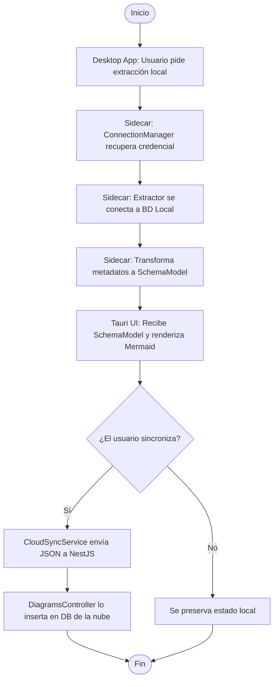

*Nota.* Elaboración propia basada en la arquitectura híbrida de FluxSQL.

### 6.3.3 Diagramas de secuencia

A continuación se presenta un diagrama de secuencia por cada uno de los 20 Casos de Uso del sistema.

#### DS-01: Iniciar sesión de usuario

*Figura 2. Diagrama de secuencia del CU-01: Iniciar sesión de usuario.*

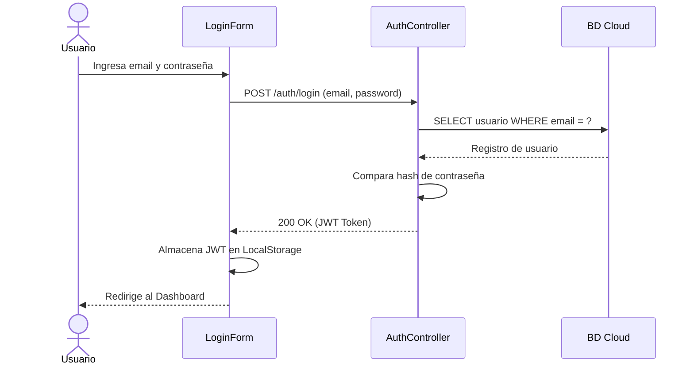

*Nota.* Elaboración propia.

#### DS-02: Registrar nueva cuenta de usuario

*Figura 3. Diagrama de secuencia del CU-02: Registrar nueva cuenta de usuario.*

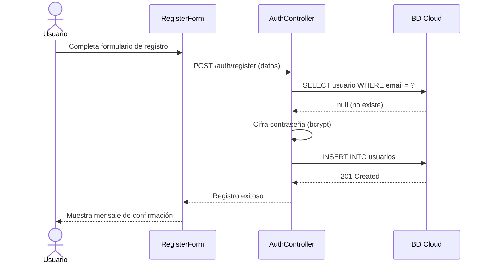

*Nota.* Elaboración propia.

#### DS-03: Cerrar sesión de usuario

*Figura 4. Diagrama de secuencia del CU-03: Cerrar sesión de usuario.*

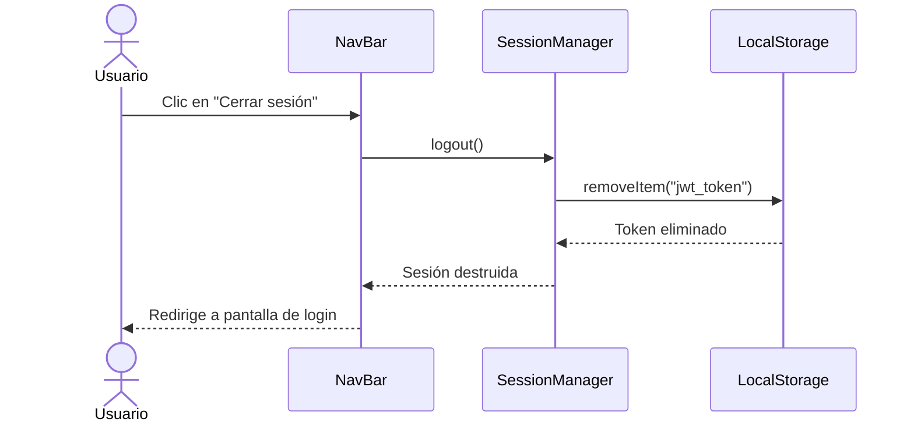

*Nota.* Elaboración propia.

#### DS-04: Visualizar galería de proyectos guardados

*Figura 5. Diagrama de secuencia del CU-04: Visualizar galería de proyectos.*

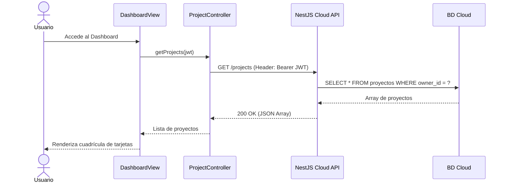

*Nota.* Elaboración propia.

#### DS-05: Crear nuevo proyecto de modelado

*Figura 6. Diagrama de secuencia del CU-05: Crear nuevo proyecto de modelado.*

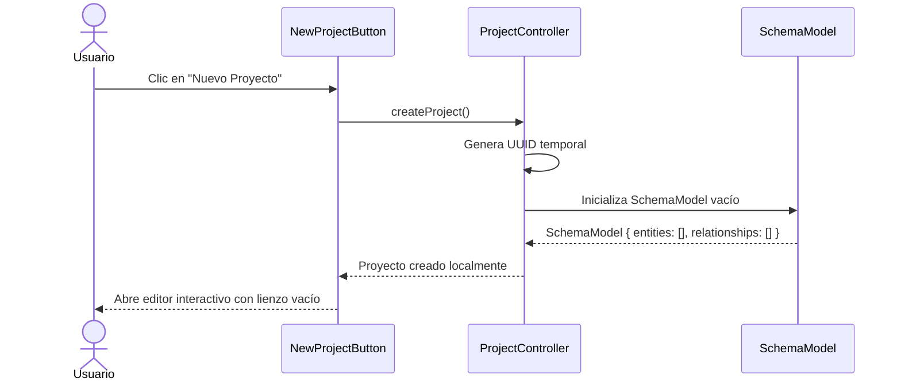

*Nota.* Elaboración propia.

#### DS-06: Guardar / Sincronizar estado del diagrama (Push)

*Figura 7. Diagrama de secuencia del CU-06: Sincronizar diagrama (Push).*

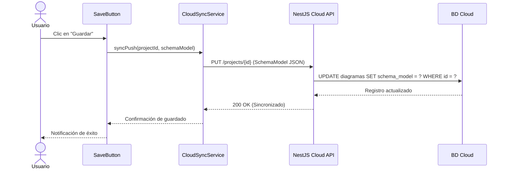

*Nota.* Elaboración propia. El payload nunca contiene credenciales de BD.

#### DS-07: Cargar / Restaurar diagrama desde la nube (Pull)

*Figura 8. Diagrama de secuencia del CU-07: Restaurar diagrama (Pull).*

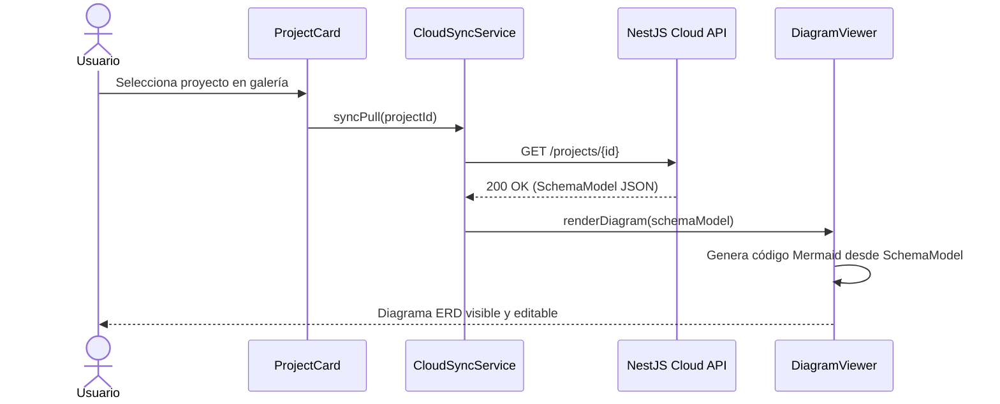

*Nota.* Elaboración propia.

#### DS-08: Eliminar proyecto de la nube

*Figura 9. Diagrama de secuencia del CU-08: Eliminar proyecto.*

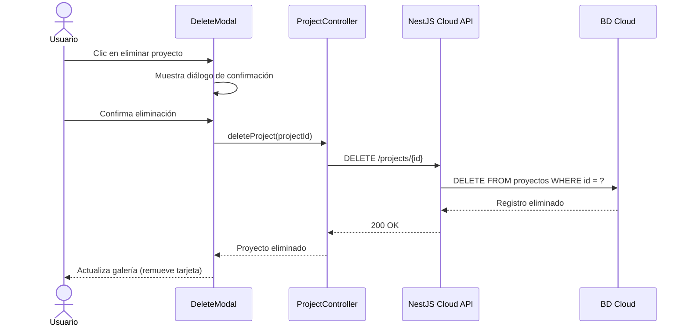

*Nota.* Elaboración propia.

#### DS-09: Ingresar script SQL DDL manualmente

*Figura 10. Diagrama de secuencia del CU-09: Ingresar script SQL DDL.*

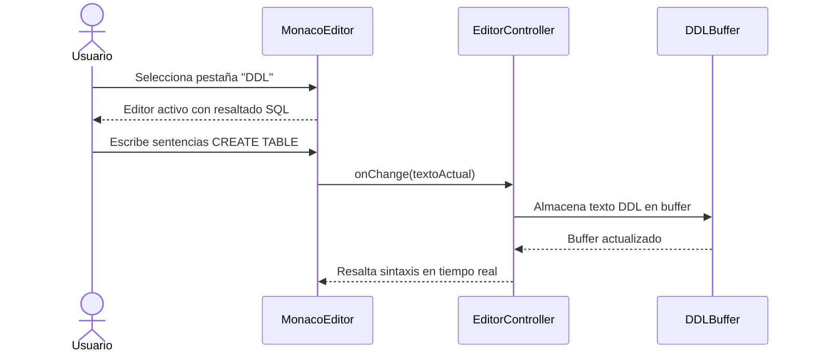

*Nota.* Elaboración propia.

#### DS-10: Parsear script DDL a diagrama

*Figura 11. Diagrama de secuencia del CU-10: Parsear DDL a diagrama.*

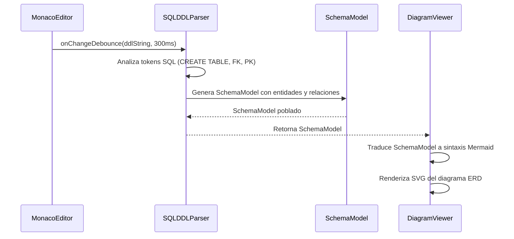

*Nota.* Elaboración propia. El parseo ocurre en el lado del cliente.

#### DS-11: Ingresar estructura mediante JSON Schema

*Figura 12. Diagrama de secuencia del CU-11: Ingresar JSON Schema.*

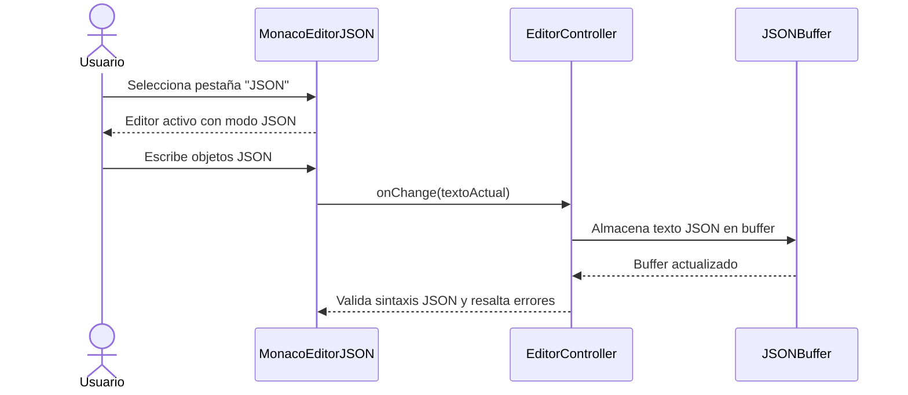

*Nota.* Elaboración propia.

#### DS-12: Parsear JSON Schema a diagrama

*Figura 13. Diagrama de secuencia del CU-12: Parsear JSON Schema a diagrama.*

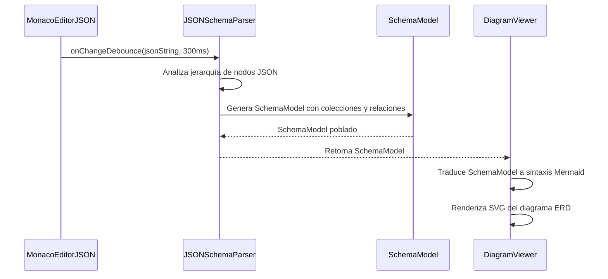

*Nota.* Elaboración propia.

#### DS-13: Ampliar o reducir lienzo (Zoom)

*Figura 14. Diagrama de secuencia del CU-13: Zoom del lienzo.*

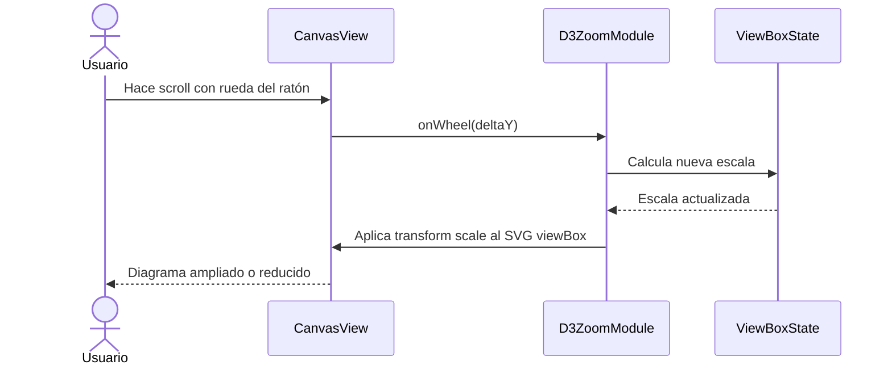

*Nota.* Elaboración propia.

#### DS-14: Desplazarse por el diagrama (Paneo)

*Figura 15. Diagrama de secuencia del CU-14: Paneo del lienzo.*

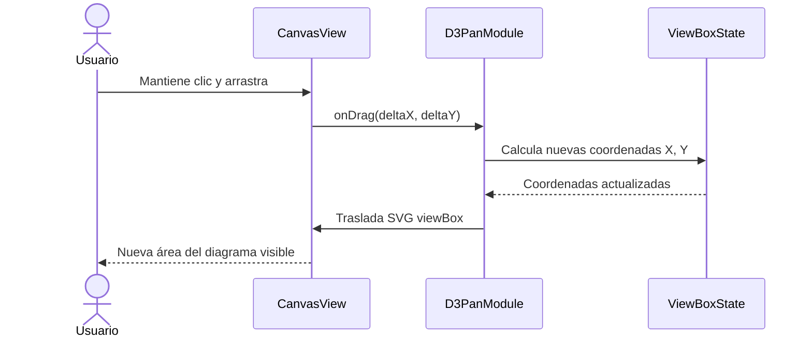

*Nota.* Elaboración propia.

#### DS-15: Exportar diagrama a imagen PNG

*Figura 16. Diagrama de secuencia del CU-15: Exportar a PNG.*

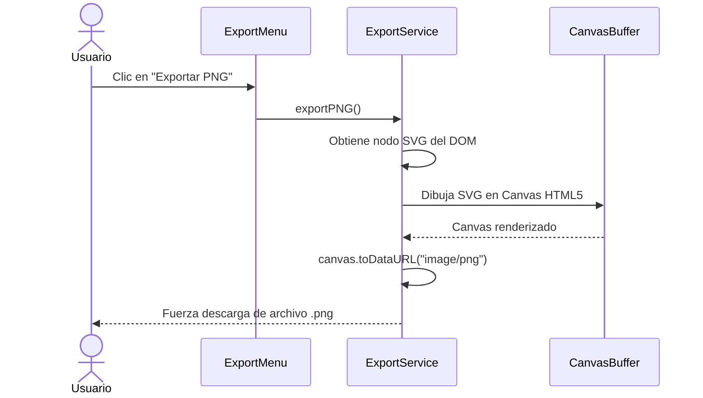

*Nota.* Elaboración propia.

#### DS-16: Exportar diagrama a vector SVG

*Figura 17. Diagrama de secuencia del CU-16: Exportar a SVG.*

```mermaid
sequenceDiagram
    actor Usuario
    participant EM as ExportMenu
    participant ES as ExportService

    Usuario ->> EM: Clic en "Exportar SVG"
    EM ->> ES: exportSVG()
    ES ->> ES: Extrae nodo SVG del DOM
    ES ->> ES: Serializa a XMLSerializer
    ES ->> ES: Crea Blob de tipo "image/svg+xml"
    ES -->> Usuario: Fuerza descarga de archivo .svg
```

*Nota.* Elaboración propia.

#### DS-17: Exportar diagrama a código Mermaid

*Figura 18. Diagrama de secuencia del CU-17: Exportar a Mermaid.*

```mermaid
sequenceDiagram
    actor Usuario
    participant EM as ExportMenu
    participant ES as ExportService

    Usuario ->> EM: Clic en "Exportar Mermaid"
    EM ->> ES: exportMermaid()
    ES ->> ES: Recupera string Mermaid del estado interno
    ES ->> ES: Crea Blob de tipo "text/plain"
    ES -->> Usuario: Fuerza descarga de archivo .mmd
```

*Nota.* Elaboración propia.

#### DS-18: Registrar credenciales de Base de Datos local

*Figura 19. Diagrama de secuencia del CU-18: Registrar credenciales locales.*

```mermaid
sequenceDiagram
    actor DBA
    participant CF as ConnectionForm
    participant CM as ConnectionManager
    participant KR as OS Keyring
    participant LS as LocalStorage

    DBA ->> CF: Ingresa Host, Puerto, User, Password, Motor
    CF ->> CM: saveConnection(connectionData)
    CM ->> KR: Almacena password cifrada en Keyring del SO
    KR -->> CM: Password almacenada de forma segura
    CM ->> LS: Guarda metadatos (host, puerto, motor)
    LS -->> CM: Metadatos persistidos
    CM -->> CF: Perfil de conexión creado
    CF -->> DBA: Confirmación visual de perfil guardado
```

*Nota.* Elaboración propia. Las credenciales jamás se envían a la nube.

#### DS-19: Ejecutar introspección de Base de Datos local

*Figura 20. Diagrama de secuencia del CU-19: Introspección de BD local.*

```mermaid
sequenceDiagram
    actor DBA
    participant UI as Tauri UI
    participant SC as FastAPI Sidecar
    participant CM as ConnectionManager
    participant EF as ExtractorFactory
    participant BD as BD Local

    DBA ->> UI: Clic en "Extraer Esquema"
    UI ->> SC: POST /extract { connectionId }
    SC ->> CM: getDecryptedConnection(connectionId)
    CM -->> SC: Connection string descifrada
    SC ->> EF: create(motor)
    EF -->> SC: Instancia de PostgresExtractor o MySQLExtractor
    SC ->> BD: SELECT * FROM information_schema.tables, columns, key_column_usage
    BD -->> SC: Metadatos crudos (tablas, columnas, FKs)
    SC -->> UI: 200 OK (RawMetadata JSON)
```

*Nota.* Elaboración propia.

#### DS-20: Transformar metadatos crudos a SchemaModel

*Figura 21. Diagrama de secuencia del CU-20: Transformar a SchemaModel.*

```mermaid
sequenceDiagram
    participant SC as FastAPI Sidecar
    participant ST as SchemaTransformer
    participant SM as SchemaModel
    participant UI as Tauri UI
    participant DV as DiagramViewer

    SC ->> ST: transform(rawMetadata)
    ST ->> ST: Mapea tipos PG/MySQL a tipos universales
    ST ->> ST: Identifica relaciones FK entre tablas
    ST ->> SM: Construye SchemaModel JSON
    SM -->> ST: SchemaModel completo
    ST -->> SC: Retorna SchemaModel
    SC -->> UI: 200 OK (SchemaModel JSON)
    UI ->> DV: renderDiagram(schemaModel)
    DV -->> UI: Diagrama ERD renderizado
```

*Nota.* Elaboración propia.

### 6.3.4 Diagrama de clases

*Figura 22. Diagrama de clases del dominio de FluxSQL.*

```mermaid
classDiagram
    class SchemaModel {
        +entities: Entity[]
        +relationships: Relationship[]
    }
    class Entity {
        +name: String
        +attributes: Attribute[]
    }
    class Attribute {
        +name: String
        +type: String
        +isPrimaryKey: Boolean
    }
    class BaseExtractor {
        <<interface>>
        +extract(connString): SchemaModel
    }
    class PostgresExtractor
    class MySQLExtractor
    
    class SQLParser {
        +parseString(ddl: String): SchemaModel
    }

    SchemaModel "1" *-- "*" Entity
    Entity "1" *-- "*" Attribute
    BaseExtractor ..> SchemaModel : Produce
    BaseExtractor <|.. PostgresExtractor
    BaseExtractor <|.. MySQLExtractor
    SQLParser ..> SchemaModel : Produce
```

*Nota.* Elaboración propia.

# 7. Conclusiones

1. La arquitectura del sistema FluxSQL demuestra ser viable y altamente segura, implementando políticas modernas de separación de dominios (Cloud vs Local).
2. El ERS valida la necesidad de un patrón *Sidecar* para habilitar la introspección profunda de bases de datos sin vulnerar políticas de IT empresariales ni exponer los puertos a internet.
3. El uso estandarizado del modelo `SchemaModel` proporciona la base perfecta para integrar otros lenguajes, motores y eventualmente agentes MCP o IA, sin tener que rediseñar el motor gráfico de React (Mermaid).

# 8. Recomendaciones

1. **Mantener Trazabilidad**: El diseño de la nube (NestJS) y del Sidecar (FastAPI) deben evolucionar de la mano respecto al DTO `SchemaModel` para evitar incompatibilidades durante la sincronización.
2. **Cobertura BDD**: Automatizar la verificación de los escenarios de seguridad descritos en BDD usando Cypress o Playwright durante los pipelines de integración.
3. **Optimización**: Asegurar que los extractores (PostgreSQL/MySQL) utilicen consultas eficientes en las vistas del sistema (`information_schema`) para evitar sobrecargar bases de datos en producción.

# 9. Bibliografia

1. Pressman, R. S., & Maxim, B. R. (2020). *Software Engineering: A Practitioner's Approach*.
2. FastAPI Official Documentation. (2026). *Building Python APIs with modern typing*.
3. NestJS Core Team. (2026). *A progressive Node.js framework for building scalable server-side applications*.
4. Tauri Studio. (2026). *Build smaller, faster, and more secure desktop applications*.

# 10. Webgrafia

- Repositorio del proyecto FluxSQL: `README.md` y estructura de directorios.
- Diagramado gráfico web: [Mermaid.js](https://mermaid.js.org/)
- Framework Frontend: [Next.js](https://nextjs.org/)
- Construcción Desktop: [Tauri](https://tauri.app/)

# 11. Historias de Usuario, Criterios y Escenarios BDD

A continuación se definen los escenarios utilizando lenguaje Gherkin orientados al núcleo híbrido de FluxSQL.

## HU-01 Extracción local segura de esquemas de BD

**Como** Ingeniero de Datos, **quiero** conectar la aplicación de escritorio a mi BD local **para** extraer su estructura gráfica sin revelar mis credenciales a internet.

**CA-01.1:** Ejecución restringida al entorno Sidecar.

- **Escenario 01:** **Dado** que el usuario ingresa su usuario y contraseña, **cuando** el Sidecar intenta la extracción, **entonces** los metadatos de estructura (tablas, columnas) se extraen exitosamente.
- **Escenario 02:** **Dado** un `SchemaModel` ya generado localmente, **cuando** la aplicación Desktop se sincroniza con el Cloud API, **entonces** el payload HTTPS enviado no contiene claves ni credenciales en absoluto.

**CA-01.2:** Soporte de motores relacionales.

- **Escenario 03:** **Dado** que se selecciona el motor MySQL, **cuando** el Sidecar es invocado, **entonces** utiliza el extractor y driver compatible para MySQL.
- **Escenario 04:** **Dado** un servidor inaccesible o apagado, **cuando** se ejecuta la conexión, **entonces** el Sidecar atrapa el timeout y el frontend muestra un error legible sin corromperse.

## HU-02 Modelado dinámico mediante texto (DDL)

**Como** Desarrollador, **quiero** escribir comandos `CREATE TABLE` en la web **para** ver el diagrama ERD reaccionar en tiempo real.

**CA-02.1:** Parseo en tiempo real (Client-side).

- **Escenario 05:** **Dado** un editor de código DDL activo, **cuando** el usuario termina de escribir un comando SQL válido, **entonces** el diagrama Mermaid se actualiza visualmente en menos de 500ms.
- **Escenario 06:** **Dado** un error de sintaxis SQL en el editor, **cuando** el parser evalúa el texto, **entonces** el diagrama visual mantiene el estado previo y se resalta la línea con error.

## HU-03 Sincronización híbrida de proyectos

**Como** Team Lead, **quiero** poder ver en la nube los diagramas actualizados por mi equipo local **para** colaborar y comentar el diseño.

**CA-03.1:** Actualización de versiones en NestJS.

- **Escenario 07:** **Dado** un diagrama con el estado local modificado, **cuando** el usuario hace clic en "Sincronizar", **entonces** el API Cloud responde `201` guardando la nueva versión.
- **Escenario 08:** **Dado** un token de autenticación (JWT) vencido, **cuando** la Desktop App intenta sincronizar, **entonces** la operación falla con estado `401 Unauthorized` y se notifica al usuario.

| Historia | Escenarios | Objetivo Funcional |
|----------|------------|--------------------|
| HU-01 | 01-04 | Garantizar arquitectura Zero-Trust y uso de FastAPI Sidecar. |
| HU-02 | 05-06 | Validar el parseo cliente (Next.js/TS) e interactividad Mermaid. |
| HU-03 | 07-08 | Sincronización Cloud API (NestJS) con seguridad perimetral. |

---
*Fin del documento.*
