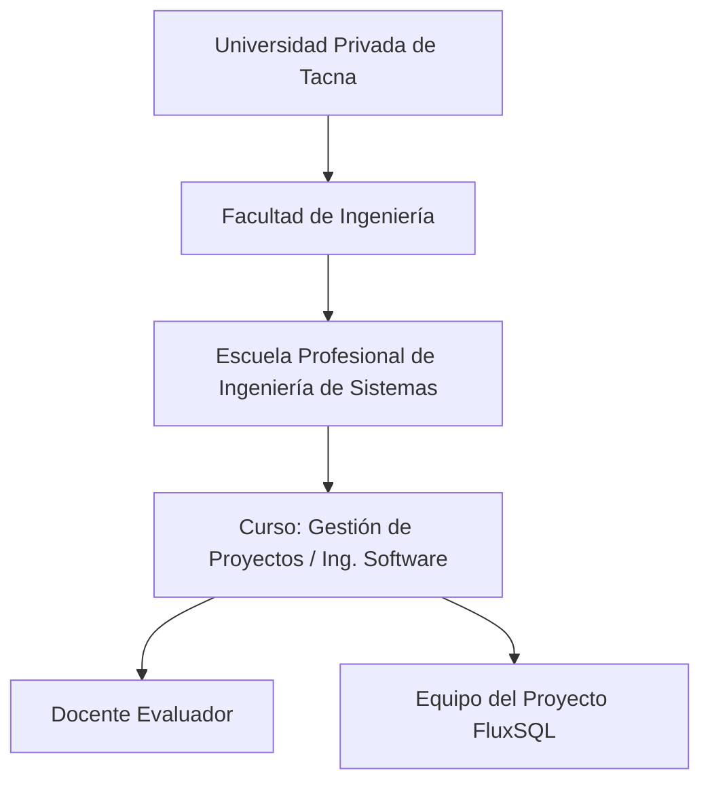
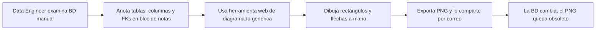
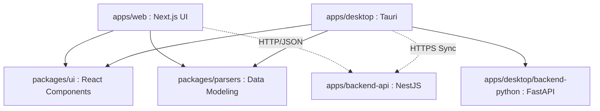
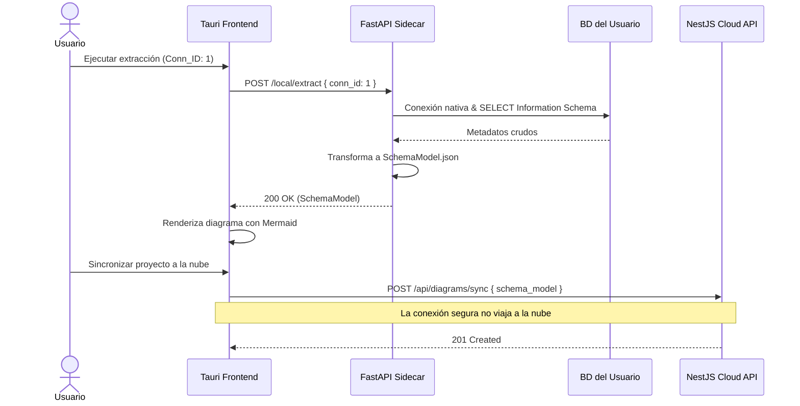
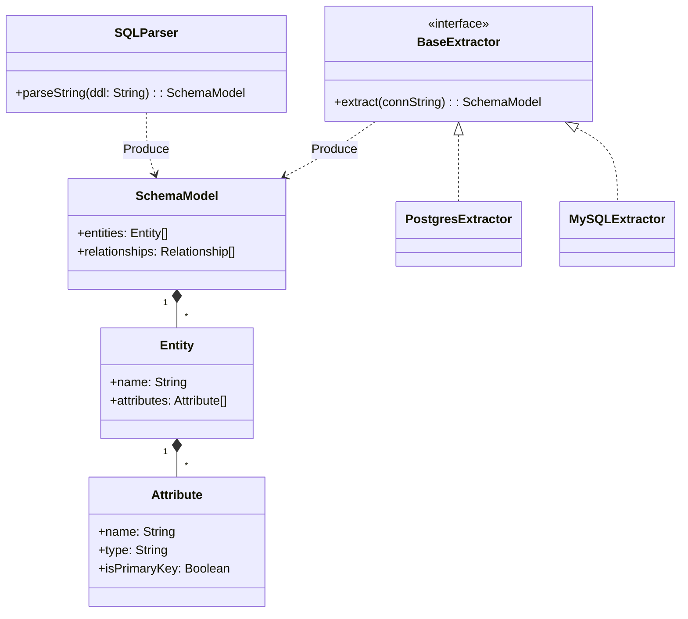

<center>


**UNIVERSIDAD PRIVADA DE TACNA**

**FACULTAD DE INGENIERÍA**

**Escuela Profesional de Ingeniería de Sistemas**

**Informe de Especificación de Requerimientos**

**Plataforma de Modelado y Sincronización de Diagramas (FluxSQL)**

Curso: *Gestión de Proyectos / Ingeniería de Software*

Docente: *Mag. Patrick Cuadros Quiroga*

Integrantes:

***Zapana Murillo, Kiara Holly (2023077087)***

***Vargas Espinoza, Jefferson Alfonso (2023076820)***

**Tacna - Perú**

***2026***

</center>

<div style="page-break-after: always; visibility: hidden">\pagebreak</div>

Sistema *Plataforma de Modelado y Sincronización de Diagramas (FluxSQL)*

Informe de Especificación de Requerimientos

Versión *2.1*

| CONTROL DE VERSIONES |           |              |               |            |                 |
|:--------------------:|:----------|:-------------|:--------------|:-----------|:----------------|
|       Versión        | Hecha por | Revisada por | Aprobada por  | Fecha      | Motivo          |
|         1.0          | KHZM, JAVE| KHZM, JAVE   | P. Cuadros Q. | 2026-04-22 | Versión inicial (DBCanvas) |
|         2.0          | KHZM, JAVE| KHZM, JAVE   | P. Cuadros Q. | 2026-06-25 | Actualización de arquitectura (Sidecar / Cloud) |
|         2.1          | KHZM, JAVE| KHZM, JAVE   | P. Cuadros Q. | 2026-07-04 | Unificación a nuevo formato institucional BDD |

# ÍNDICE GENERAL

1. [Introducción](#1-introducción)
2. [Generalidades de la Empresa](#2-generalidades-de-la-empresa)
    1. [Nombre de la Empresa](#21-nombre-de-la-empresa)
    2. [Visión](#22-visión)
    3. [Misión](#23-misión)
    4. [Organigrama](#24-organigrama)
3. [Visionamiento de la Empresa](#3-visionamiento-de-la-empresa)
    1. [Descripcion del problema](#31-descripcion-del-problema)
    2. [Objetivo de Negocios](#32-objetivo-de-negocios)
    3. [Objetivo de diseño](#33-objetivo-de-diseño)
    4. [Alcance del proyecto](#34-alcance-del-proyecto)
    5. [Viabilidad del sistema](#35-viabilidad-del-sistema)
    6. [Informacion obtenida del Levantamiento de informacion](#36-informacion-obtenida-del-levantamiento-de-informacion)
4. [Analisis de procesos](#4-analisis-de-procesos)
    1. [Diagrama de Procesos Actual](#41-diagrama-de-procesos-actual)
    2. [Diagrama de Procesos Propuesto](#42-diagrama-de-procesos-propuesto)
5. [Especificacion de Requerimientos de Software](#5-especificacion-de-requerimientos-de-software)
    1. [Cuadro de Requerimientos funcionales Inicial](#51-cuadro-de-requerimientos-funcionales-inicial)
    2. [Cuadro de Requerimientos no funcionales](#52-cuadro-de-requerimientos-no-funcionales)
    3. [Cuadro de Requerimientos funcionales Final](#53-cuadro-de-requerimientos-funcionales-final)
    4. [Regla de Negocio](#54-regla-de-negocio)
6. [Fase de Desarrollo](#6-fase-de-desarrollo)
    1. [Perfil del Usuario](#61-perfil-del-usuario)
    2. [Modelo Conceptual](#62-modelo-conceptual)
        1. [Diagrama de paquetes](#621-diagrama-de-paquetes)
        2. [Diagrama de casos de uso](#622-diagrama-de-casos-de-uso)
        3. [Escenarios de casos de uso (narrativas)](#623-escenarios-de-casos-de-uso-narrativas)
    3. [Modelo Lógico](#63-modelo-lógico)
        1. [Analisis de Objetos](#631-analisis-de-objetos)
        2. [Diagrama de Actividades con objetos](#632-diagrama-de-actividades-con-objetos)
        3. [Diagrama de secuencia](#633-diagrama-de-secuencia)
        4. [Diagrama de clases](#634-diagrama-de-clases)
7. [Conclusiones](#7-conclusiones)
8. [Recomendaciones](#8-recomendaciones)
9. [Bibliografia](#9-bibliografia)
10. [Webgrafia](#10-webgrafia)
11. [Historias de Usuario, Criterios y Escenarios BDD](#11-historias-de-usuario-criterios-y-escenarios-bdd)

<div style="page-break-after: always; visibility: hidden">\pagebreak</div>

# 1. Introducción

El presente Informe de Especificación de Requerimientos de Software (ERS) define, de manera verificable, las capacidades
funcionales y no funcionales del sistema **FluxSQL**. Este documento integra la visión académica del proyecto (FD02), la factibilidad evaluada (FD01) y el estado actual del código fuente en el monorepo para asegurar la trazabilidad real entre requisitos e implementación.

FluxSQL es una plataforma orientada al modelado de bases de datos que permite la creación manual de diagramas mediante código DDL o la extracción automatizada de esquemas directamente desde motores locales (PostgreSQL, MySQL, SQLite, etc.) utilizando un Sidecar en Python. El sistema garantiza un entorno híbrido donde los artefactos seguros se sincronizan con la nube (NestJS), mientras que las credenciales permanecen estrictamente cifradas en el equipo del usuario (Tauri).

# 2. Generalidades de la Empresa

## 2.1 Nombre de la empresa

Universidad Privada de Tacna – Facultad de Ingeniería – Escuela Profesional de Ingeniería de Sistemas.

## 2.2 Visión

Formar profesionales líderes, innovadores y comprometidos con la calidad, capaces de desarrollar soluciones tecnológicas
aplicadas a problemas reales del entorno.

## 2.3 Misión

Brindar formación integral en ingeniería de software, promoviendo investigación aplicada, ética profesional y producción
de software de calidad con impacto académico y social.

## 2.4 Organigrama



# 3. Visionamiento de la Empresa

## 3.1 Descripcion del problema

En el ámbito del diseño de bases de datos, los equipos técnicos enfrentan dificultades para documentar esquemas heredados ("legacy") y mantener sincronizados los diagramas relacionales con la base de datos real. Las soluciones existentes en la nube obligan a exponer cadenas de conexión y puertos sensibles en internet, comprometiendo la seguridad corporativa.

## 3.2 Objetivo de negocios

Proveer una herramienta de modelado visual que reduzca el tiempo de documentación de bases de datos, garantizando la seguridad de las credenciales mediante procesamiento local, y facilitando la colaboración en equipo a través de la sincronización en la nube de diagramas estandarizados.

## 3.3 Objetivo de diseño

Diseñar una solución híbrida y modular (Monorepo) que incluya:
- Una **Web App** (Next.js) para la colaboración y diseño manual mediante DDL.
- Un **Cloud API** (NestJS) para gestionar proyectos y persistir modelos estandarizados de manera segura.
- Una **Desktop App** local (Tauri + FastAPI Sidecar) que se encargue de la introspección segura de bases de datos conectadas en intranets o redes privadas sin exponer los datos sensibles.

## 3.4 Alcance del proyecto

**Incluido en la versión actual:**
- Modelado de bases de datos mediante editor de texto (DDL) y parsers.
- Extracción automatizada de esquemas mediante un ejecutable local (Sidecar FastAPI).
- Soporte para múltiples motores: PostgreSQL, MySQL, SQLite, MongoDB y SQL Server.
- Visualización interactiva de diagramas Entidad-Relación usando Mermaid.js.
- Sincronización híbrida: *SchemaModel* JSON a la nube; credenciales cifradas localmente.
- Gestión básica de proyectos, usuarios y versionado.

**Fuera de alcance en la versión actual:**
- Migraciones inversas automáticas (alterar la BD desde el diagrama interactivo).
- Reemplazo total de clientes SQL pesados (DBeaver, DataGrip).

## 3.5 Viabilidad del sistema

De acuerdo al FD01, la viabilidad del sistema es **alta**. La combinación de tecnologías open-source maduras (React, NestJS, FastAPI, Rust/Tauri) minimiza costos operativos. La estrategia de un Sidecar para conectividad elimina los obstáculos legales y de seguridad (no se requieren servidores perimetrales ni abrir puertos a internet).

## 3.6 Informacion obtenida del levantamiento de informacion

Fuentes de entrada para este ERS:
- Documento de factibilidad (`docs/formatos/FD01-Informe-Factibilidad (6).md`).
- Documento de visión (`docs/formatos/FD02-Informe-Vision (1).md`).
- Código fuente y estructura del monorepo (`apps/web`, `apps/backend-api`, `apps/desktop`).

# 4. Analisis de procesos

## 4.1 Diagrama de procesos actual

Modelado y documentación manual sin integración híbrida.



## 4.2 Diagrama de procesos propuesto

Modelado híbrido y automatizado con FluxSQL.

```mermaid
flowchart LR
    A[Usuario instala FluxSQL Desktop] --> B[Registra credenciales seguras de BD local]
    B --> C[Local Sidecar extrae metadatos (Information Schema)]
    C --> D[Sidecar convierte a SchemaModel JSON]
    D --> E[Tauri UI renderiza diagrama Mermaid automáticamente]
    E --> F[Usuario edita el diagrama o añade notas]
    F --> G[Sincronización a Cloud API NestJS sin enviar credenciales]
    G --> H[Equipo consulta la versión actualizada en Web App]
```

# 5. Especificacion de Requerimientos de Software

## 5.1 Cuadro de requerimientos funcionales inicial

| ID     | Requerimiento funcional inicial   | Criterio general de aceptación                                        |
|--------|-----------------------------------|-----------------------------------------------------------------------|
| RFI-01 | Crear diagrama manual (DDL)       | El usuario ingresa código SQL DDL y el sistema dibuja el ERD.         |
| RFI-02 | Conectar a BD Local               | El Sidecar acepta parámetros de conexión y ejecuta `ping`.            |
| RFI-03 | Extraer tablas y relaciones       | El Sidecar obtiene llaves primarias, foráneas y tipos de datos.       |
| RFI-04 | Convertir a modelo estándar       | La metadata cruda se transforma a un objeto `SchemaModel` universal.  |
| RFI-05 | Visualizar diagrama ERD           | El sistema renderiza el diagrama interactivamente usando Mermaid.     |
| RFI-06 | Gestionar proyectos y versiones   | Un diagrama puede ser versionado y asociado a un proyecto en la nube. |
| RFI-07 | Sincronización segura             | Solo el `SchemaModel` se sube al Cloud API; nunca las credenciales.   |

## 5.2 Cuadro de requerimientos no funcionales

| ID     | Requerimiento no funcional | Métrica / Umbral                                               | Evidencia esperada                                           |
|--------|----------------------------|----------------------------------------------------------------|--------------------------------------------------------------|
| RNF-01 | **Seguridad Híbrida**      | Cero (0) credenciales almacenadas en la base de datos Cloud    | Análisis de código del NestJS API y base de datos            |
| RNF-02 | **Rendimiento UI**         | Renderizado de modelos < 500 ms (hasta 100 tablas)             | Carga dinámica controlada por *debounce* en editor de código |
| RNF-03 | **Portabilidad Desktop**   | Ejecutable nativo Tauri para Windows/Linux/macOS               | Binarios cruzados compilados sin requerir Python externo     |
| RNF-04 | **Eficiencia Memoria**     | Consumo RAM en estado de reposo < 150 MB                       | Benchmark en Administrador de Tareas (vs Electron)           |
| RNF-05 | **Escalabilidad Cloud**    | Operaciones *stateless* soportando balanceo de carga           | Infraestructura Serverless/Docker en NestJS                  |

## 5.3 Cuadro de requerimientos funcionales final

| ID    | Requerimiento funcional final                                                             | Prioridad | Trazabilidad técnica (módulo/código)                                                                                |
|-------|-------------------------------------------------------------------------------------------|-----------|---------------------------------------------------------------------------------------------------------------------|
| RF-01 | Registrar y autenticar usuarios (JWT)                                                     | Alta      | `apps/backend-api` (NestJS AuthGuard)                                                                               |
| RF-02 | Parsear scripts SQL DDL y JSON Schema en el cliente                                       | Alta      | `packages/parsers/SQLDDLParser.ts`                                                                                  |
| RF-03 | Administrar múltiples perfiles de conexión local cifrada                                  | Alta      | `apps/desktop/backend-python/connection_manager.py`                                                                 |
| RF-04 | Extraer esquemas desde PostgreSQL y MySQL locales                                         | Alta      | `apps/desktop/backend-python/extractors/`                                                                           |
| RF-05 | Transformar metadata heterogénea al formato `SchemaModel`                                 | Alta      | `packages/parsers/SchemaModel.ts`                                                                                   |
| RF-06 | Renderizar diagramas usando motor gráfico dinámico Mermaid                                | Alta      | `packages/ui/DiagramViewer.tsx`                                                                                     |
| RF-07 | Sincronizar (Push/Pull) artefactos de diseño entre Local y Nube                           | Alta      | `apps/backend-api/diagrams.controller.ts`                                                                           |
| RF-08 | Integrar un puente local para Skills y agentes IA (MCP)                                   | Media     | `apps/desktop/backend-python/mcp_bridge.py`                                                                         |
| RF-09 | Exportar diagramas a formatos PNG/SVG descargables                                        | Media     | `packages/ui/ExportTools.ts`                                                                                        |

## 5.4 Regla de negocio

| ID    | Regla de negocio                                                                                    | Aplicación                                     |
|-------|-----------------------------------------------------------------------------------------------------|------------------------------------------------|
| RN-01 | **Zero-Trust Connection**: El NestJS Cloud API rechazará estructuralmente cualquier carga útil que contenga hosts, usuarios o contraseñas de bases de datos. | `CloudSyncService.ts` / DTO Validation en NestJS |
| RN-02 | El `SchemaModel` es la única fuente de verdad para el dibujado visual; el parser nunca debe graficar directamente. | Flujo de Datos Arquitectónico                  |
| RN-03 | Las contraseñas de conexión a bases de datos locales deben almacenarse en el Keyring cifrado del Sistema Operativo huésped. | `CryptoService.py` en FastAPI Sidecar          |

# 6. Fase de Desarrollo

## 6.1 Perfil del usuario

| Perfil                      | Características                           | Necesidades principales                       |
|-----------------------------|-------------------------------------------|-----------------------------------------------|
| Analista de Datos / DBA     | Conoce credenciales de conexión interna   | Generar diagramas ERD sin exponer IPs locales |
| Desarrollador Backend       | Escribe esquemas SQL frecuentemente       | Ver los cambios de su DDL en tiempo real      |
| Desarrollador Frontend      | Consume diagramas documentados            | Consultar el proyecto online sin instalar nada|
| Administrador (Team Lead)   | Organiza espacios de trabajo y accesos    | Dashboard centralizado en la nube (Web App)   |

## 6.2 Modelo Conceptual

### 6.2.1 Diagrama de paquetes



### 6.2.2 Diagrama de casos de uso

```mermaid
flowchart LR
    U[Usuario estándar] --> UC1[Gestionar proyectos y versiones]
    U --> UC2[Dibujar diagrama manualmente (DDL)]
    U --> UC3[Exportar PNG/SVG]
    
    T[Usuario técnico / DBA] --> UC1
    T --> UC3
    T --> UC4[Conectar BD Local vía Sidecar]
    T --> UC5[Extraer metadata de BD]
    T --> UC6[Sincronizar a Cloud API]
    
    UC4 --> S[FluxSQL Sidecar]
    UC5 --> S
```

### 6.2.3 Escenarios de casos de uso (narrativas)

| Caso de uso                   | Actor   | Flujo principal                                                                                | Resultado                                           |
|-------------------------------|---------|------------------------------------------------------------------------------------------------|-----------------------------------------------------|
| CU-01 Dibujar DDL manual      | Usuario | Ingresa DDL en el editor; el parser evalúa sintaxis y actualiza modelo visual.                 | Diagrama actualizado en pantalla en < 500ms.        |
| CU-02 Extraer esquema BD      | DBA     | Ingresa credenciales locales; Sidecar conecta, extrae info cruda y convierte a SchemaModel JSON| Diagrama relacional fiel a la base de datos local.  |
| CU-03 Sincronizar nube        | Usuario | Clic en "Guardar versión". La Desktop App envía el `SchemaModel` por HTTPS al API de NestJS.   | Nueva versión disponible online para el equipo.     |
| CU-04 Exportar gráfico        | Usuario | Clic en "Exportar PNG". El motor Mermaid extrae un canvas renderizado y fuerza descarga.       | Archivo de imagen generado.                         |

## 6.3 Modelo Lógico

### 6.3.1 Analisis de objetos

| Objeto                                            | Responsabilidad                                                  | Tipo                         |
|---------------------------------------------------|------------------------------------------------------------------|------------------------------|
| `SchemaModel`                                     | Estructura JSON universal (Tablas, Atributos, Relaciones)        | DTO / Entidad Dominio        |
| `SQLDDLParser`                                    | Transforma texto SQL crudo en `SchemaModel`                      | Servicio de Dominio          |
| `ConnectionManager`                               | Almacena localmente las cadenas de conexión                      | Servicio Sidecar (Python)    |
| `PostgresExtractor`                               | Introspección directa a Information Schema de PG                 | Adaptador Infraestructura    |
| `CloudSyncService`                                | Cliente que envía/recibe `SchemaModel` a NestJS                  | Cliente API HTTP             |
| `DiagramsController`                              | Controlador NestJS que guarda los artefactos                     | Control / API                |
| `DiagramViewer`                                   | Componente React/Mermaid para visualización gráfica              | Presentación (UI)            |

### 6.3.2 Diagrama de actividades con objetos


### 6.3.3 Diagrama de secuencia



### 6.3.4 Diagrama de clases



# 7. Conclusiones

1. La arquitectura del sistema FluxSQL demuestra ser viable y altamente segura, implementando políticas modernas de separación de dominios (Cloud vs Local).
2. El ERS valida la necesidad de un patrón *Sidecar* para habilitar la introspección profunda de bases de datos sin vulnerar políticas de IT empresariales ni exponer los puertos a internet.
3. El uso estandarizado del modelo `SchemaModel` proporciona la base perfecta para integrar otros lenguajes, motores y eventualmente agentes MCP o IA, sin tener que rediseñar el motor gráfico de React (Mermaid).

# 8. Recomendaciones

1. **Mantener Trazabilidad**: El diseño de la nube (NestJS) y del Sidecar (FastAPI) deben evolucionar de la mano respecto al DTO `SchemaModel` para evitar incompatibilidades durante la sincronización.
2. **Cobertura BDD**: Automatizar la verificación de los escenarios de seguridad descritos en BDD usando Cypress o Playwright durante los pipelines de integración.
3. **Optimización**: Asegurar que los extractores (PostgreSQL/MySQL) utilicen consultas eficientes en las vistas del sistema (`information_schema`) para evitar sobrecargar bases de datos en producción.

# 9. Bibliografia

1. Pressman, R. S., & Maxim, B. R. (2020). *Software Engineering: A Practitioner's Approach*.
2. FastAPI Official Documentation. (2026). *Building Python APIs with modern typing*.
3. NestJS Core Team. (2026). *A progressive Node.js framework for building scalable server-side applications*.
4. Tauri Studio. (2026). *Build smaller, faster, and more secure desktop applications*.

# 10. Webgrafia

- Repositorio del proyecto FluxSQL: `README.md` y estructura de directorios.
- Diagramado gráfico web: [Mermaid.js](https://mermaid.js.org/)
- Framework Frontend: [Next.js](https://nextjs.org/)
- Construcción Desktop: [Tauri](https://tauri.app/)

# 11. Historias de Usuario, Criterios y Escenarios BDD

A continuación se definen los escenarios utilizando lenguaje Gherkin orientados al núcleo híbrido de FluxSQL.

## HU-01 Extracción local segura de esquemas de BD

**Como** Ingeniero de Datos, **quiero** conectar la aplicación de escritorio a mi BD local **para** extraer su estructura gráfica sin revelar mis credenciales a internet.

**CA-01.1:** Ejecución restringida al entorno Sidecar.

- **Escenario 01:** **Dado** que el usuario ingresa su usuario y contraseña, **cuando** el Sidecar intenta la extracción, **entonces** los metadatos de estructura (tablas, columnas) se extraen exitosamente.
- **Escenario 02:** **Dado** un `SchemaModel` ya generado localmente, **cuando** la aplicación Desktop se sincroniza con el Cloud API, **entonces** el payload HTTPS enviado no contiene claves ni credenciales en absoluto.

**CA-01.2:** Soporte de motores relacionales.

- **Escenario 03:** **Dado** que se selecciona el motor MySQL, **cuando** el Sidecar es invocado, **entonces** utiliza el extractor y driver compatible para MySQL.
- **Escenario 04:** **Dado** un servidor inaccesible o apagado, **cuando** se ejecuta la conexión, **entonces** el Sidecar atrapa el timeout y el frontend muestra un error legible sin corromperse.

## HU-02 Modelado dinámico mediante texto (DDL)

**Como** Desarrollador, **quiero** escribir comandos `CREATE TABLE` en la web **para** ver el diagrama ERD reaccionar en tiempo real.

**CA-02.1:** Parseo en tiempo real (Client-side).

- **Escenario 05:** **Dado** un editor de código DDL activo, **cuando** el usuario termina de escribir un comando SQL válido, **entonces** el diagrama Mermaid se actualiza visualmente en menos de 500ms.
- **Escenario 06:** **Dado** un error de sintaxis SQL en el editor, **cuando** el parser evalúa el texto, **entonces** el diagrama visual mantiene el estado previo y se resalta la línea con error.

## HU-03 Sincronización híbrida de proyectos

**Como** Team Lead, **quiero** poder ver en la nube los diagramas actualizados por mi equipo local **para** colaborar y comentar el diseño.

**CA-03.1:** Actualización de versiones en NestJS.

- **Escenario 07:** **Dado** un diagrama con el estado local modificado, **cuando** el usuario hace clic en "Sincronizar", **entonces** el API Cloud responde `201` guardando la nueva versión.
- **Escenario 08:** **Dado** un token de autenticación (JWT) vencido, **cuando** la Desktop App intenta sincronizar, **entonces** la operación falla con estado `401 Unauthorized` y se notifica al usuario.

| Historia | Escenarios | Objetivo Funcional |
|----------|------------|--------------------|
| HU-01 | 01-04 | Garantizar arquitectura Zero-Trust y uso de FastAPI Sidecar. |
| HU-02 | 05-06 | Validar el parseo cliente (Next.js/TS) e interactividad Mermaid. |
| HU-03 | 07-08 | Sincronización Cloud API (NestJS) con seguridad perimetral. |

---
*Fin del documento.*
