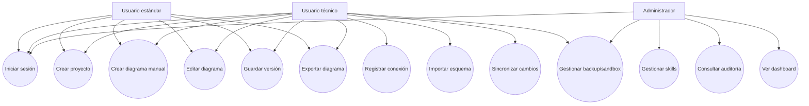
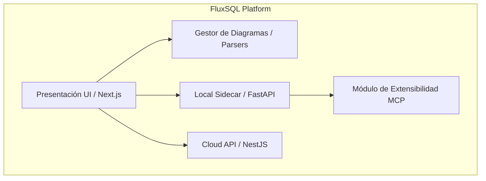
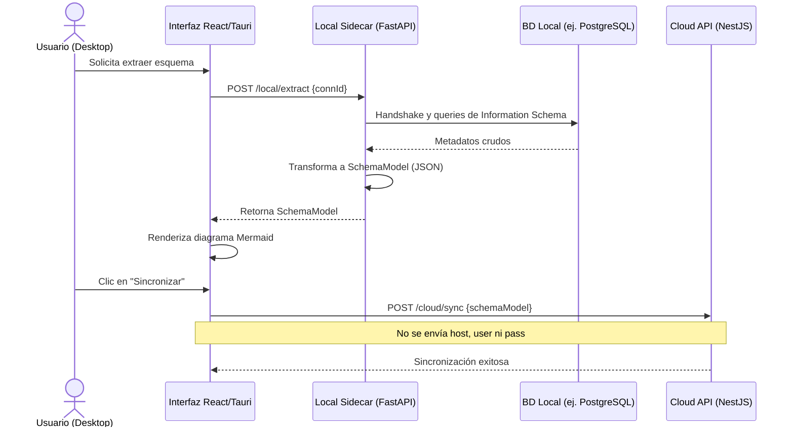
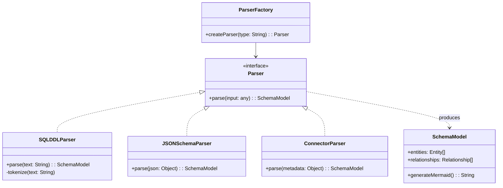
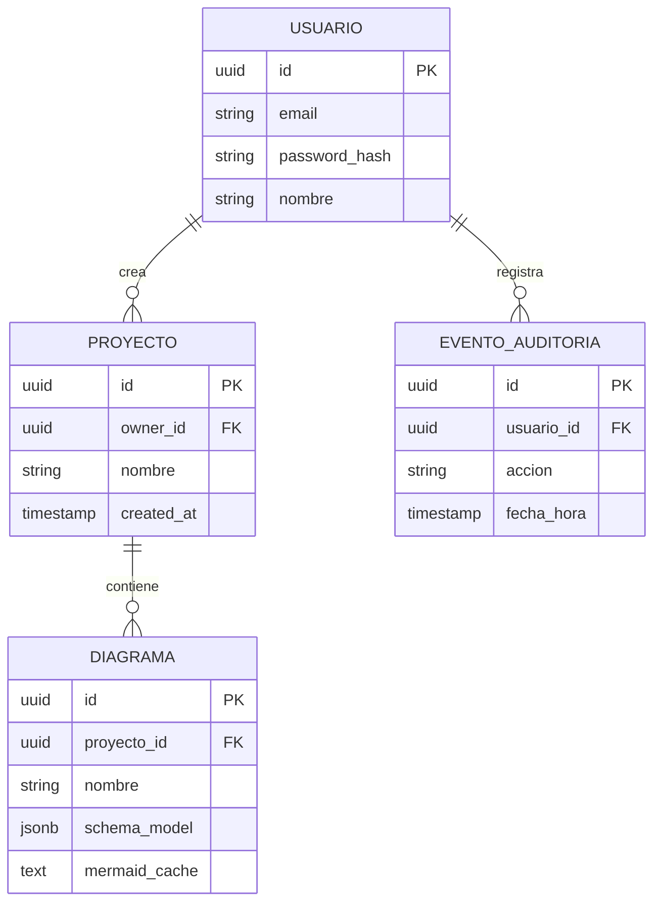
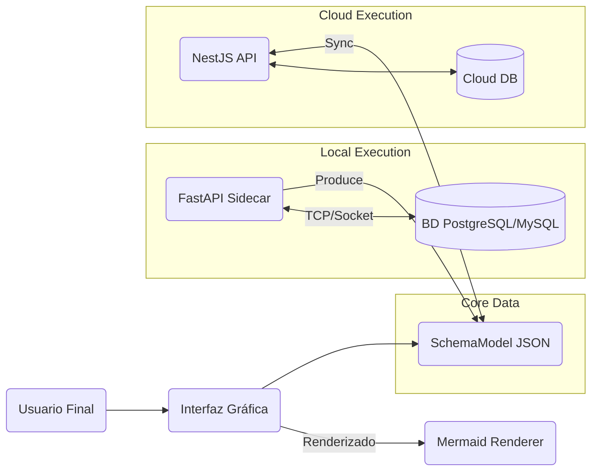
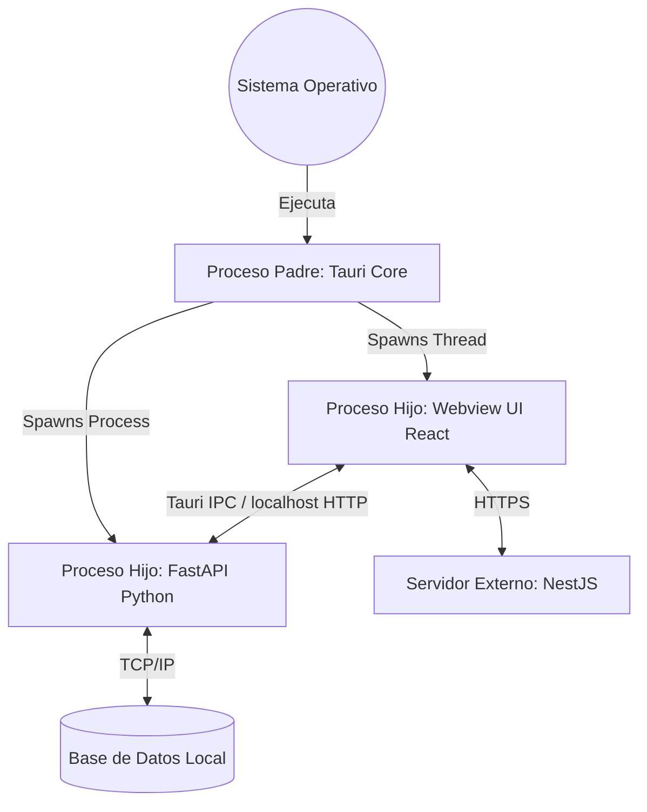
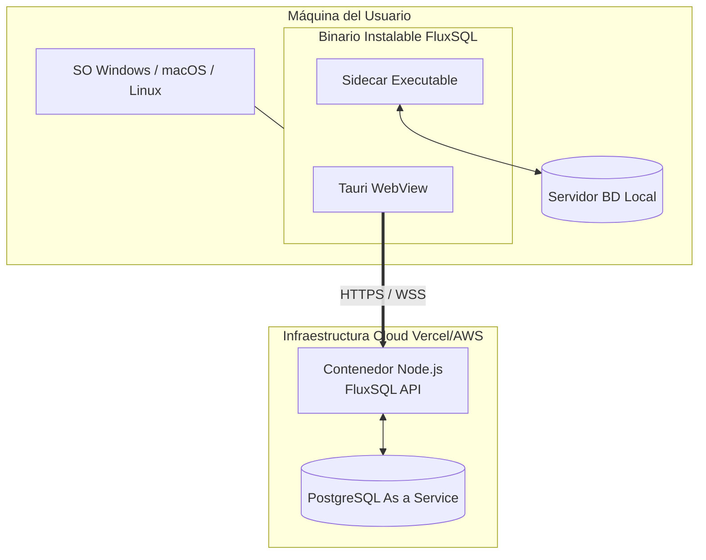

# UNIVERSIDAD PRIVADA DE TACNA
## FACULTAD DE INGENIERÍA
### Escuela Profesional de Ingeniería de Sistemas

# FluxSQL
## Informe de Arquitectura de Software
### FD04 - Software Architecture Document

**Curso:** Gestión de Proyectos / Ingeniería de Software  
**Docente:** Mag. Patrick Cuadros Quiroga  
**Integrantes:** 
- Zapana Murillo, Kiara Holly (2023077087)
- Vargas Espinoza, Jefferson Alfonso (2023076820)
  
**Ubicación:** Tacna - Perú  
**Año:** 2026  
**Versión del documento:** 3.0  

---

# CONTROL DE VERSIONES

| Versión | Hecha por | Revisada por | Aprobada por | Fecha | Motivo |
|---|---|---|---|---|---|
| 1.0 | KHZM / JAVE | Pendiente | Pendiente | Abril 2026 | Versión Original (DBCanvas) |
| 1.1 | KHZM / JAVE | Pendiente | Pendiente | Junio 2026 | Actualización de arquitectura (Go/Electron) |
| 2.0 | KHZM / JAVE | Pendiente | Pendiente | 2026-07-04 | Refactorización a Plataforma FluxSQL |
| 3.0 | KHZM / JAVE | Pendiente | Pendiente | 2026-07-04 | Extensión a formato académico (4 secciones, Vistas y Atributos de Calidad) |

---

# ÍNDICE GENERAL

1. INTRODUCCIÓN
   1.1. Propósito
   1.2. Alcance
   1.3. Definición, siglas y abreviaturas
   1.4. Organización del documento
2. OBJETIVOS Y RESTRICCIONES ARQUITECTÓNICAS
   2.1. Priorización de requerimientos
      2.1.1. Requerimientos Funcionales
      2.1.2. Requerimientos No Funcionales – Atributos de Calidad
   2.2. Restricciones
3. REPRESENTACIÓN DE LA ARQUITECTURA DEL SISTEMA
   3.1. Vista de Caso de uso
      3.1.1. Diagramas de Casos de Uso
   3.2. Vista Lógica
      3.2.1. Diagrama de Subsistemas
      3.2.2. Diagrama de Secuencia
      3.2.3. Diagrama de Colaboración
      3.2.4. Diagrama de Objetos
      3.2.5. Diagrama de Clases
      3.2.6. Diagrama de Base de datos
   3.3. Vista de Implementación
      3.3.1. Diagrama de arquitectura software (paquetes)
      3.3.2. Diagrama de arquitectura del sistema
   3.4. Vista de procesos
      3.4.1. Diagrama de Procesos del sistema
   3.5. Vista de Despliegue
      3.5.1. Diagrama de despliegue
4. ATRIBUTOS DE CALIDAD DEL SOFTWARE
   4.1. Escenario de Funcionalidad
   4.2. Escenario de Usabilidad
   4.3. Escenario de confiabilidad
   4.4. Escenario de rendimiento
   4.5. Escenario de mantenibilidad
   4.6. Otros Escenarios
      4.6.1. Escalabilidad
      4.6.2. Seguridad (OWASP Top 10)
      4.6.3. Portabilidad

---

# 1. INTRODUCCIÓN

## 1.1. Propósito

El propósito de este documento es proporcionar una descripción exhaustiva de la arquitectura de software para el sistema **FluxSQL**. Este informe documenta las decisiones de diseño arquitectónico tomadas para cumplir con los requerimientos funcionales y no funcionales del sistema, sirviendo como guía fundamental para los desarrolladores, evaluadores y administradores del proyecto a lo largo del ciclo de vida del software.

## 1.2. Alcance

El alcance arquitectónico detallado en este documento abarca la plataforma híbrida completa de FluxSQL. Esto incluye:
- **FluxSQL Web y Cloud API**: Ecosistema en la nube que proporciona autenticación, colaboración y sincronización de diagramas mediante NestJS y Next.js.
- **FluxSQL Desktop y Sidecar**: Aplicación nativa instalable que incluye la interfaz exportada sobre Tauri y un motor backend local (Sidecar) escrito en FastAPI para la interacción directa con motores de base de datos de manera segura.
- **Módulos de Integración**: El puente de extensibilidad (Skills) y el soporte para el protocolo Model Context Protocol (MCP) para agentes IA.

## 1.3. Definición, siglas y abreviaturas

- **API** (Application Programming Interface): Interfaz que permite la comunicación entre la aplicación y el servidor.
- **DDL** (Data Definition Language): Lenguaje SQL utilizado para definir o modificar la estructura de las bases de datos.
- **ERD** (Entity-Relationship Diagram): Diagrama que muestra la estructura lógica de la base de datos.
- **MCP** (Model Context Protocol): Estándar abierto que estandariza cómo las aplicaciones exponen contexto a los modelos de inteligencia artificial (LLMs).
- **Sidecar**: Patrón arquitectónico donde un servicio auxiliar (en este caso FastAPI) corre paralelo a la aplicación principal (Tauri) para proveer funcionalidades específicas sin contaminar el hilo de UI.
- **SPA** (Single Page Application): Aplicación web de una sola página.
- **SchemaModel**: Modelo lógico en formato JSON que estandariza la estructura de cualquier base de datos parseada en FluxSQL, independientemente del motor de origen.

## 1.4. Organización del documento

Este documento está estructurado en 4 capítulos principales:
1. **Introducción**: Contexto general, propósito y alcance.
2. **Objetivos y Restricciones Arquitectónicas**: Los requerimientos que moldean el diseño y las limitaciones impuestas por el entorno.
3. **Representación de la Arquitectura del Sistema**: Compuesta por las 5 vistas arquitectónicas de Kruchten (4+1): Casos de Uso, Lógica, Implementación, Procesos y Despliegue.
4. **Atributos de Calidad del Software**: Escenarios que validan cómo la arquitectura responde a exigencias de rendimiento, seguridad, confiabilidad, entre otros.

---

# 2. OBJETIVOS Y RESTRICCIONES ARQUITECTÓNICAS

## 2.1. Priorización de requerimientos

El diseño arquitectónico de FluxSQL está impulsado por un subconjunto de requerimientos críticos que definen la viabilidad del proyecto.

### 2.1.1. Requerimientos Funcionales

| Prioridad | ID | Descripción Corta | Impacto en Arquitectura |
|:--|:--|:--|:--|
| **Alta** | RFF-14 | Registrar y usar conexiones a base de datos reales. | Requiere un backend local persistente (Sidecar) que gestione secretos sin enviarlos a la nube. |
| **Alta** | RFF-19 | Importar esquema de BD para reverse engineering. | Exige un pipeline capaz de extraer metadatos de múltiples motores y transformarlos a `SchemaModel`. |
| **Alta** | RFF-22 | Sincronización local-remota. | Fuerza una arquitectura distribuida donde el Sidecar y el Cloud API compartan un modelo de datos común (JSON). |
| **Alta** | RFF-24 | Gestión de aplicación de escritorio. | Implica empaquetar binarios nativos cruzados (Tauri + Python) para evitar dependencia exclusiva de la web. |
| **Media** | RFF-25 | Gestión de Skills y MCP. | Demanda una interfaz o socket local que permita registrar rutinas extensibles. |

### 2.1.2. Requerimientos No Funcionales – Atributos de Calidad

| Prioridad | ID | Descripción | Implicación Arquitectónica |
|:--|:--|:--|:--|
| **Alta** | RNF-01 | **Seguridad e Integridad**: Nunca exponer credenciales locales en la nube. | Separación total de dominios: *Cloud API* solo almacena `SchemaModel`. *Sidecar* almacena strings de conexión. |
| **Alta** | RNF-03 | **Rendimiento**: Renderizado de diagramas de hasta 100 entidades en tiempo real (< 500ms). | Renderizado cliente puro vía Mermaid.js y Next.js sin hacer round-trips al servidor para dibujar. |
| **Alta** | RNF-09 | **Portabilidad**: El sistema debe ejecutarse en Windows, macOS y Linux. | Uso de Tauri (compilación cruzada en Rust) y scripts de empaquetado independientes del OS. |

## 2.2. Restricciones

1. **Restricción de Privacidad Híbrida**: *“Cloud syncs safe artifacts. Local runtime keeps credentials, backups, sandboxes, dumps and private query results.”*
2. **Desacoplamiento del Parser**: El motor de parseo y renderizado debe ser independiente de la fuente de datos. Cualquier fuente (SQL crudo o conexión BD) debe transformarse obligatoriamente a un `SchemaModel` intermediario.
3. **Consumo de Memoria**: La aplicación de escritorio no debe basarse en Electron para evitar el alto consumo de RAM del framework Chromium; se usará Tauri integrado con el WebView nativo del SO.

---

# 3. REPRESENTACIÓN DE LA ARQUITECTURA DEL SISTEMA

La arquitectura de FluxSQL se describe mediante diferentes vistas arquitectónicas para abarcar las necesidades de los desarrolladores, integradores, administradores y usuarios finales.

## 3.1. Vista de Caso de uso

Esta vista describe la funcionalidad del sistema desde la perspectiva de los actores externos. 

### 3.1.1. Diagramas de Casos de Uso



## 3.2. Vista Lógica

La vista lógica describe el modelo de objetos y la organización funcional del sistema en paquetes y subsistemas.

### 3.2.1. Diagrama de Subsistemas



### 3.2.2. Diagrama de Secuencia

Este diagrama ilustra la secuencia de **Extracción Local y Sincronización en la Nube**, respetando las restricciones de seguridad.



### 3.2.3. Diagrama de Colaboración

Muestra cómo los objetos colaboran temporalmente para guardar una nueva versión de un diagrama.

```mermaid
graph TD
    A[UI_Client] -- 1. "solicitar_guardado(SchemaModel)" --> B[DiagramController]
    B -- 2. "crear_version()" --> C[VersionManager]
    C -- 3. "validar_cambios()" --> D[SchemaModel]
    B -- 4. "persistir_modelo()" --> E[DatabaseAdapter]
    E -- 5. "commit()" --> F[(DB Nube)]
```

### 3.2.4. Diagrama de Objetos

Representa un estado particular del sistema tras extraer un esquema simple de "Usuarios".

```mermaid
objectDiagram
    classDef obj fill:#f9f,stroke:#333,stroke-width:2px;
    
    CurrentSchema: SchemaModel
    CurrentSchema : name = "DB_Produccion"
    CurrentSchema : entities = 1

    TableUser: Entity
    TableUser : name = "usuarios"
    TableUser : primaryKey = ["id"]

    ColId: Attribute
    ColId : name = "id"
    ColId : type = "uuid"

    ColEmail: Attribute
    ColEmail : name = "email"
    ColEmail : type = "varchar"

    CurrentSchema --> TableUser : contains
    TableUser --> ColId : has_attr
    TableUser --> ColEmail : has_attr
```
*(Nota: Estructura lógica en formato gráfico jerárquico)*

### 3.2.5. Diagrama de Clases

Representación del núcleo de transformación lógica (Parte del paquete `@fluxsql/parsers`).



### 3.2.6. Diagrama de Base de datos

ERD de la persistencia Cloud (NestJS API). No almacena credenciales de usuario de bases de datos externas.



## 3.3. Vista de Implementación

Muestra la organización del código estático en el monorepo.

### 3.3.1. Diagrama de arquitectura software (paquetes)

```mermaid
graph TD
    subgraph Monorepo FluxSQL
        subgraph Apps
            W[apps/web<br>Frontend Next.js]
            D[apps/desktop<br>Tauri + Next.js]
            B[apps/backend-api<br>NestJS Cloud API]
            S[apps/backend-python<br>FastAPI Local Sidecar]
        end
        subgraph Packages Compartidos
            UI[@fluxsql/ui<br>Componentes React]
            PA[@fluxsql/parsers<br>Lógica de Modelado]
        end
    end
    W --> UI
    W --> PA
    D --> UI
    D --> PA
    D --> S
    W -.-> B
    D -.-> B
```

### 3.3.2. Diagrama de arquitectura del sistema

Este diagrama ilustra la arquitectura global a nivel de alto nivel de componentes y puertos.



## 3.4. Vista de procesos

Describe cómo el sistema maneja la ejecución y los hilos de procesos en el cliente de escritorio.

### 3.4.1. Diagrama de Procesos del sistema



## 3.5. Vista de Despliegue

La vista de despliegue muestra la correspondencia entre los componentes de software y el hardware físico/virtual.

### 3.5.1. Diagrama de despliegue



---

# 4. ATRIBUTOS DE CALIDAD DEL SOFTWARE

El diseño de FluxSQL se ha evaluado frente a múltiples escenarios de calidad usando como referencia los estándares de arquitectura de software.

## 4.1. Escenario de Funcionalidad

- **Estímulo**: El usuario técnico inserta las credenciales de una base de datos PostgreSQL local y solicita extraer el esquema.
- **Fuente del estímulo**: Interfaz Desktop.
- **Artefacto**: Sidecar FastAPI y gestor de conexiones.
- **Entorno**: Ejecución local (offline o en intranet protegida).
- **Respuesta**: El Sidecar autentica, extrae metadatos y devuelve el `SchemaModel` estructurado.
- **Medida de respuesta**: Se completan el 100% de las tablas y sus relaciones primarias en el diagrama.

## 4.2. Escenario de Usabilidad

- **Estímulo**: El usuario edita manualmente el DDL (texto SQL) en el editor interactivo de la Web App.
- **Fuente del estímulo**: Desarrollador o estudiante operando la interfaz web.
- **Artefacto**: Parser `@fluxsql/parsers` y Renderer UI.
- **Entorno**: Navegador web en operación normal.
- **Respuesta**: El editor actualiza el diagrama ERD en tiempo real a medida que el usuario teclea, validando la sintaxis.
- **Medida de respuesta**: El renderizado se realiza con un *debounce* visual fluido, tomando menos de 500 milisegundos tras detener la escritura.

## 4.3. Escenario de confiabilidad

- **Estímulo**: La red se desconecta abruptamente durante un intento de sincronización local hacia el Cloud API.
- **Fuente del estímulo**: Falla de conectividad externa.
- **Artefacto**: Cliente HTTP de Tauri / Next.js.
- **Entorno**: Operación productiva normal.
- **Respuesta**: El sistema detecta la falla temporal, marca el diagrama con estado "Sincronización Pendiente" y guarda los cambios en caché local.
- **Medida de respuesta**: Cero pérdida de datos de modelado. El sistema reintenta automáticamente la sincronización al detectar conexión.

## 4.4. Escenario de rendimiento

- **Estímulo**: Extracción de un esquema de base de datos corporativa ("monolito") con más de 200 tablas y 2000 atributos.
- **Fuente del estímulo**: BD Corporativa MySQL.
- **Artefacto**: Motor de introspección del Sidecar FastAPI.
- **Entorno**: Cliente Desktop conectado por VPN al servidor.
- **Respuesta**: El Sidecar consulta los metadatos usando `information_schema` eficientemente, empaqueta la respuesta JSON y el frontend usa un algoritmo de layout óptimo (Mermaid ELK).
- **Medida de respuesta**: La interfaz no se bloquea (no UI freeze), finalizando la presentación del diagrama en menos de 3 segundos totales.

## 4.5. Escenario de mantenibilidad

- **Estímulo**: El equipo de desarrollo decide agregar soporte para graficar bases de datos "Graph DB" (ej. Neo4j).
- **Fuente del estímulo**: Evolución del producto (Nuevos requisitos).
- **Artefacto**: Monorepo (`packages/parsers` y Sidecar).
- **Entorno**: Tiempo de desarrollo.
- **Respuesta**: Un desarrollador implementa la interfaz `Parser` para Cypher, conectándola al generador de `SchemaModel` existente.
- **Medida de respuesta**: No es necesario modificar ni una línea de código del renderizador visual (UI), comprobando el alto nivel de desacoplamiento de la arquitectura.

## 4.6. Otros Escenarios

### 4.6.1. Escalabilidad
- El Cloud API (NestJS) opera de forma *stateless* (sin estado local de sesión). En respuesta a picos altos de usuarios, el proveedor Cloud puede levantar 10 réplicas del servicio instantáneamente sin corromper el modelo de datos.

### 4.6.2. Seguridad (OWASP Top 10)
- Contra Inyección SQL: FluxSQL **nunca** ejecuta queries construidos por el usuario en el Sidecar. Se usan drivers nativos y consultas `PRAGMA` / `information_schema` predefinidas estáticamente en el código.
- Protección de Credenciales: El Sidecar local almacena las contraseñas usando Keyrings seguros del sistema operativo. La Web App autentica contra la nube usando JWT firmados (JSON Web Tokens).

### 4.6.3. Portabilidad
- La compilación del cliente Desktop mediante **Tauri** permite generar instaladores `.exe` (Windows), `.dmg` (macOS) y `.deb`/`.AppImage` (Linux) a partir del mismo código base web. El Sidecar en Python se empaqueta junto a binarios autocontenidos mediante PyInstaller, evitando al usuario instalar dependencias extra de Python.

---

# FIN DEL DOCUMENTO
