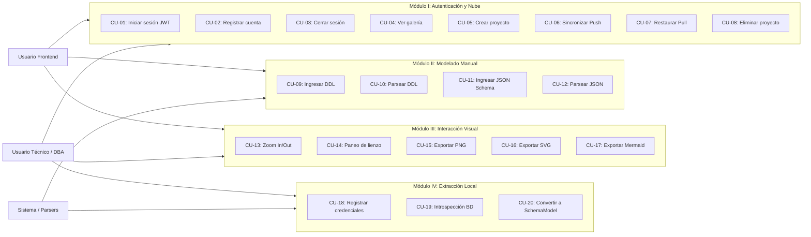
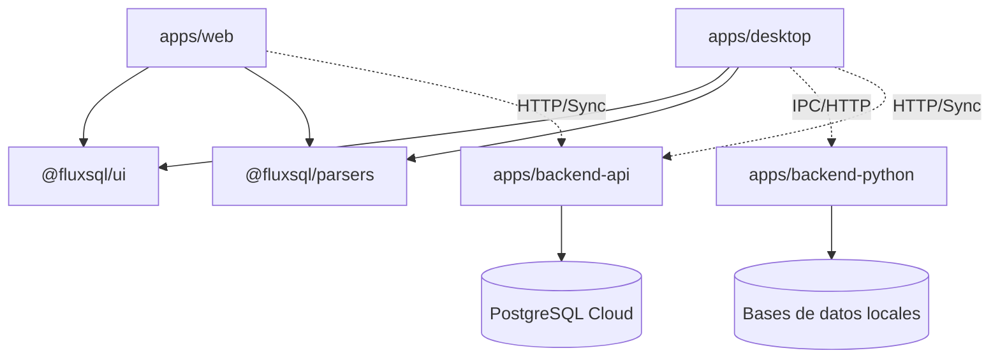
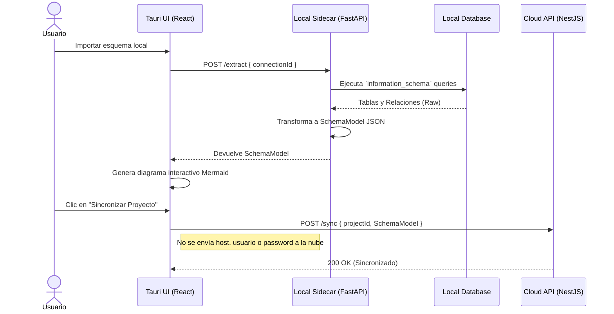
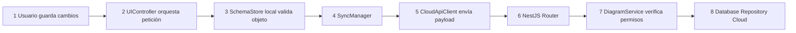
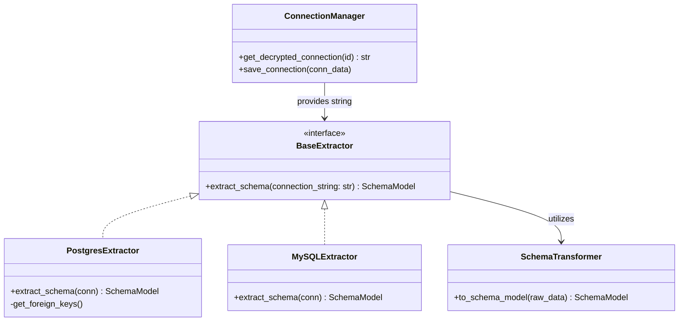
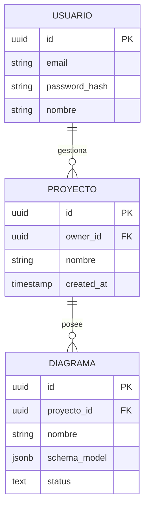
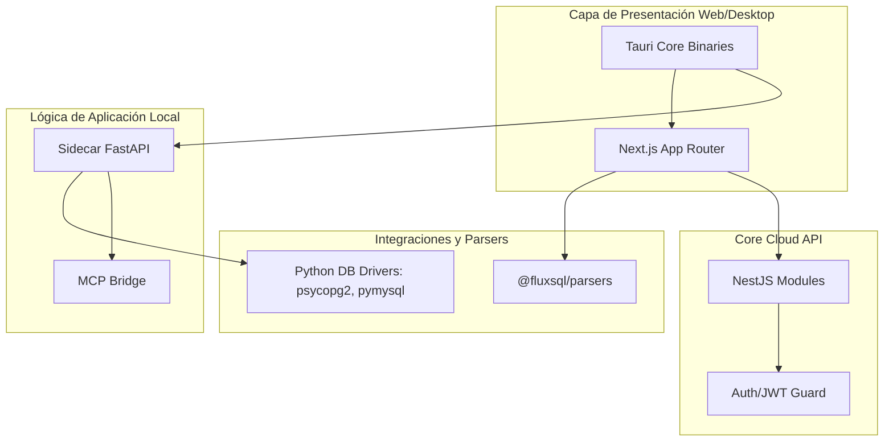
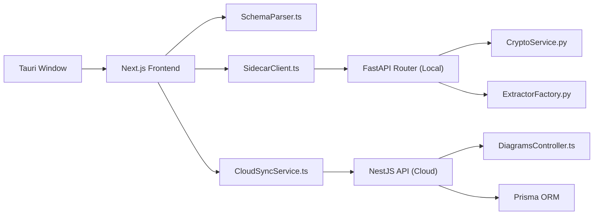
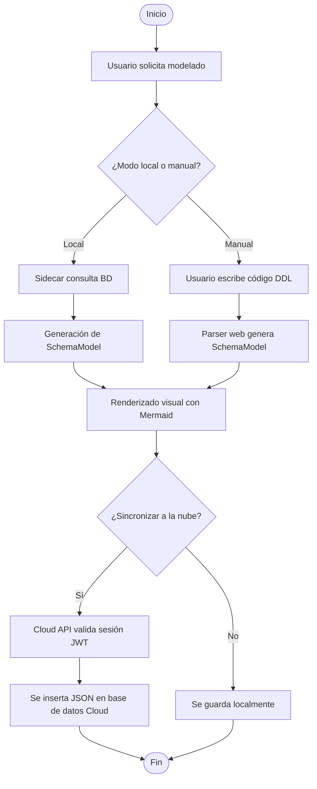
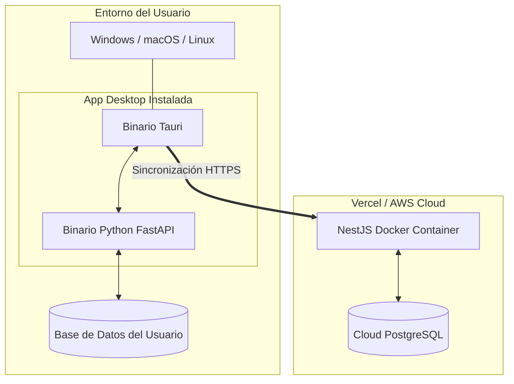

<center>


**UNIVERSIDAD PRIVADA DE TACNA**

**FACULTAD DE INGENIERÍA**

**Escuela Profesional de Ingeniería de Sistemas**

**Informe de Arquitectura de Software**

**Plataforma de Modelado y Sincronización de Diagramas (FluxSQL)**

Curso: *Gestión de Proyectos / Ingeniería de Software*

Docente: *Mag. Patrick Cuadros Quiroga*

Integrantes:

***Zapana Murillo, Kiara Holly (2023077087)***

***Vargas Espinoza, Jefferson Alfonso (2023076820)***

**Tacna - Perú**

***2026***

</center>

<div style="page-break-after: always; visibility: hidden">\pagebreak</div>

Sistema *Plataforma de Modelado y Sincronización de Diagramas (FluxSQL)*

Informe de Arquitectura de Software

Versión *2.0*

| CONTROL DE VERSIONES |           |              |               |            |                 |
|:--------------------:|:----------|:-------------|:--------------|:-----------|:----------------|
|       Versión        | Hecha por | Revisada por | Aprobada por  | Fecha      | Motivo          |
|         1.0          | KHZM, JAVE| KHZM, JAVE   | P. Cuadros Q. | 2026-04-22 | Versión inicial (DBCanvas) |
|         2.0          | KHZM, JAVE| KHZM, JAVE   | P. Cuadros Q. | 2026-07-04 | Refactorización a arquitectura híbrida FluxSQL |

# ÍNDICE GENERAL

1. [Introducción](#1-introducción)
    1. [Propósito (Diagrama 4+1)](#11-propósito-diagrama-41)
    2. [Alcance](#12-alcance)
    3. [Definiciones, siglas y abreviaturas](#13-definiciones-siglas-y-abreviaturas)
    4. [Organización del documento](#14-organización-del-documento)
2. [Objetivos y restricciones arquitectónicas](#2-objetivos-y-restricciones-arquitectónicas)
    1. [Priorización de requerimientos](#21-priorización-de-requerimientos)
        1. [Requerimientos funcionales](#211-requerimientos-funcionales)
        2. [Requerimientos no funcionales](#212-requerimientos-no-funcionales)
    2. [Restricciones arquitectónicas](#22-restricciones-arquitectónicas)
3. [Representación de la arquitectura del sistema](#3-representación-de-la-arquitectura-del-sistema)
    1. [Vista de uso](#31-vista-de-uso)
        1. [Diagrama de casos de uso](#311-diagrama-de-casos-de-uso)
    2. [Vista lógica](#32-vista-lógica)
        1. [Diagrama de sub-sistemas (paquetes)](#321-diagrama-de-sub-sistemas-paquetes)
        2. [Diagrama de secuencia (vista de diseño)](#322-diagrama-de-secuencia-vista-de-diseño)
        3. [Diagrama de colaboración (vista de diseño)](#323-diagrama-de-colaboración-vista-de-diseño)
        4. [Diagrama de objetos](#324-diagrama-de-objetos)
        5. [Diagrama de clases](#325-diagrama-de-clases)
        6. [Diagrama de base de datos](#326-diagrama-de-base-de-datos)
    3. [Vista de implementación (vista de desarrollo)](#33-vista-de-implementación-vista-de-desarrollo)
        1. [Diagrama de arquitectura de software](#331-diagrama-de-arquitectura-de-software)
        2. [Diagrama de arquitectura del sistema (diagrama de componentes)](#332-diagrama-de-arquitectura-del-sistema-diagrama-de-componentes)
    4. [Vista de procesos](#34-vista-de-procesos)
        1. [Diagrama de procesos del sistema (diagrama de actividades)](#341-diagrama-de-procesos-del-sistema-diagrama-de-actividades)
    5. [Vista de despliegue](#35-vista-de-despliegue)
        1. [Diagrama de despliegue](#351-diagrama-de-despliegue)
4. [Atributos de calidad del software](#4-atributos-de-calidad-del-software)
    1. [Escenario de funcionalidad](#41-escenario-de-funcionalidad)
    2. [Escenario de usabilidad](#42-escenario-de-usabilidad)
    3. [Escenario de confiabilidad](#43-escenario-de-confiabilidad)
    4. [Escenario de rendimiento](#44-escenario-de-rendimiento)
    5. [Escenario de mantenibilidad](#45-escenario-de-mantenibilidad)
    6. [Otros escenarios de calidad](#46-otros-escenarios-de-calidad)
5. [Evidencias de calidad y pruebas](#5-evidencias-de-calidad-y-pruebas)
6. [Ingeniería Inversa e Infraestructura](#6-ingeniería-inversa-e-infraestructura)

<div style="page-break-after: always; visibility: hidden">\pagebreak</div>

# 1. Introducción

## 1.1 Propósito (Diagrama 4+1)

Este informe describe la arquitectura de software de *FluxSQL* siguiendo el enfoque 4+1, articulando las vistas
de uso, lógica, implementación, procesos y despliegue, y vinculándolas con los requerimientos establecidos en FD03.

Las decisiones de arquitectura priorizan:

- **Seguridad Híbrida**: La nube (Cloud API) sincroniza únicamente artefactos seguros (`SchemaModel`), mientras que el entorno local (Sidecar) gestiona de forma aislada las credenciales, conexiones y consultas sensibles.
- **Extensibilidad**: Soporte para múltiples motores de bases de datos y adopción de interfaces locales (Skills y MCP) para conectar agentes de Inteligencia Artificial.
- **Rendimiento**: Renderizado de diagramas de bases de datos masivas sin latencia de red, centralizando el parseo en clientes locales (Tauri) o en navegador (Next.js).

## 1.2 Alcance

Este documento cubre la arquitectura del sistema en su versión híbrida (Monorepo), incluyendo:

- **FluxSQL Web**: Frontend en Next.js para colaboración y proyectos en la nube.
- **FluxSQL Cloud API**: Backend en NestJS para gestión de cuentas, sincronización y persistencia distribuida.
- **FluxSQL Desktop**: Aplicación local encapsulada en Tauri (Rust) con interfaz web.
- **Local Sidecar**: Servicio de apoyo en Python (FastAPI) para gestionar conexiones locales nativas a DBs y ejecución de rutinas aisladas.

No incluye herramientas para migración destructiva de bases de datos, ya que el sistema opera estrictamente bajo políticas de *solo lectura* para la introspección estructural.

## 1.3 Definiciones, siglas y abreviaturas

| Término   | Definición                                                                 |
|-----------|----------------------------------------------------------------------------|
| API       | Interfaz de programación de aplicaciones para comunicación entre sistemas. |
| MCP       | Model Context Protocol, estándar para exponer contexto a agentes IA.       |
| DDL       | Data Definition Language, código SQL para definir esquemas de tablas.      |
| SchemaModel| Estructura JSON universal e intermedia que representa cualquier BD en Flux.|
| Sidecar   | Proceso backend auxiliar (FastAPI) que corre anexo a la App principal.   |
| SPA       | Single Page Application.                                                   |
| Tauri     | Framework en Rust para crear binarios de escritorio ligeros con vistas web.|
| ERD       | Diagrama Entidad-Relación (Entity-Relationship Diagram).                   |

## 1.4 Organización del documento

- Sección 2: presenta objetivos arquitectónicos y priorización de requerimientos.
- Sección 3: documenta las vistas arquitectónicas (4+1) mediante diagramas Mermaid.
- Sección 4: define escenarios de atributos de calidad y métricas operativas.
- Sección 5 y 6: evidencian las estrategias de calidad y despliegue automatizado.

# 2. Objetivos y restricciones arquitectónicas

## 2.1 Priorización de requerimientos

### 2.1.1 Requerimientos funcionales

| ID    | Descripción                                                               | Prioridad |
|-------|---------------------------------------------------------------------------|-----------|
| RF-01 | Parsear estructuras DDL en el lado del cliente                            | Alta      |
| RF-02 | Extraer esquemas desde conexiones locales (Sidecar FastAPI)               | Alta      |
| RF-03 | Generar diagramas relacionales (Mermaid) interactivamente                 | Alta      |
| RF-04 | Sincronizar artefactos estructurales al Cloud API                         | Alta      |
| RF-05 | Guardar credenciales locales de forma cifrada (sin enviar a la nube)      | Alta      |
| RF-06 | Soporte para Skills instalables y flujos MCP                              | Media     |
| RF-07 | Gestión de proyectos y versionado de diagramas en la Web App              | Alta      |
| RF-08 | Dashboard de analítica y reportes de auditoría                            | Media     |

### 2.1.2 Requerimientos no funcionales

| ID     | Descripción                                         | Prioridad |
|--------|-----------------------------------------------------|-----------|
| RNF-01 | Seguridad de credenciales bajo arquitectura Zero-Trust| Alta    |
| RNF-02 | Portabilidad de la Desktop App sin requerir NodeJS o Python local | Alta      |
| RNF-03 | Escalabilidad del Cloud API mediante arquitectura stateless| Alta    |
| RNF-04 | Renderizado de diagramas complejos en menos de 500ms| Alta      |
| RNF-05 | Privacidad de consultas locales (ejecución Sidecar) | Alta      |

## 2.2 Restricciones arquitectónicas

| Restricción                                  | Implicancia de diseño                                                          |
|----------------------------------------------|--------------------------------------------------------------------------------|
| Seguridad Híbrida Obligatoria                | *"Cloud syncs safe artifacts. Local runtime keeps credentials"*. La API Cloud rechaza cualquier intento de almacenar *connection strings* con contraseñas. |
| Consumo de Memoria Desktop                   | Prohibido usar Electron. Se debe usar **Tauri** con WebView nativo del SO para mantener el consumo de RAM bajo los 150MB. |
| Parseo Universal                             | Todo flujo de entrada (conexión BD, texto DDL, JSON) debe transmutarse a un objeto intermediario estricto (`SchemaModel`) antes de renderizar. |
| Bases de datos Multi-motor                   | Se utilizarán bibliotecas nativas de Python en el Sidecar para conectarse a PG, MySQL, SQLite, etc. No se escribirán conectores desde cero. |

# 3. Representación de la arquitectura del sistema

## 3.1 Vista de uso

### 3.1.1 Diagrama de casos de uso



## 3.2 Vista lógica

### 3.2.1 Diagrama de sub-sistemas (paquetes)



### 3.2.2 Diagrama de secuencia (vista de diseño)



### 3.2.3 Diagrama de colaboración (vista de diseño)



### 3.2.4 Diagrama de objetos

Muestra el estado temporal del objeto `SchemaModel` al extraer un esquema simple de una tabla de usuarios.

```mermaid
classDiagram
    object CurrentSchema {
        name = "InventarioDB"
        createdAt = "2026-07-04"
    }
    
    object TableProducts {
        name = "productos"
        type = "table"
    }
    
    object ColID {
        name = "id"
        type = "uuid"
        isPrimaryKey = true
    }

    CurrentSchema --|> TableProducts : contains
    TableProducts --|> ColID : hasAttribute
```

### 3.2.5 Diagrama de clases

Representa los adaptadores del Sidecar en Python para diferentes bases de datos.



### 3.2.6 Diagrama de base de datos

Diagrama lógico de la base de datos distribuida en la nube (PostgreSQL gestionado por NestJS).



## 3.3 Vista de implementación (vista de desarrollo)

### 3.3.1 Diagrama de arquitectura de software



### 3.3.2 Diagrama de arquitectura del sistema (diagrama de componentes)



## 3.4 Vista de procesos

### 3.4.1 Diagrama de procesos del sistema (diagrama de actividades)



## 3.5 Vista de despliegue

### 3.5.1 Diagrama de despliegue



# 4. Atributos de calidad del software

## 4.1 Escenario de funcionalidad

| Elemento            | Definición                                                               |
|---------------------|--------------------------------------------------------------------------|
| Fuente de estímulo  | Usuario técnico (Data Engineer / Backend Dev)                            |
| Estímulo            | Conectar una base de datos MySQL local para extraer esquema relacional   |
| Entorno             | Aplicación de escritorio (entorno offline sin salida a internet)         |
| Respuesta           | El Sidecar efectúa la introspección y devuelve el modelo JSON preciso    |
| Medida de respuesta | Cobertura total de tablas, atributos y llaves foráneas correctas.        |

## 4.2 Escenario de usabilidad

| Elemento            | Definición                                                                |
|---------------------|---------------------------------------------------------------------------|
| Fuente de estímulo  | Desarrollador frontend                                                    |
| Estímulo            | Escribir comandos DDL en el editor interactivo de la Web App              |
| Entorno             | Navegador web estándar                                                    |
| Respuesta           | Diagrama dibujado dinámicamente con resaltado de sintaxis                 |
| Medida de respuesta | *Debounce* de visualización inferior a 300 milisegundos sin congelar UI   |

## 4.3 Escenario de confiabilidad

| Elemento            | Definición                                                                          |
|---------------------|-------------------------------------------------------------------------------------|
| Fuente de estímulo  | Caída repentina de red wifi o falla de ISP                                          |
| Estímulo            | Pérdida de conectividad durante la edición de un diagrama sincronizado              |
| Entorno             | Aplicación Web / Desktop en uso activo                                              |
| Respuesta           | Activación de estado *Offline*, caché local de los cambios                          |
| Medida de respuesta | Ningún dato de modelado se pierde; reconexión y sincronización silente automática   |

## 4.4 Escenario de rendimiento

| Elemento            | Definición                                                        |
|---------------------|-------------------------------------------------------------------|
| Fuente de estímulo  | Análisis de esquema heredado muy denso (> 300 tablas)             |
| Estímulo            | El motor Sidecar envía un JSON inmenso al frontend                |
| Entorno             | Máquina de trabajo estándar (8GB RAM)                             |
| Respuesta           | La capa de UI renderiza progresivamente la representación visual  |
| Medida de respuesta | Tiempo de parseo y pintado en pantalla < 2 segundos totales       |

## 4.5 Escenario de mantenibilidad

| Elemento            | Definición                                                                    |
|---------------------|-------------------------------------------------------------------------------|
| Fuente de estímulo  | Soporte nativo para una nueva base de datos NoSQL (ej. Cassandra)             |
| Estímulo            | Actualización evolutiva del sistema                                           |
| Entorno             | Desarrollo del Monorepo                                                       |
| Respuesta           | Creación de un nuevo `Extractor` en Python sin tocar el frontend ni NestJS    |
| Medida de respuesta | Desacoplamiento arquitectónico comprobable; bajo riesgo de impacto colateral  |

## 4.6 Otros escenarios de calidad

### 4.6.1 Escalabilidad

| Elemento            | Definición                                                      |
|---------------------|-----------------------------------------------------------------|
| Fuente de estímulo  | Alto tráfico concurrente por una clase completa de estudiantes  |
| Estímulo            | Solicitudes de guardado simultáneas a la Cloud API              |
| Entorno             | Servidores Cloud / Vercel Edge                                  |
| Respuesta           | Balanceo natural gracias a la naturaleza *Stateless* de NestJS  |
| Medida de respuesta | Cero *downtime* detectado bajo carga (Latencia < 100ms)         |

### 4.6.2 Seguridad (OWASP Top 10)

| Elemento            | Definición                                                          |
|---------------------|---------------------------------------------------------------------|
| Fuente de estímulo  | Petición maliciosa intentando robo de credenciales                  |
| Estímulo            | Escaneo de puertos o intercepción de tráfico Cloud                  |
| Entorno             | Internet público                                                    |
| Respuesta           | La API ignora peticiones por diseño (nunca viajan credenciales)     |
| Medida de respuesta | Privacidad garantizada por segregación física de responsabilidades  |

### 4.6.3 Portabilidad

| Elemento            | Definición                                                          |
|---------------------|---------------------------------------------------------------------|
| Fuente de estímulo  | Equipo mixto de desarrolladores (Mac, Ubuntu, Windows 11)           |
| Estímulo            | Instalación de la aplicación de escritorio FluxSQL                  |
| Entorno             | Instaladores nativos `.dmg`, `.deb` y `.exe`                        |
| Respuesta           | Ejecución autónoma sin instalar manualmente Python ni Node.js       |
| Medida de respuesta | 100% de compatibilidad mediante *bundling* de Tauri y PyInstaller   |

# 5. Evidencias de calidad y pruebas

FluxSQL incorpora rutinas automatizadas de análisis estático, seguridad y pruebas unitarias integradas en los pipelines de GitHub Actions. 

| Evidencia | Descripción / Herramienta |
|-----------|---------------------------|
| **Pruebas Unitarias** | Validan el motor de parseo `@fluxsql/parsers` mediante Jest / Vitest con cobertura garantizada sobre sintaxis SQL compleja. |
| **Pruebas de Componente** | Next.js Testing Library para validar el renderizado de la UI de diagramas sin errores. |
| **Análisis Estático** | Evaluación de calidad de código en TypeScript y Python usando ESLint, Prettier y Flake8. |
| **Seguridad de Dependencias** | Uso de Snyk o GitHub Dependabot para bloquear vulnerabilidades en paquetes npm o PyPI. |

# 6. Ingeniería Inversa e Infraestructura

La arquitectura descrita corresponde a los directorios y código implementado en el repositorio actual:

| Vista | Componente correspondiente en Monorepo |
|-------|----------------------------------------|
| **Vistas Lógicas** | `/packages/parsers` (SchemaModel y transformación) |
| **Despliegue Nube**| `/apps/backend-api` (NestJS) + Infraestructura Vercel/Docker |
| **Despliegue Local**| `/apps/desktop/src-tauri` (Rust) y `/apps/desktop/backend-python` |
| **Pipeline de CI/CD** | `.github/workflows` (Scripts de build automatizados) |

---
*Fin del documento.*
