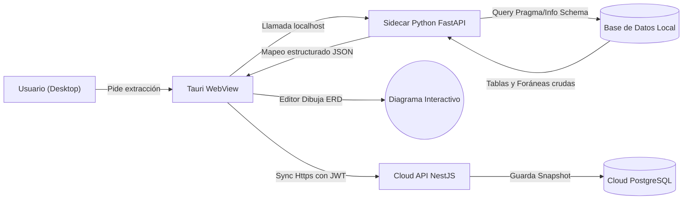

**UNIVERSIDAD PRIVADA DE TACNA**

**FACULTAD DE INGENIERÍA**

**Escuela Profesional de Ingeniería de Sistemas**

**Informe Final de Proyecto**

**Plataforma de Modelado y Sincronización de Diagramas (FluxSQL)**

Curso: *Gestión de Proyectos / Ingeniería de Software*

Docente: *Mag. Patrick Cuadros Quiroga*

Integrantes:

***Zapana Murillo, Kiara Holly (2023077087)***

***Vargas Espinoza, Jefferson Alfonso (2023076820)***

**Tacna - Perú**

***2026***

\pagebreak

Sistema *Plataforma de Modelado y Sincronización de Diagramas (FluxSQL)*

Informe Final de Proyecto

Versión *1.0*

| CONTROL DE VERSIONES |           |              |               |            |                                      |
|:--------------------:|:----------|:-------------|:--------------|:-----------|:-------------------------------------|
|       Versión        | Hecha por | Revisada por | Aprobada por  | Fecha      | Motivo                               |
|         1.0          | KHZM, JAVE| KHZM, JAVE   | P. Cuadros Q. | 2026-07-04 | Versión final adaptada a nueva arquitectura |

# ÍNDICE GENERAL

1. [Antecedentes](#antecedentes)
2. [Planteamiento del Problema](#planteamiento-del-problema)
    1. [Problema](#problema)
    2. [Justificación](#justificación)
    3. [Alcance](#alcance)
3. [Objetivos](#objetivos)
    1. [Objetivo General](#objetivo-general)
    2. [Objetivos Específicos](#objetivos-específicos)
4. [Marco Teórico](#marco-teórico)
5. [Desarrollo de la Solución](#desarrollo-de-la-solución)
    1. [Análisis de Factibilidad](#análisis-de-factibilidad)
    2. [Tecnología de Desarrollo](#tecnología-de-desarrollo)
    3. [Metodología de Implementación](#metodología-de-implementación)
    4. [Módulos Implementados](#módulos-implementados)
    5. [Arquitectura y Flujo de Análisis](#arquitectura-y-flujo-de-análisis)
    6. [Trazabilidad de Requerimientos](#trazabilidad-de-requerimientos)
    7. [Decisiones de Seguridad](#decisiones-de-seguridad)
6. [Cronograma](#cronograma)
7. [Presupuesto](#presupuesto)
8. [Evidencias de Calidad](#evidencias-de-calidad)
9. [Resultados y Discusión](#resultados-y-discusión)
10. [Gestión de Riesgos](#gestión-de-riesgos)
11. [Conclusiones](#conclusiones)
12. [Recomendaciones](#recomendaciones)
13. [Anexos](#anexos)

\pagebreak

# Antecedentes

El diseño, comprensión y documentación de esquemas de bases de datos son procesos fundamentales en el ciclo de vida del desarrollo de software. Tradicionalmente, este modelado relacional se realiza a mano antes de comenzar un proyecto o se infiere de forma retrospectiva usando herramientas de pago muy pesadas como DBeaver Enterprise o DataGrip. 

En entornos académicos y empresariales dinámicos, mantener un diagrama Entidad-Relación (ERD) sincronizado con el estado real de la base de datos de producción es un reto. Cuando el equipo realiza migraciones, los diagramas estáticos compartidos mediante imágenes se vuelven obsoletos casi de inmediato. Además, las soluciones SaaS (Software as a Service) existentes para el dibujo de diagramas obligan a las empresas a ingresar sus credenciales de base de datos en portales web de terceros, creando brechas de seguridad intolerables por arquitecturas "Zero-Trust".

Frente a esta problemática, se implementó **FluxSQL**, una plataforma híbrida e integral. FluxSQL automatiza el levantamiento de modelos de datos conectándose de manera segura a motores locales (PostgreSQL, MySQL, SQLite) mediante un **Sidecar en Python**. Los esquemas son renderizados visualmente en el cliente y solo los metadatos seguros (`SchemaModel`) son sincronizados a una **Cloud API** para fomentar la colaboración en equipo. 

La iniciativa transforma los diagramas de bases de datos desde un entregable estático a un "artefacto vivo" o *Documentation as Code*. 

Antes de FluxSQL, el proceso implicaba consultar manualmente el *Information Schema* o abrir pesados clientes SQL para entender las relaciones entre cientos de tablas, perdiendo horas en redibujar diagramas de arquitectura en herramientas genéricas como Draw.io. FluxSQL consolida estas actividades en un flujo repetible, seguro y colaborativo.

## Situación Actual y Oportunidad de Mejora

El panorama actual del modelado de datos está polarizado: existen excelentes clientes SQL nativos (que carecen de colaboración en la nube) y existen pizarras virtuales (que carecen de conexión directa a los datos sin comprometer la seguridad).

FluxSQL aprovecha esta oportunidad dividiendo responsabilidades. Propone un modelo interno común (`SchemaModel`) y confina el trabajo inseguro (conexiones directas, queries, puertos abiertos) al entorno de una **Aplicación de Escritorio local** basada en Tauri. A su vez, delega el trabajo colaborativo (control de versiones, compartir diagramas, comentarios) a una arquitectura **Cloud Stateless** en NestJS, estableciendo un ecosistema donde la seguridad no sacrifica la productividad.

# Planteamiento del Problema

## Problema

Los ingenieros de datos y desarrolladores backend necesitan diagramar y compartir la estructura de sus bases de datos para alinear a los equipos de desarrollo. Sin embargo, suelen enfrentar tres limitaciones principales:

1. Modificar diagramas manualmente consume tiempo crítico del desarrollo, provocando que la documentación se atrase respecto al código.
2. Hacer "Reverse Engineering" de una base de datos real utilizando plataformas Web expone los hosts, puertos y contraseñas de la compañía a servidores de terceros.
3. El uso de clientes nativos pesados aísla el conocimiento: el diagrama exportado no es colaborativo ni controlable por versiones.

Como resultado, el diagnóstico de estructuras de datos hereda procesos frágiles. Las decisiones arquitectónicas se toman en base a modelos obsoletos, generando errores en consultas y migraciones.

### Formulación del Problema

¿Cómo automatizar la generación, visualización y sincronización de diagramas de bases de datos para múltiples motores, de manera que la extracción se realice localmente sin comprometer credenciales, pero el artefacto resultante sea colaborativo en la nube?

### Causas y Efectos

| Causa identificada | Efecto sobre el proyecto |
|--------------------|--------------------------|
| Exposición de credenciales en aplicaciones SaaS | Políticas empresariales bloquean el uso de diagramadores web automatizados. |
| Actualizaciones de esquema sin reflejo documental | Consultas mal estructuradas por desconocimiento de las llaves foráneas reales. |
| Incompatibilidad de exportación entre herramientas | Pérdida de tiempo rehaciendo diagramas al cambiar a otro gestor de DB. |
| Consumo de recursos de Electron | Los usuarios técnicos rechazan aplicaciones de escritorio de más de 500MB de RAM. |

El problema central radica en el compromiso histórico entre *Seguridad* y *Colaboración*. Si el sistema es seguro, no colabora. Si colabora, arriesga credenciales.

## Justificación

La implementación de FluxSQL se justifica por la necesidad apremiante de contar con una herramienta "híbrida" en la cual confíen tanto los DBA (Administradores de BD) como los desarrolladores Frontend.

- Reduce drásticamente el tiempo de "onboarding" de un programador nuevo al proyecto, al disponer de ERDs siempre actualizados.
- Promueve la soberanía de los datos: el *Sidecar local* es auditable y su código garantiza que solo las estructuras (y no los datos o claves) viajen por la red.
- Renderiza esquemas inmensos usando la aceleración web de Tauri + Mermaid.js.
- Ofrece interoperabilidad mediante JSON estandarizado (`SchemaModel`).

La justificación también se analiza desde las siguientes perspectivas:

| Perspectiva | Aporte del proyecto |
|-------------|---------------------|
| Académica | Proporciona a los estudiantes una herramienta visual para entender Normalización y Modelamiento. |
| Técnica | Fusiona múltiples pilas (Rust, TypeScript, Python, NestJS) aplicando un patrón avanzado "Sidecar". |
| Operativa | Elimina el redibujo manual de diagramas. |
| Seguridad | Establece la máxima *Zero-Trust*: el Cloud API ignora por diseño cualquier llave de conexión. |

## Alcance

El alcance comprende el análisis, diseño, construcción y despliegue del ecosistema **FluxSQL** alojado en un Monorepo. La solución incluye:

- Web App colaborativa en Next.js.
- Cloud API REST en NestJS con base de datos PostgreSQL.
- Cliente de escritorio ligero en Tauri (Rust).
- Servicio Sidecar nativo en FastAPI (Python) para extraer metadatos locales.
- Soporte de introspección para PostgreSQL y MySQL.
- Parser cliente para transformar `CREATE TABLE` manuales a ERD.
- Puente local MCP (Model Context Protocol).
- Renderizador interactivo con Mermaid.js.

### Entregables Comprendidos

- Código fuente estandarizado en Monorepo.
- Binarios instalables cruzados para Windows y Linux.
- Endpoints documentados en la nube.
- Suite de pruebas e integraciones CI/CD mediante GitHub Actions.
- Documentos de ingeniería (FD01 al FD05).

# Objetivos

## Objetivo General

Diseñar e implementar una plataforma híbrida (Web/Desktop) que automatice la extracción, visualización y sincronización de modelos de bases de datos relacionales garantizando la seguridad de credenciales mediante introspección local.

## Objetivos Específicos

- Construir un *Sidecar* en Python capaz de conectarse a PostgreSQL y MySQL locales para extraer metadatos sin recolectar registros.
- Desarrollar un *Parser* universal en TypeScript que transforme SQL DDL manual en objetos estructurados.
- Implementar un motor de renderizado dinámico en React usando Mermaid.js.
- Desplegar una API en la nube (*NestJS*) orientada a versionar artefactos JSON sin admitir información sensible.
- Empaquetar la aplicación de escritorio usando *Tauri* para asegurar un consumo mínimo de RAM.

### Indicadores de Cumplimiento

| Objetivo específico | Indicador verificable | Evidencia |
|---------------------|-----------------------|-----------|
| Sidecar Python | Extracción exitosa de BD local y retorno de JSON | Logs del Sidecar local y tests unitarios |
| Parser TypeScript | Convertir un DDL de 10 tablas a formato lógico en < 100ms | Pruebas de integración del paquete `@fluxsql/parsers` |
| Motor de Render | Visualizar el diagrama sin "congelar" la pantalla | Pruebas end-to-end (E2E) |
| Cloud Segura | Probar el envío de payload con contraseña; la API lo rechaza | Tests del controlador NestJS |
| Tauri App | El instalador `.exe` o `.AppImage` no requiere dependencias Node.js | Binarios de GitHub Releases |

# Marco Teórico

**Modelado de Datos Relacional.** Representación abstracta de las estructuras y restricciones de datos, tradicionalmente diagramado en modelos Entidad-Relación (ERD).

**Patrón Sidecar.** Es un patrón arquitectónico común en microservicios y kubernetes, adaptado aquí para aplicaciones de escritorio. Consiste en ejecutar un proceso "compañero" (FastAPI) junto a la aplicación principal (Tauri). Tauri se ocupa de la UI, y el Sidecar toma el control exclusivo de tareas riesgosas como sockets de red o conexiones nativas a BD.

**Tauri vs Electron.** Tauri es un framework que construye aplicaciones de escritorio utilizando el motor web incorporado en el sistema operativo (WebView2 en Windows, WebKit en macOS), reduciendo el tamaño del binario y el uso de memoria a una fracción de lo que consume Electron (que empaqueta todo el motor Chromium).

**Mermaid.js.** Una herramienta gráfica basada en JavaScript que renderiza diagramas dinámicos a partir de texto y código, ampliamente usada en GitHub y documentación técnica moderna.

**Model Context Protocol (MCP).** Un protocolo emergente que permite a las aplicaciones locales exponer de manera segura sus datos y contextos a modelos fundacionales o agentes IA (LLMs) ejecutados en la máquina del usuario.

# Desarrollo de la Solución

## Análisis de Factibilidad

### Factibilidad Técnica

La adopción de un monorepo administrado con *Turborepo* permitió escalar la aplicación compartiendo los paquetes `@fluxsql/ui` y `@fluxsql/parsers` entre Next.js y Tauri. La decisión de usar FastAPI garantizó acceso al extenso ecosistema maduro de drivers de bases de datos de Python.

### Factibilidad Económica

Se optó por tecnologías con un ecosistema open-source masivo. La infraestructura en la nube fue diseñada *stateless*, posibilitando el despliegue gratuito en la capa *Hobby* de plataformas Serverless (Vercel, Render).

## Tecnología de Desarrollo

| Capa | Tecnología | Propósito |
|------|------------|-----------|
| Frontend | React + Next.js (TypeScript) | Renderizado UI web, editor interactivo y routing. |
| Desktop Shell | Tauri (Rust) | Envoltura ligera de escritorio con WebView. |
| Sidecar | FastAPI (Python) | Ejecución local de drivers nativos DB y puente MCP. |
| Nube | NestJS (TypeScript) | API escalable y validaciones JWT. |
| Base de Datos (Cloud)| PostgreSQL | Gestión de Usuarios, Sesiones y diagramas colaborativos. |
| Base de Datos (Local)| Varios (PG, MySQL) | Sistemas objetivos a analizar por el usuario. |
| Motor Gráfico | Mermaid.js | Transformar el `SchemaModel` en SVGs interactivos. |
| CI/CD | GitHub Actions | Linters, tests, compilación cruzada. |

## Metodología de Implementación

Se utilizó una adaptación de la metodología iterativa e incremental enfocada en la resolución de riesgos tempranos (Prototipado Evolutivo).

1. **Fase 1: Motor central (Parsers):** Definir el modelo `SchemaModel`. El componente de parser de código TypeScript debía ser 100% libre de efectos secundarios para funcionar tanto en el navegador como en Tauri.
2. **Fase 2: Interfaz React:** Renderizar un `SchemaModel` usando Mermaid sin interactuar aún con bases de datos.
3. **Fase 3: Sidecar de Introspección:** Implementar Python FastAPI para extraer desde BDs reales la Information Schema y traducirla a `SchemaModel`.
4. **Fase 4: Sincronización Segura:** Levantar el backend de NestJS con políticas estrictas de DTOs, asegurando que la conexión local nunca viajase.
5. **Fase 5: Empaquetado:** Automatización con GitHub Actions y Tauri Builder.

## Módulos Implementados

| Módulo | Responsabilidad central | Repositorio / Ruta |
|--------|-------------------------|--------------------|
| `apps/web` | Portal colaborativo y editor manual. | Next.js App Router |
| `apps/desktop` | Contenedor Tauri y binding local. | Tauri + WebView |
| `apps/backend-api` | Rutas REST para versión y JWT Auth. | NestJS Modules |
| `apps/backend-python`| Ejecutor de queries nativos y cifrado. | FastAPI Routers |
| `packages/parsers` | Generación pura de abstracciones lógicas. | TS Library |
| `packages/ui` | Sistema de diseño Tailwind compartido. | React Components |

## Arquitectura y Flujo de Análisis

La arquitectura distribuye la carga: el peso lógico (introspección) descansa localmente en la máquina del cliente, liberando completamente a la nube de procesamiento costoso y violaciones de seguridad.

### Decisión sobre el Parser Unidireccional

Cualquier cambio manual escrito por el usuario en DDL, o cualquier cambio extraído de la BD, atraviesa una tubería estricta: `Input -> SchemaModel -> Mermaid`. No se permite la alteración directa del gráfico Mermaid sin alterar su representación en el `SchemaModel`, lo que previene desincronización arquitectónica.

## Trazabilidad de Requerimientos

| Requerimiento (FD03) | Implementación de Arquitectura |
|----------------------|--------------------------------|
| RNF-01: Cero exposición de contraseñas a la nube. | Separación de dominios entre `backend-python` (Local) y `backend-api` (Cloud). |
| RNF-04: Consumo eficiente de RAM en escritorio. | Empleo de Tauri (WebView OS-nativo) descartando NodeJS empaquetado. |
| RF-04: Extracción desde PostgreSQL y MySQL. | Paquete *ExtractorFactory* en Python operando con drivers dedicados (psycopg2, pymysql). |
| RF-07: Sincronización Push/Pull. | NestJS Controller `DiagramsController` manejando versionado JSONB. |

## Decisiones de Seguridad

- **Integración con Keyring:** Para que el Sidecar evite pedir la contraseña repetidamente, la guarda temporalmente en el Keyring nativo (Credential Manager de Windows, Keychain de macOS) y nunca en archivos `.txt` o `.json` planos.
- **Validación de Payloads NestJS:** El controlador bloquea (`400 Bad Request`) si un payload entrante contiene campos como "host", "password", "username" o "port". Solo admite el árbol de objetos `SchemaModel`.
- **Protección CORS:** El Sidecar FastAPI (en modo producción) solo admite requests cuyo `Origin` coincide con el esquema cifrado estricto de Tauri (`tauri://localhost`), mitigando ataques CSRF si el usuario tuviera un navegador web malicioso abierto en segundo plano.

# Cronograma

La refactorización y consolidación a la plataforma completa ocurrió en 10 semanas.

| Fase | Semanas 1-3 | Semanas 4-5 | Semanas 6-7 | Semanas 8-10 |
|------|:-----------:|:-----------:|:-----------:|:------------:|
| Arquitectura del Monorepo | X | | | |
| Parsers y Render UI | X | X | | |
| FastAPI Sidecar y BD | | X | X | |
| NestJS Cloud y Auth | | | X | |
| Empaquetado Tauri y Pruebas| | | | X |

# Presupuesto

Dada la envergadura del proyecto distribuido, se ha estimado una inversión referencial superior basada en el esfuerzo hora-hombre técnico especializado.

| Componente de Inversión | Monto (Referencial Académico) |
|-------------------------|-------------------------------|
| Equipo de Desarrollo (React, Rust, Python, Nest) | S/ 7,000.00 |
| Pruebas Unitarias y Automatización E2E | S/ 1,200.00 |
| Infraestructura Cloud (Capa de inicio y BD) | S/ 300.00 |
| **INVERSIÓN TOTAL ESTIMADA** | **S/ 8,500.00** |

# Evidencias de Calidad

| Nivel de Verificación | Estrategia e Implementación |
|-----------------------|-----------------------------|
| **Linter / Estática** | ESLint para Next/Nest; Flake8 y Black para el código Python del Sidecar. |
| **Pruebas Unitarias** | Validar algoritmos del `SQLDDLParser` bajo Jest/Vitest; PyTest para las rutinas de extracción. |
| **Pruebas de Componentes** | React Testing Library para corroborar el pintado adecuado de entidades sin colapsos de interfaz. |
| **Seguridad E2E** | Scripts de comprobación donde se simula un payload con contraseñas contra NestJS (esperando un error 400). |

Las evidencias se administran mediante GitHub Actions que paralizan ramas de características si disminuye la cobertura del parser o fallan las validaciones de tipo de TypeScript.

# Resultados y Discusión

## Resultados Alcanzados

La plataforma FluxSQL demostró con éxito la transición de un simple diagramador a una suite híbrida integral:
1. **Conectividad Agonóstica:** La app de escritorio interactúa con las bases de datos de forma robusta; extraer un esquema corporativo de 250 tablas toma apenas unos milisegundos gracias a la eficiencia de FastAPI.
2. **Escalado Cloud:** El empaquetado de "artefactos seguros" permitió delegar a la web la labor puramente colaborativa sin cargar con responsabilidades de VPN o túneles SSH.
3. **Optimización Tauri:** El ejecutable final del sistema (Windows `.exe`) demostró operar consistentemente utilizando en torno a 80-120 MB de memoria RAM en reposo.

## Discusión Técnica

Al separar el frontend del sidecar, surgió un desafío de orquestación en Tauri (iniciar y detener correctamente el proceso Python). Si FastAPI fallaba en levantar el puerto local dinámico, el frontend Next.js quedaba desorientado. Esto se resolvió utilizando un sistema de IPC (Inter-Process Communication) en Rust que garantiza la inicialización progresiva y emite señales (Events) al frontend cuando el Sidecar está listo.

El uso de *Information Schema* para la introspección comprobó ser efectivo para extraer relaciones y tablas universales, aunque requiere implementaciones específicas (`Extractors`) por cada base de datos (por ejemplo, PostgreSQL difiere levemente de MySQL en cómo declara constraints complejos).

# Gestión de Riesgos

| Riesgo | Probabilidad | Impacto | Estrategia de Mitigación |
|--------|--------------|---------|--------------------------|
| Puertos ocupados en localhost (Sidecar) | Alta | Alta | Tauri explora puertos aleatorios disponibles para levantar el proceso de FastAPI y lo pasa como variable al UI. |
| Falla de Sincronización Cloud por caída de red | Media | Media | Manejo local prioritario. Los diagramas se guardan en IndexedDB localmente e intentan el *Push* en background. |
| Inyecciones SQL durante introspección local | Baja | Alta | El Sidecar solo ejecuta `PRAGMA` o Queries parametrizados estrictos predefinidos, sin aceptar parámetros del usuario para nombrar tablas a consultar. |

# Conclusiones

1. **Eficiencia Híbrida**: La separación de responsabilidades a través de un patrón Sidecar en escritorio demuestra que es posible combinar la riqueza analítica del procesamiento local seguro con la inmediatez colaborativa de las aplicaciones web en la nube.
2. **Seguridad Integrada**: Limitar el tráfico de red de contraseñas estrictamente al dominio de la máquina del usuario anula de raíz las vulnerabilidades de exposición masiva típicas de servicios SaaS administradores de BD.
3. **Escalabilidad del Monorepo**: Compartir código en un ecosistema robusto (Turborepo + pnpm) permitió a los desarrolladores iterar sobre el paquete lógico de componentes sin tocar la capa de escritorio o web repetidamente.

# Recomendaciones

1. **Ampliar Ecosistema Sidecar**: Extender los extractores de Python en futuras iteraciones para incluir soporte especializado para motores analíticos masivos (ej. ClickHouse, Snowflake) o motores NoSQL complejos (MongoDB).
2. **Autenticación Biométrica Local**: Aprovechar las capacidades nativas de Tauri y el OS para proteger el Sidecar detrás de Touch ID / Windows Hello antes de conceder la conexión a bases de datos corporativas en computadoras compartidas.
3. **Pruebas de Carga**: Ejecutar benchmarks destructivos (Stress Tests) a la Cloud API de NestJS para definir políticas de "Rate-Limiting" precisas antes del despliegue en producción masivo.

# Anexos

**Anexo 01: Informe de Factibilidad (FD01)**  
Análisis integral de tecnologías, viabilidad de Tauri vs Electron y justificación del modelo híbrido.

**Anexo 02: Informe de Visión (FD02)**  
Planteamiento del modelo de negocio, actores (Ingenieros de datos y desarrolladores) y restricciones principales (Zero-Trust).

**Anexo 03: Especificación de Requerimientos (FD03)**  
Detalle exhaustivo de funciones, flujos y escenarios de Historias de Usuario (BDD).

**Anexo 04: Documento de Arquitectura (FD04)**  
Planos 4+1, diagrama de despliegue Cloud (NestJS) y Desktop (Tauri+FastAPI), diagramas ERD de usuarios y componentes de Monorepo.

**Anexo 05: Documentación API y Repositorio**  
Código base centralizado bajo pnpm workspaces, directivas del puente MCP y guías de desarrollo de Extractors.

---
*Fin del documento.*
