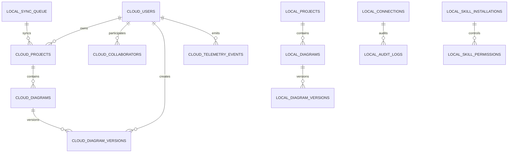

**UNIVERSIDAD PRIVADA DE TACNA**

**FACULTAD DE INGENIERIA**

**Escuela Profesional de Ingenieria de Sistemas**

**Proyecto *Plataforma de Modelado y Sincronizacion de Diagramas (FluxSQL)***

Curso: *Base de Datos II*

Docente: *Mag. Patrick Cuadros Quiroga*

Integrantes:

***Zapana Murillo, Kiara Holly (2023077087)***

***Vargas Espinoza, Jefferson Alfonso (2023076820)***

**Tacna - Peru**

***2026***

\pagebreak

Sistema *FluxSQL - Database Diagram Generator & Cloud Sync*

Diccionario de Datos

Version *1.0*

| CONTROL DE VERSIONES | | | | | |
| :-: | :- | :- | :- | :- | :- |
| Version | Hecha por | Revisada por | Aprobada por | Fecha | Motivo |
| 1.0 | KHZM / JAVE | KHZM / JAVE | P. Cuadros Q. | Julio 2026 | Diccionario completo de datos Cloud/Web y Desktop/Local |

## INDICE GENERAL

1. [Introduccion](#1-introduccion)
2. [Convenciones](#2-convenciones)
3. [Mapa General de Datos](#3-mapa-general-de-datos)
4. [Diccionario Cloud/Web](#4-diccionario-cloudweb)
5. [Diccionario Desktop/Local](#5-diccionario-desktoplocal)
6. [Contratos de Intercambio](#6-contratos-de-intercambio)
7. [Endpoints Principales](#7-endpoints-principales)
8. [Reglas de Integridad y Seguridad](#8-reglas-de-integridad-y-seguridad)
9. [Trazabilidad con el Codigo](#9-trazabilidad-con-el-codigo)

\pagebreak

# Diccionario de Datos

## 1. Introduccion

El presente documento define las estructuras de datos utilizadas por **FluxSQL**, plataforma hibrida para modelado, generacion, versionado y sincronizacion de diagramas de bases de datos.

FluxSQL se divide en dos entornos:

- **Cloud/Web:** aplicacion web Next.js y API Cloud NestJS con persistencia PostgreSQL mediante Drizzle ORM.
- **Desktop/Local:** aplicacion Tauri/Next.js con sidecar FastAPI en Python y base local SQLite mediante SQLAlchemy.

El objetivo del diccionario es describir tablas, campos, contratos JSON, reglas de validacion, relaciones y restricciones de seguridad. No se documentan datos internos de las bases de datos del usuario final, porque FluxSQL solamente extrae metadatos seguros y no debe almacenar dumps, backups, contrasenas ni resultados privados de consultas en la nube.

## 2. Convenciones

| Simbolo | Significado |
|---|---|
| Si | Campo obligatorio |
| No | Campo opcional |
| Cond. | Obligatorio segun motor, modulo o contexto |
| PK | Llave primaria |
| FK | Llave foranea |
| JSON | Objeto serializable |
| Local | Dato permitido solo en Desktop/Sidecar |
| Cloud-safe | Dato permitido para sincronizacion hacia la nube |
| Secreto | Dato sensible que no debe exponerse ni registrarse en texto plano |

## 3. Mapa General de Datos

## 4. Diccionario Cloud/Web

El dominio Cloud/Web se implementa en `apps/web/backend-api`. Su funcion es almacenar artefactos compartibles: usuarios, proyectos, diagramas, versiones, colaboracion y telemetria. Por diseno, no almacena contrasenas de bases de datos ni cadenas de conexion.

### 4.1. Tabla `users`

| Campo | Tipo | Obligatorio | Clave | Descripcion |
|---|---|:---:|:---:|---|
| `id` | `uuid` | Si | PK | Identificador interno del usuario. |
| `auth_id` | `uuid` | No | UQ | Identificador del proveedor de autenticacion externo. |
| `email` | `text` | Si | UQ | Correo del usuario. |
| `name` | `text` | No |  | Nombre visible. |
| `avatar_url` | `text` | No |  | URL de imagen de perfil. |
| `created_at` | `timestamp with timezone` | Si |  | Fecha de creacion del registro. |

### 4.2. Tabla `projects`

| Campo | Tipo | Obligatorio | Clave | Descripcion |
|---|---|:---:|:---:|---|
| `id` | `uuid` | Si | PK | Identificador del proyecto en la nube. |
| `name` | `text` | Si |  | Nombre del proyecto. |
| `description` | `text` | No |  | Descripcion funcional o tecnica. |
| `owner_id` | `uuid` | Si | FK | Usuario propietario. |
| `tags` | `text[]` | No |  | Etiquetas para clasificacion. |
| `created_at` | `timestamp with timezone` | Si |  | Fecha de creacion. |
| `updated_at` | `timestamp with timezone` | Si |  | Ultima actualizacion. |

Relacion: `owner_id` referencia `users.id` con eliminacion en cascada.

### 4.3. Tabla `collaborators`

| Campo | Tipo | Obligatorio | Clave | Descripcion |
|---|---|:---:|:---:|---|
| `id` | `uuid` | Si | PK | Identificador del colaborador. |
| `project_id` | `uuid` | Si | FK | Proyecto compartido. |
| `user_id` | `uuid` | Si | FK | Usuario invitado o miembro. |
| `role` | `text` | Si |  | Rol: `owner`, `editor` o `viewer`. |
| `joined_at` | `timestamp with timezone` | Si |  | Fecha de incorporacion. |

Reglas:

- La combinacion `project_id` + `user_id` debe ser unica.
- El campo `role` solo acepta `owner`, `editor` o `viewer`.

### 4.4. Tabla `diagrams`

| Campo | Tipo | Obligatorio | Clave | Descripcion |
|---|---|:---:|:---:|---|
| `id` | `uuid` | Si | PK | Identificador del diagrama. |
| `project_id` | `uuid` | Si | FK | Proyecto contenedor. |
| `name` | `text` | Si |  | Nombre del diagrama. |
| `source_code` | `text` | No |  | SQL, DDL o fuente textual usada para generar el diagrama. |
| `dialect` | `text` | No |  | Dialecto activo: PostgreSQL, MySQL, SQL Server, JSON, MongoDB o Neo4j. |
| `flow_json` | `jsonb` | No |  | Estado visual del lienzo React Flow. |
| `mermaid_string` | `text` | No |  | Representacion exportable Mermaid. |
| `is_public` | `boolean` | Si |  | Indica si el diagrama puede publicarse por enlace. |
| `share_access` | `text` | Si |  | Nivel de acceso compartido, por defecto `view`. |
| `created_at` | `timestamp with timezone` | Si |  | Fecha de creacion. |
| `updated_at` | `timestamp with timezone` | Si |  | Ultima actualizacion. |

Relacion: `project_id` referencia `projects.id` con eliminacion en cascada.

### 4.5. Tabla `diagram_versions`

| Campo | Tipo | Obligatorio | Clave | Descripcion |
|---|---|:---:|:---:|---|
| `id` | `uuid` | Si | PK | Identificador de version. |
| `diagram_id` | `uuid` | Si | FK | Diagrama versionado. |
| `version_number` | `integer` | Si |  | Numero incremental de version. |
| `flow_json` | `jsonb` | Si |  | Estado visual completo en el momento del guardado. |
| `sql_content` | `text` | No |  | SQL asociado a la version. |
| `active_dialect` | `text` | Si |  | Dialecto activo al crear la version. |
| `snapshots` | `jsonb` | No |  | Exportaciones por dialecto: `postgresql`, `mysql`, `sqlserver`, `json`. |
| `message` | `text` | Si |  | Descripcion del cambio. |
| `user_id` | `uuid` | Si | FK | Usuario que crea la version. |
| `created_at` | `timestamp with timezone` | Si |  | Fecha de versionamiento. |

### 4.6. Tabla `telemetry_events`

| Campo | Tipo | Obligatorio | Clave | Descripcion |
|---|---|:---:|:---:|---|
| `id` | `uuid` | Si | PK | Identificador del evento. |
| `user_id` | `uuid` | No | FK | Usuario autenticado; nulo para sesiones anonimas. |
| `platform` | `text` | Si |  | Plataforma emisora: `web` o `desktop`. |
| `event` | `text` | Si |  | Evento: `session_start`, `page_view`, `session_end` u otro evento controlado. |
| `metadata` | `jsonb` | No |  | Datos tecnicos no sensibles. |
| `created_at` | `timestamp with timezone` | Si |  | Fecha de registro. |

## 5. Diccionario Desktop/Local

El dominio Desktop/Local se implementa en `apps/desktop/backend-python`. Su base SQLite interna guarda conexiones locales cifradas, proyectos, diagramas, versiones, cola de sincronizacion, auditoria y permisos de agentes. Este dominio si puede manejar credenciales, pero deben permanecer en el equipo del usuario.

### 5.1. Tabla `conexiones`

| Campo | Tipo | Obligatorio | Clave | Descripcion |
|---|---|:---:|:---:|---|
| `id` | `integer` | Si | PK | Identificador local autoincremental. |
| `nombre_alias` | `string(100)` | No |  | Nombre amigable de la conexion. |
| `motor_bd` | `string(50)` | Si |  | Motor: MySQL, PostgreSQL, SQL Server, MongoDB, Cassandra o Neo4j. |
| `host` | `string(255)` | Si |  | Host o IP local/remoto. |
| `puerto` | `integer` | Si |  | Puerto entre 1 y 65535. |
| `nombre_bd` | `string(255)` | Si |  | Nombre de base de datos. |
| `usuario_db` | `string(255)` | No |  | Usuario de conexion. |
| `password_db` | `text` | No | Secreto | Contrasena cifrada con Fernet. |
| `registros_generados` | `integer` | Si |  | Total generado para pruebas. |
| `registros_insertados` | `integer` | Si |  | Total insertado en BD externa. |
| `created_at` | `datetime` | Si |  | Fecha de creacion. |

### 5.2. Tabla local `projects`

| Campo | Tipo | Obligatorio | Clave | Descripcion |
|---|---|:---:|:---:|---|
| `id` | `integer` | Si | PK | Identificador local del proyecto. |
| `name` | `string` | Si |  | Nombre del proyecto. |
| `description` | `text` | No |  | Descripcion. |
| `created_at` | `datetime` | Si |  | Fecha de creacion. |
| `updated_at` | `datetime` | No |  | Ultima actualizacion. |
| `deleted_at` | `datetime` | No |  | Fecha de borrado logico. |
| `is_public` | `boolean` | Si |  | Estado de publicacion. |
| `share_access` | `string` | Si |  | Acceso compartido: `view` o `edit`. |
| `members_json` | `text` | Si | JSON | Lista serializada de miembros. |

### 5.3. Tabla local `diagrams`

| Campo | Tipo | Obligatorio | Clave | Descripcion |
|---|---|:---:|:---:|---|
| `id` | `integer` | Si | PK | Identificador local del diagrama. |
| `project_id` | `integer` | Si | FK | Proyecto local. |
| `name` | `string` | Si |  | Nombre del diagrama. |
| `schema_json` | `text` | No | JSON | Estado visual serializado. |
| `sql_content` | `text` | Si |  | SQL generado o ingresado. |
| `active_dialect` | `string` | Si |  | Dialecto activo, por defecto `postgresql`. |
| `source_database` | `string` | No |  | Base de datos origen usada para introspeccion. |
| `selected_tables_json` | `text` | Si | JSON | Lista de tablas seleccionadas. |
| `last_synced_at` | `datetime` | No |  | Ultima sincronizacion con Cloud. |
| `created_at` | `datetime` | Si |  | Fecha de creacion. |
| `updated_at` | `datetime` | No |  | Ultima actualizacion. |

### 5.4. Tabla local `diagram_versions`

| Campo | Tipo | Obligatorio | Clave | Descripcion |
|---|---|:---:|:---:|---|
| `id` | `integer` | Si | PK | Identificador de version local. |
| `diagram_id` | `integer` | Si | FK | Diagrama asociado. |
| `version_number` | `integer` | Si |  | Numero incremental. |
| `message` | `string` | Si |  | Motivo o resumen de cambio. |
| `flow_json` | `text` | Si | JSON | Estado visual completo. |
| `sql_content` | `text` | Si |  | SQL de la version. |
| `active_dialect` | `string` | Si |  | Dialecto activo. |
| `snapshots_json` | `text` | Si | JSON | Exportaciones por dialecto. |
| `created_at` | `datetime` | Si |  | Fecha de versionamiento. |

### 5.5. Tabla `sync_queue`

| Campo | Tipo | Obligatorio | Clave | Descripcion |
|---|---|:---:|:---:|---|
| `id` | `integer` | Si | PK | Identificador de cola. |
| `artifact_type` | `string(50)` | Si |  | Tipo de artefacto: proyecto, diagrama, skill u otro. |
| `local_id` | `string(100)` | Si |  | Identificador local del artefacto. |
| `operation` | `string(50)` | Si |  | Operacion: `upsert`, `delete`, etc. |
| `payload_json` | `text` | Si | JSON | Payload cloud-safe serializado. |
| `status` | `string(50)` | Si |  | Estado: `pending`, `synced`, `failed`. |
| `attempts` | `integer` | Si |  | Numero de intentos. |
| `last_error` | `text` | No |  | Ultimo error seguro. |
| `created_at` | `datetime` | Si |  | Fecha de creacion. |
| `updated_at` | `datetime` | Si |  | Ultima actualizacion. |

### 5.6. Tabla `cloud_account_session`

| Campo | Tipo | Obligatorio | Clave | Descripcion |
|---|---|:---:|:---:|---|
| `id` | `integer` | Si | PK | Registro unico de sesion local. |
| `user_email` | `string(255)` | Si |  | Correo enlazado. |
| `access_token` | `text` | Si | Secreto | Token de acceso local. |
| `refresh_token` | `text` | No | Secreto | Token de refresco. |
| `provider` | `string(50)` | Si |  | Proveedor, por defecto `fluxy_web`. |
| `status` | `string(50)` | Si |  | Estado: `linked`, `expired`, `unlinked`. |
| `linked_at` | `datetime` | Si |  | Fecha de enlace. |
| `updated_at` | `datetime` | Si |  | Ultima actualizacion. |

### 5.7. Tablas de agentes, auditoria y habilidades

| Tabla | Proposito | Campos principales |
|---|---|---|
| `local_skill_installations` | Instalaciones de habilidades locales. | `skill_id`, `version`, `enabled`, `source`, `installed_at`, `updated_at`. |
| `audit_logs` | Trazabilidad de operaciones de agentes o acciones sensibles. | `agent`, `skill_id`, `connection_id`, `action`, `result`, `backup_id`, `sandbox_id`, `human_approved`, `details_json`. |
| `report_artifacts` | Reportes generados en Markdown u otros formatos. | `title`, `artifact_type`, `content`, `audit_log_id`, `created_at`. |
| `agent_memories` | Memoria local de agentes por alcance. | `scope`, `subject`, `content`, `tags_json`, `created_at`, `updated_at`. |
| `skill_permissions` | Permisos de habilidades por entorno. | `skill_id`, `can_read_schema`, `can_generate_sql`, `can_execute`, `requires_approval`, `environment`. |
| `approval_requests` | Solicitudes de aprobacion humana. | `title`, `risk_level`, `status`, `requested_by`, `details_json`. |
| `schema_decisions` | Decisiones de arquitectura de esquema. | `project_id`, `title`, `decision`, `rationale`, `status`. |
| `environment_guards` | Guardas por ambiente. | `environment`, `require_backup`, `require_sandbox`, `require_approval`, `allow_direct_write`. |

## 6. Contratos de Intercambio

### 6.1. `FlowJson`

| Campo | Tipo | Obligatorio | Descripcion |
|---|---|:---:|---|
| `nodes` | `Node[]` | No | Nodos del diagrama React Flow. |
| `edges` | `Edge[]` | No | Relaciones visuales entre nodos. |
| `viewport` | `object` | No | Posicion y zoom del lienzo. |
| `viewport.x` | `number` | Cond. | Posicion horizontal. |
| `viewport.y` | `number` | Cond. | Posicion vertical. |
| `viewport.zoom` | `number` | Cond. | Nivel de acercamiento. |

### 6.2. `EditorColumn`

| Campo | Tipo | Obligatorio | Descripcion |
|---|---|:---:|---|
| `name` | `string` | Si | Nombre de columna o atributo. |
| `type` | `string` | Si | Tipo logico o nativo. |
| `isPrimaryKey` | `boolean` | No | Marca llave primaria. |
| `isForeignKey` | `boolean` | No | Marca llave foranea. |
| `nullable` | `boolean` | No | Permite nulos. |
| `defaultValue` | `string` | No | Valor por defecto. |
| `references.table` | `string` | No | Tabla referenciada. |
| `references.column` | `string` | No | Columna referenciada. |

### 6.3. `EditorTableData`

| Campo | Tipo | Obligatorio | Descripcion |
|---|---|:---:|---|
| `tableName` | `string` | Si | Nombre de tabla, coleccion o etiqueta. |
| `columns` | `EditorColumn[]` | Si | Columnas o propiedades. |
| `comment` | `string` | No | Comentario documental. |
| `color` | `string` | No | Color de visualizacion. |

### 6.4. `ConexionRequest`

| Campo | Tipo | Obligatorio | Regla / descripcion |
|---|---|:---:|---|
| `alias` | `string` | No | Nombre amigable. |
| `host` | `string` | Si | No debe estar vacio. |
| `puerto` | `integer` | Si | Entre 1 y 65535. |
| `usuario` | `string` | Si | Usuario de motor externo. |
| `password` | `string` | Si | Secreto de uso local. |
| `nombre_bd` | `string` | Si | Base objetivo. |
| `motor` | `MotorBDEnum` | No | `mysql`, `postgresql`, `sqlserver`, `mongodb`, `cassandra`, `neo4j`. |

### 6.5. `DatabaseSchema`

| Campo | Tipo | Obligatorio | Descripcion |
|---|---|:---:|---|
| `motor` | `string` | Si | Motor origen. |
| `database_name` | `string` | Si | Nombre de base. |
| `tables` | `TableSchema[]` | Si | Tablas detectadas. |

### 6.6. `TableSchema`

| Campo | Tipo | Obligatorio | Descripcion |
|---|---|:---:|---|
| `name` | `string` | Si | Nombre de tabla. |
| `columns` | `ColumnSchema[]` | Si | Columnas de la tabla. |
| `primary_keys` | `string[]` | No | Llaves primarias. |
| `foreign_keys` | `dict[]` | No | Relaciones externas. |

### 6.7. `ColumnSchema`

| Campo | Tipo | Obligatorio | Descripcion |
|---|---|:---:|---|
| `name` | `string` | Si | Nombre de columna. |
| `data_type` | `string` | Si | Tipo detectado. |
| `is_nullable` | `boolean` | Si | Permite nulos. |
| `is_primary_key` | `boolean` | Si | Es llave primaria. |
| `is_unique` | `boolean` | Si | Tiene restriccion unica. |
| `default_value` | `string` | No | Valor por defecto. |
| `foreign_key` | `dict` | No | Tabla/columna referenciada. |
| `max_length` | `integer` | No | Longitud maxima. |

### 6.8. `CloudConnectionProfileDto`

| Campo | Tipo | Obligatorio | Descripcion |
|---|---|:---:|---|
| `connectionProfileId` | `string` | Si | Identificador local o sincronizado. |
| `engine` | `string` | Si | Motor de base de datos. |
| `version` | `string` | No | Version del motor. |
| `environment` | `DatabaseEnvironment` | Si | `development`, `staging`, `production` o `unknown`. |
| `localOnly` | `true` | Si | Garantiza que el perfil real vive solo en Desktop. |

### 6.9. `CloudSafeArtifactPolicyDto`

| Campo | Tipo | Valor esperado | Descripcion |
|---|---|---|---|
| `allowsCredentials` | `boolean` | `false` | La nube no acepta credenciales. |
| `allowsBackups` | `boolean` | `false` | La nube no acepta backups. |
| `allowsDumps` | `boolean` | `false` | La nube no acepta dumps. |
| `allowsPrivateQueryResults` | `boolean` | `false` | La nube no acepta resultados privados. |
| `allowsDiagramMetadata` | `boolean` | `true` | Si acepta metadatos de diagramas. |
| `allowsGeneratedSql` | `boolean` | `true` | Si acepta SQL generado/documental. |

## 7. Endpoints Principales

### 7.1. Cloud API

| Metodo | Ruta | Entrada | Salida |
|---|---|---|---|
| GET | `/health` | Ninguna | Estado de API. |
| GET | `/policy/cloud-safe-artifacts` | Ninguna | Politica cloud-safe. |
| GET | `/projects` | Ninguna | Lista de proyectos. |
| POST | `/projects` | `CreateProjectDto` | `ProjectDto`. |
| GET | `/projects/:projectId` | Parametro de ruta | `ProjectDto`. |
| GET | `/diagrams/project/:projectId` | Parametro de ruta | Lista de diagramas. |
| POST | `/diagrams` | `SaveDiagramDto` | `DiagramDto`. |
| GET | `/versions/diagram/:diagramId` | Parametro de ruta | Versiones del diagrama. |
| POST | `/versions/diagram/:diagramId` | Version | Version creada. |
| POST | `/public-links` | Configuracion de enlace | Token publico. |
| GET | `/public-links/:token` | Token | Diagrama publico. |
| POST | `/telemetry/event` | Evento | Resultado de registro. |
| GET | `/telemetry/summary` | Ninguna | Resumen de telemetria. |

### 7.2. Desktop Sidecar API

| Metodo | Ruta | Entrada | Salida |
|---|---|---|---|
| GET | `/health` | Ninguna | Estado del sidecar. |
| POST | `/api/v1/connect/test` | `ConexionRequest` | Resultado de conexion. |
| POST | `/api/v1/connect/schema` | `ConexionRequest` | `DatabaseSchema`. |
| POST | `/api/v1/connect/table-rows` | `TableRowsRequest` | Filas paginadas. |
| GET | `/api/v1/connect/saved` | Ninguna | Conexiones guardadas sin password. |
| GET | `/api/v1/connect/saved/{id}/schema` | ID local | Esquema seguro. |
| POST | `/api/v1/diagrams/generate` | Conexion + tablas | Diagrama generado. |
| POST | `/api/v1/generate/preview` | `GeneratePreviewRequest` | Vista previa de datos. |
| POST | `/api/v1/generate/export` | `ExportRequest` | Archivo exportable. |
| POST | `/api/v1/connect/insert` | `InsertRequest` | Resultado de insercion. |
| GET | `/api/v1/mcp/health` | Ninguna | Estado MCP. |
| GET | `/api/v1/mcp/config` | Ninguna | Configuracion del puente MCP. |
| POST | `/api/v1/sync/cloud/sync` | Sesion local | Resultado de sincronizacion. |

## 8. Reglas de Integridad y Seguridad

1. La nube no debe recibir contrasenas, cadenas de conexion, dumps, backups ni resultados privados.
2. Las contrasenas locales se almacenan cifradas y nunca se devuelven en respuestas publicas.
3. Los proyectos eliminan diagramas asociados por cascada en Cloud y Desktop.
4. Los roles de colaborador solo pueden ser `owner`, `editor` o `viewer`.
5. El puerto de conexion debe estar entre 1 y 65535.
6. El JSON de diagrama debe mantenerse como `nodes`, `edges` y `viewport` para compatibilidad con React Flow.
7. Las exportaciones SQL deben generarse desde el modelo visual, no desde resultados privados.
8. Las operaciones de escritura directa en bases externas requieren politica, ambiente y aprobacion cuando corresponda.
9. La cola de sincronizacion debe transportar solamente artefactos cloud-safe.
10. Los logs de auditoria deben ocultar credenciales, tokens y datos sensibles.

## 9. Trazabilidad con el Codigo

| Estructura | Archivo |
|---|---|
| Esquema Cloud Drizzle | `apps/web/backend-api/src/db/schema.ts` |
| DTO de proyectos Cloud | `apps/web/backend-api/src/projects/dto.ts` |
| DTO de diagramas Cloud | `apps/web/backend-api/src/diagrams/dto.ts` |
| Politica cloud-safe | `apps/web/backend-api/src/common/cloud-safe.dto.ts` |
| Modelos ORM locales | `apps/desktop/backend-python/backend/models/models.py` |
| Modelos ORM de diagramas locales | `apps/desktop/backend-python/diagrams/models.py` |
| Esquemas Pydantic Desktop | `apps/desktop/backend-python/backend/models/schemas.py` |
| Esquemas Pydantic de diagramas | `apps/desktop/backend-python/diagrams/schemas.py` |
| Tipos de editor y serializacion | `apps/desktop/frontend-app/lib/editor-schema.ts` |
| Tipo `FlowJson` | `apps/desktop/frontend-app/lib/flow-types.ts` |
| Cliente API Desktop | `apps/desktop/frontend-app/lib/api/client.ts` |

---
*Fin del Documento.*
