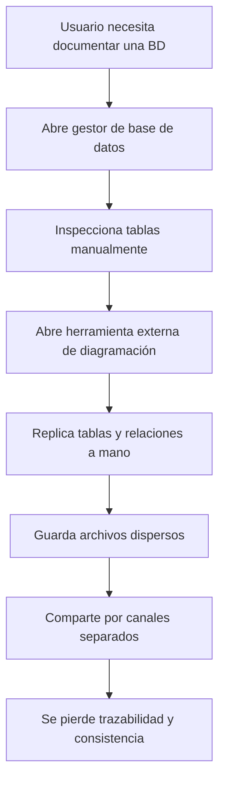
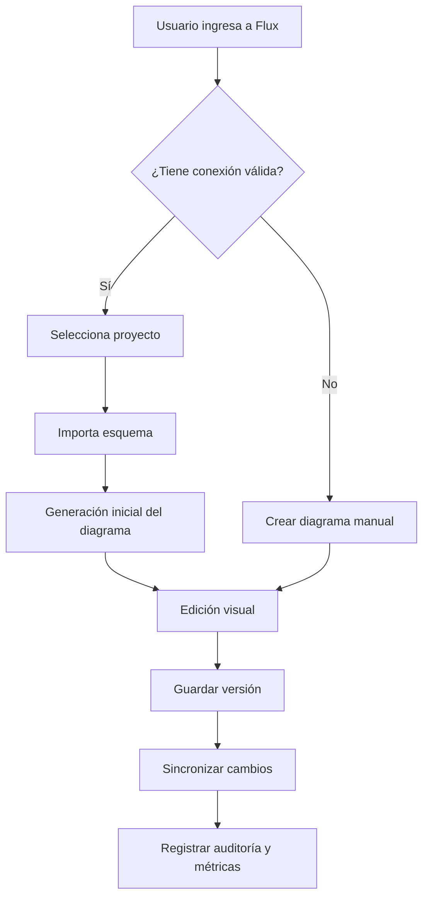
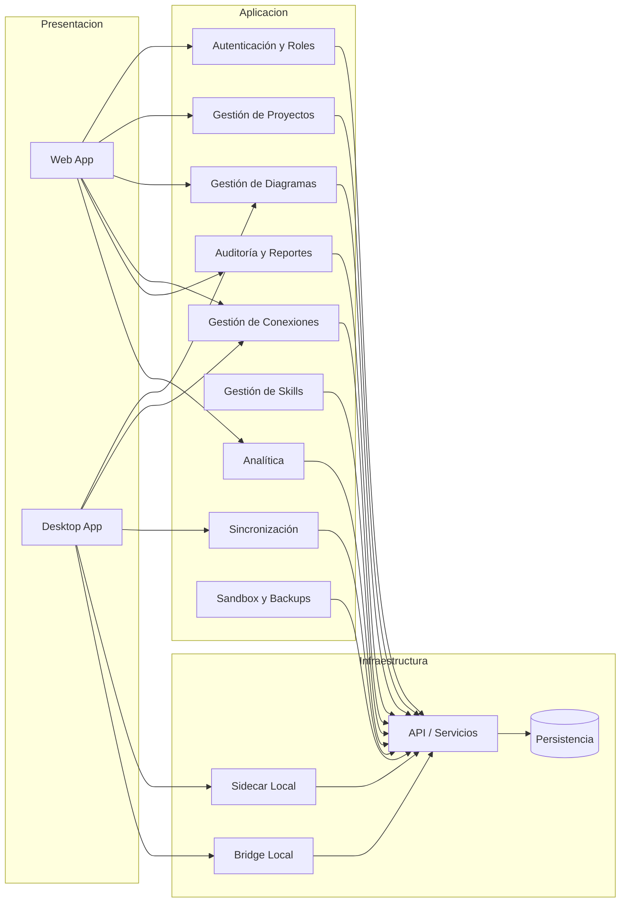
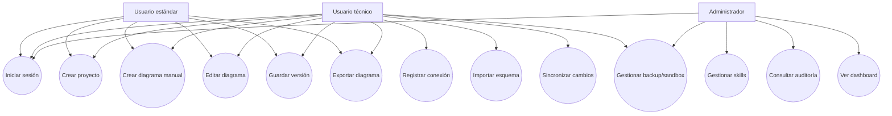
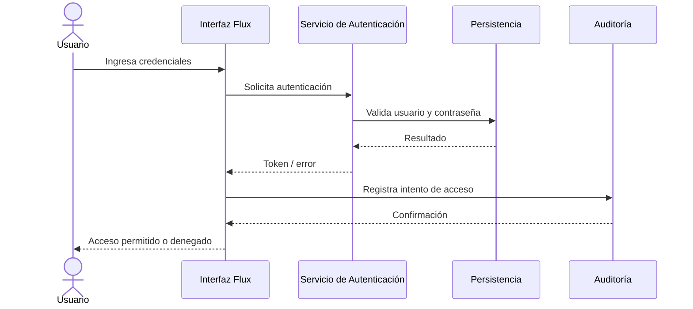
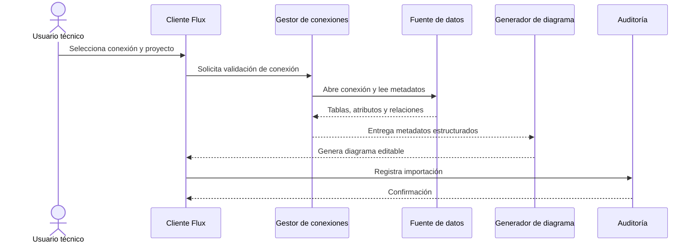
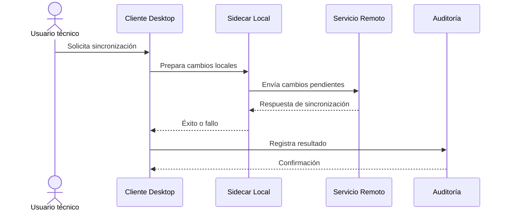
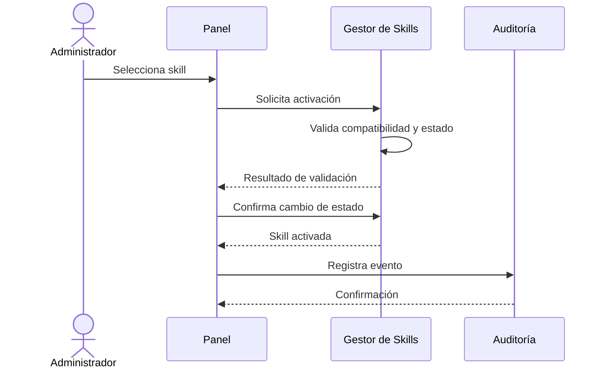
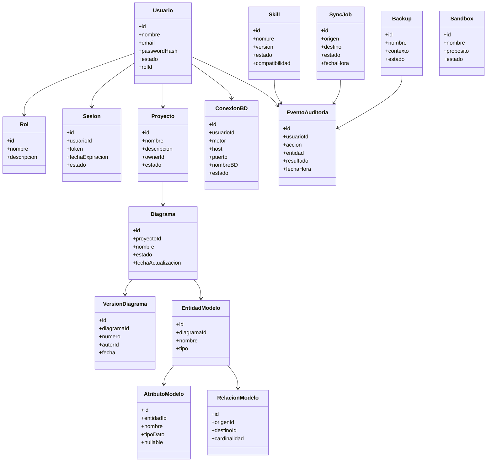

# realiza el md completo exahustivamente con todos los puntos que salieron en el ejemplo correctamente

Aquí tienes un FD03/SRS completo en Markdown, estructurado siguiendo el ejemplo adjunto y alineado con la evidencia del repositorio, que contiene documentación por fases del monorepo, web/cloud API, desktop con sidecar local, skills, backup/sandbox, bridge local y sync/audit/reports, además de commits sobre conexiones guardadas, sincronización full-stack, sidecar y analítica.[^1]
Lo dejé listo para pegar en `FD03.md`, usando Mermaid para los diagramas porque GitHub los renderiza dentro de archivos Markdown.[^2]

## Documento

```md
# UNIVERSIDAD PRIVADA DE TACNA
## FACULTAD DE INGENIERÍA
### Escuela Profesional de Ingeniería de Sistemas

# FLUX
## Documento de Especificación de Requerimientos de Software
### FD03 - Software Requirements Specification (SRS)

**Curso:** Gestión de Proyectos / Ingeniería de Software  
**Docente:** [Completar]  
**Integrantes:** Grupo 02 - [Completar nombres y códigos]  
**Ubicación:** Tacna - Perú  
**Año:** 2026  
**Versión del documento:** 1.0  

---

# CONTROL DE VERSIONES

| Versión | Hecha por | Revisada por | Aprobada por | Fecha | Motivo |
|---|---|---|---|---|---|
| 1.0 | Grupo 02 | Pendiente | Pendiente | 2026-07-04 | Elaboración inicial del SRS |
| 1.1 | Grupo 02 | Pendiente | Pendiente | [Completar] | Ajustes de revisión académica |
| 2.0 | Grupo 02 | Pendiente | Pendiente | [Completar] | Versión final para entrega |

---

# ÍNDICE GENERAL

- INTRODUCCIÓN
- 1. Generalidades del Proyecto
  - 1.1. Nombre del Proyecto
  - 1.2. Visión
  - 1.3. Misión
  - 1.4. Organización del Equipo
- 2. Visionamiento del Proyecto
  - 2.1. Descripción del Problema
  - 2.2. Objetivos de Negocio
  - 2.3. Objetivos de Diseño
  - 2.4. Alcance del Proyecto
  - 2.5. Viabilidad del Sistema
  - 2.6. Información obtenida del levantamiento de información
  - 2.6.1. Hallazgos clave
  - 2.6.2. Oportunidades identificadas
- 3. Análisis de Procesos
  - 3.1. Diagrama del proceso actual
  - 3.2. Diagrama del proceso propuesto
- 4. Especificación de Requerimientos de Software
  - 4.1. Cuadro de requerimientos funcionales inicial
  - 4.2. Cuadro de requerimientos no funcionales
  - 4.3. Cuadro de requerimientos funcionales final
  - 4.4. Reglas de negocio
- 5. Fase de Desarrollo
  - 5.1. Perfiles de usuario
  - 5.2. Modelo conceptual
  - 5.2.1. Diagrama de paquetes
  - 5.2.2. Diagrama de casos de uso
  - 5.2.3. Escenarios de caso de uso (narrativa)
  - 5.2.4. Historias de usuario
  - 5.3. Modelo lógico
  - 5.3.1. Análisis de objetos
  - 5.3.2. Diagramas de secuencia
  - 5.3.3. Diagrama de clases
- 6. Diccionario de datos
- 7. Criterios de aceptación globales
- 8. Anexos sugeridos

---

# INTRODUCCIÓN

El presente Documento de Especificación de Requerimientos de Software (SRS) tiene como propósito definir de manera detallada las funcionalidades, restricciones, reglas de negocio, atributos de calidad, actores, flujos operativos y criterios de aceptación del proyecto **Flux**.

Este documento establece una base formal para el diseño, construcción, validación, pruebas, despliegue y evolución del sistema, de modo que todos los interesados del proyecto cuenten con una comprensión clara del alcance funcional y técnico del producto.

Flux surge como respuesta a la necesidad de centralizar en una sola plataforma las tareas de modelado, importación, sincronización, auditoría y extensibilidad relacionadas con diagramas y estructuras de bases de datos. El proyecto contempla una solución con componentes web, desktop y servicios auxiliares locales, buscando reducir el trabajo manual, mejorar la trazabilidad de cambios y facilitar la reutilización de integraciones.

A lo largo de este documento se describen el contexto del proyecto, el problema identificado, los procesos actual y propuesto, los requerimientos funcionales y no funcionales, las reglas de negocio, los perfiles de usuario, los casos de uso, el modelo lógico y el diccionario de datos. De esta manera, el SRS servirá como guía directriz durante el ciclo de vida del producto y como base documental para la sustentación académica.

---

# 1. Generalidades del Proyecto

## 1.1. Nombre del Proyecto

> **Flux**

## 1.2. Visión

> Posicionar a Flux como una plataforma académica y técnica moderna para la creación, análisis, sincronización y documentación de diagramas de bases de datos, con soporte multiplataforma, trazabilidad operativa y capacidad de ampliación mediante skills e integraciones publicadas.

## 1.3. Misión

> Facilitar el modelado y la gestión de estructuras de datos mediante una solución accesible desde web y desktop que permita importar esquemas, crear diagramas manualmente, sincronizar cambios, registrar auditoría y extender capacidades del sistema de manera segura y organizada.

## 1.4. Organización del Equipo

El proyecto es desarrollado por un grupo académico conformado por estudiantes responsables de análisis, diseño, desarrollo, pruebas, documentación y exposición. Para efectos funcionales del producto, se considera la siguiente organización operativa del equipo:

| Rol académico/técnico | Responsabilidad principal |
|---|---|
| Líder del proyecto | Coordina entregables, cronograma y validación general |
| Responsable de análisis | Define alcance, historias de usuario, reglas y requisitos |
| Responsable de backend | Implementa lógica de negocio, persistencia y servicios |
| Responsable de frontend/web | Implementa interfaces web y experiencia de usuario |
| Responsable de desktop/local | Implementa cliente desktop y sidecar local |
| Responsable de documentación | Mantiene README, wiki, reportes y SRS |
| Responsable de QA/DevSecOps | Define pruebas, seguridad y automatización |

---

# 2. Visionamiento del Proyecto

## 2.1. Descripción del Problema

En escenarios académicos y técnicos, la creación y mantenimiento de diagramas de bases de datos suele realizarse de manera dispersa entre gestores de bases de datos, scripts, archivos de documentación y herramientas visuales aisladas. Esta fragmentación genera pérdida de tiempo, duplicidad de trabajo y poca trazabilidad sobre los cambios realizados en estructuras y diagramas.

Además, cuando el flujo de trabajo depende de múltiples herramientas sin integración, se vuelve difícil mantener consistencia entre el modelo visual, la estructura real de la base de datos y la documentación del proyecto. En consecuencia, el usuario termina actualizando manualmente información que debería poder generarse, sincronizarse o auditarse de forma centralizada.

A ello se suma la necesidad de operar en distintos contextos: navegación web, ejecución local, conexiones guardadas, sincronización entre componentes, publicación de capacidades ampliadas y control de seguridad sobre acciones sensibles. Sin una plataforma unificada, estos procesos permanecen aislados y poco gobernables.

En respuesta a esta problemática, Flux se plantea como una solución multiplataforma para modelado y gestión de diagramas, con soporte para importación estructural, edición manual, sincronización local/remota, analítica, auditoría y extensibilidad mediante skills e integraciones.

## 2.2. Objetivos de Negocio

- Centralizar en una sola plataforma las tareas de modelado y gestión de diagramas de bases de datos.
- Reducir el tiempo requerido para construir, documentar y mantener modelos de datos.
- Mejorar la trazabilidad de operaciones sobre proyectos, diagramas, conexiones y sincronizaciones.
- Facilitar el uso del sistema en entornos web y desktop.
- Incrementar el valor técnico del proyecto mediante publicación de integraciones, skills o extensiones.
- Proporcionar una base sólida para demostración académica, despliegue y adopción futura.

## 2.3. Objetivos de Diseño

- Diseñar una arquitectura modular y escalable basada en componentes separados por responsabilidad.
- Permitir la creación manual de diagramas y la generación asistida por reverse engineering.
- Integrar gestión de conexiones reutilizables a bases de datos.
- Habilitar sincronización entre entornos locales y remotos.
- Incorporar bitácora, analítica y reportes para observabilidad del sistema.
- Implementar mecanismos de seguridad, roles y control de acceso.
- Ofrecer una base de extensibilidad mediante skills e integraciones publicables.
- Asegurar que la documentación y el despliegue sean repetibles y verificables.

## 2.4. Alcance del Proyecto

### Incluye

- Sistema de autenticación y control de sesión.
- Gestión de usuarios y roles según permisos.
- Creación y administración de proyectos.
- Creación de diagramas manuales.
- Importación de esquemas desde conexiones válidas.
- Gestión de conexiones guardadas.
- Generación de diagramas mediante reverse engineering.
- Edición de entidades, atributos y relaciones.
- Guardado y versionado de diagramas.
- Sincronización entre componentes locales y remotos.
- Cliente desktop para flujos locales.
- Soporte de sidecar local para operaciones auxiliares.
- Gestión de skills o integraciones.
- Auditoría y reportes de actividad.
- Dashboard de métricas para perfiles autorizados.
- Mecanismos de respaldo y sandbox técnico.

### No incluye

- Reemplazo completo de un DBMS.
- Administración total de motores de base de datos externos.
- Marketplace comercial completo con facturación en esta fase.
- Soporte universal a todos los motores de base de datos del mercado.
- Automatización ilimitada de acciones sin políticas de seguridad.

## 2.5. Viabilidad del Sistema

### Viabilidad Técnica

El proyecto es técnicamente viable porque se apoya en una arquitectura modular, componentes web, desktop, servicios auxiliares locales y documentación técnica por fases. La solución propuesta puede crecer por incrementos funcionales sin requerir un rediseño completo del producto.

También resulta viable porque el sistema no depende de un único entorno de ejecución. Flux puede distribuir responsabilidades entre interfaz web, cliente desktop, servicios locales y persistencia, lo que favorece la separación de preocupaciones y la extensibilidad.

### Viabilidad Económica

El proyecto es económicamente viable dentro del contexto académico porque aprovecha infraestructura digital, repositorio de código, herramientas de automatización y despliegue en nube o entornos controlados. La inversión principal se concentra en tiempo de desarrollo, pruebas, documentación y publicación.

Su beneficio se justifica al reducir trabajo manual de documentación, simplificar la generación de diagramas y producir entregables técnicos reutilizables. Además, el valor académico generado por el producto es mayor al costo de producir una solución aislada sin documentación ni trazabilidad.

### Viabilidad Operativa

La viabilidad operativa es positiva porque Flux agrupa funciones que hoy suelen estar repartidas entre varias herramientas, reduciendo fricción para el usuario. El sistema permite trabajar mediante flujos controlados tanto en modo manual como mediante conexiones e importaciones.

Asimismo, el producto puede ser utilizado por perfiles distintos, desde usuarios que solo modelan diagramas hasta usuarios técnicos que administran conexiones, sincronizaciones o integraciones. Esto favorece su adopción gradual.

### Viabilidad Legal

El proyecto es legalmente viable siempre que maneje credenciales, sesiones, logs y datos de usuario con controles de acceso, minimización de exposición y almacenamiento responsable. También debe evitar la publicación de secretos o información sensible en interfaces no autorizadas.

Si el sistema incorpora publicación de skills, integraciones o paquetes, estas deberán respetar términos de distribución, seguridad del código y buenas prácticas de trazabilidad de cambios.

### Viabilidad Social

El sistema es socialmente viable porque mejora la experiencia de aprendizaje, documentación y colaboración técnica. Los usuarios pueden entender mejor sus modelos de datos, compartirlos y mantener historial de decisiones con mayor claridad.

Además, una plataforma que organiza conexiones, diagramas, auditoría y sincronización mejora la calidad del trabajo colectivo, reduce errores repetitivos y fortalece la cultura de documentación.

### Viabilidad Ambiental

La viabilidad ambiental es favorable porque la propuesta digital reduce la dependencia de documentos físicos, bocetos impresos y registros manuales. Al centralizar procesos técnicos en una plataforma digital, disminuye el desperdicio asociado a documentación desorganizada o rehacer trabajo innecesario.

## 2.6. Información obtenida del levantamiento de información

El levantamiento de información para este SRS se basa en la revisión del repositorio del proyecto, la documentación técnica organizada por fases, el historial de evolución funcional registrado en commits y el análisis del ejemplo FD03 proporcionado como referencia estructural.

Se identificó que el producto evolucionó alrededor de varios bloques funcionales: fundación del monorepo, web y cloud API, desktop y sidecar local, seguridad local, synthetic seeder, sistema de skills, respaldo y sandbox en PostgreSQL, bridge local y reportes/auditoría/sincronización.

## 2.6.1. Hallazgos clave

### Hallazgo 1 - Necesidad de centralización del modelado
El trabajo con diagramas y estructuras de datos requiere una plataforma unificada que combine modelado visual, conexiones persistentes y capacidad de sincronización.

### Hallazgo 2 - Necesidad de operación híbrida
El sistema necesita cubrir flujos de trabajo tanto en web como en desktop, además de componentes locales auxiliares para procesos específicos.

### Hallazgo 3 - Necesidad de trazabilidad
Las acciones sobre proyectos, diagramas, conexiones, sincronizaciones y skills deben quedar registradas para análisis, soporte y control.

### Hallazgo 4 - Necesidad de extensibilidad
La plataforma no debe quedarse en un editor estático. Debe poder crecer mediante skills, integraciones o extensiones publicables.

### Hallazgo 5 - Necesidad de observabilidad
La existencia de dashboard analítico, telemetría y reportes indica que el sistema requiere visibilidad sobre su uso y sobre eventos operativos relevantes.

## 2.6.2. Oportunidades identificadas

| N.° | Oportunidad | Impacto proyectado |
|---|---|---|
| O-01 | Centralizar modelado y diagramación | Disminución del trabajo disperso entre herramientas |
| O-02 | Reutilizar conexiones guardadas | Mayor velocidad en flujos técnicos repetitivos |
| O-03 | Generar diagramas por reverse engineering | Reducción del tiempo de documentación inicial |
| O-04 | Habilitar sincronización local-remota | Continuidad entre trabajo desktop y web |
| O-05 | Incorporar skills/integraciones | Mayor valor técnico y posibilidad de publicación |
| O-06 | Registrar auditoría y analítica | Mejor soporte, monitoreo y trazabilidad |
| O-07 | Integrar sandbox y backups | Más seguridad y control operativo |
| O-08 | Mantener arquitectura modular | Mejor mantenibilidad y evolución por fases |

### Necesidades identificadas por interesado

| Interesado | Necesidad principal documentada |
|---|---|
| Usuario estándar | Crear y editar diagramas sin complejidad innecesaria |
| Usuario técnico | Conectarse a bases de datos, importar esquemas y sincronizar trabajo |
| Administrador | Controlar permisos, revisar auditoría y gestionar skills |
| Docente evaluador | Ver evidencia funcional, documentación y coherencia técnica |
| Equipo desarrollador | Mantener un producto extensible, documentado y demostrable |

---

# 3. Análisis de Procesos

## 3.1. Diagrama del proceso actual

En el proceso actual sin una plataforma integrada, el usuario alterna entre varias herramientas para inspeccionar una base de datos, generar notas, dibujar relaciones y guardar archivos de manera separada. Esto ocasiona reproceso, desalineación entre el modelo y la fuente real, así como pérdida de contexto histórico.

### Diagrama del proceso actual




## 3.2. Diagrama del proceso propuesto

En el proceso propuesto con Flux, el usuario trabaja dentro de una sola plataforma, crea un proyecto, importa el esquema o construye el diagrama manualmente, guarda versiones, sincroniza cambios y deja evidencia de auditoría.

### Diagrama del proceso propuesto




---

# 4. Especificación de Requerimientos de Software

## 4.1. Cuadro de Requerimientos Funcionales Inicial

| ID | Nombre | Descripción | Actor | Prioridad | Criterio de aceptación |
| :-- | :-- | :-- | :-- | :-- | :-- |
| RFI-01 | Modelado disperso | El usuario depende de múltiples herramientas para documentar la estructura de una base de datos. | Usuario | Alta | Se evidencia uso de herramientas separadas para inspección, diagramación y documentación. |
| RFI-02 | Conexiones no centralizadas | Las conexiones a bases de datos no se administran desde una interfaz unificada. | Usuario técnico | Alta | No existe un módulo central de conexiones guardadas. |
| RFI-03 | Generación manual de diagramas | La estructura del modelo debe replicarse a mano desde la base de datos. | Usuario técnico | Alta | El usuario necesita copiar tablas y relaciones manualmente. |
| RFI-04 | Ausencia de versionado formal | Los cambios en los diagramas no quedan organizados por versiones. | Usuario | Alta | No hay historial claro para volver a un estado anterior. |
| RFI-05 | Falta de sincronización | El trabajo local y el trabajo remoto no mantienen continuidad controlada. | Usuario técnico | Alta | El usuario no dispone de un mecanismo directo de sincronización. |
| RFI-06 | Integraciones aisladas | Las extensiones adicionales no siguen un esquema estandarizado de publicación o gestión. | Administrador | Media | Cada ampliación depende de implementación aislada. |
| RFI-07 | Poca trazabilidad | Las operaciones críticas no dejan evidencia suficiente para auditoría. | Administrador | Alta | No se puede reconstruir qué acción hizo cada usuario. |
| RFI-08 | Escasa observabilidad | No existe una vista consolidada del uso del sistema y sus eventos relevantes. | Administrador | Media | La plataforma no presenta métricas ni dashboard operativo. |
| RFI-09 | Riesgos en operación local | Ciertas tareas locales carecen de encapsulamiento técnico seguro. | Usuario técnico | Media | Las operaciones auxiliares no están desacopladas. |
| RFI-10 | Falta de entorno controlado | No existe una estrategia clara para pruebas técnicas con sandbox o datos controlados. | Usuario técnico | Media | Las pruebas no se encuentran separadas del flujo normal. |

## 4.2. Cuadro de Requerimientos No Funcionales

| ID | Nombre | Descripción | Actor | Prioridad | Criterio de aceptación |
| :-- | :-- | :-- | :-- | :-- | :-- |
| RNF-01 | Seguridad de acceso | El sistema debe permitir acceso a módulos privados solo mediante autenticación válida. | Todos los usuarios | Alta | Ninguna ruta protegida es accesible sin sesión válida. |
| RNF-02 | Control de roles | Las acciones del sistema deben estar restringidas según el rol del usuario. | Administrador | Alta | Usuarios sin permiso no pueden ejecutar acciones críticas. |
| RNF-03 | Rendimiento de navegación | El panel y las vistas principales deben responder de forma fluida en condiciones normales. | Usuario | Alta | El flujo principal se mantiene utilizable sin bloqueos críticos. |
| RNF-04 | Integridad de datos | El sistema no debe guardar información inconsistente sin advertencia y validación. | Sistema | Alta | Se bloquean guardados inválidos o se informa claramente el error. |
| RNF-05 | Trazabilidad operativa | Las operaciones críticas deben registrarse en auditoría. | Administrador | Alta | Los eventos muestran usuario, fecha, acción, entidad y resultado. |
| RNF-06 | Disponibilidad | Los componentes publicados deben estar disponibles en los entornos definidos para demostración y uso. | Usuario | Media | La aplicación desplegada puede ser accedida según el entorno previsto. |
| RNF-07 | Usabilidad | La interfaz debe ser comprensible para usuarios técnicos y semitécnicos. | Usuario | Alta | El usuario puede crear o editar un diagrama con mínima asistencia. |
| RNF-08 | Mantenibilidad | La arquitectura debe facilitar evolución por módulos y fases. | Equipo técnico | Alta | Los componentes están desacoplados por responsabilidad. |
| RNF-09 | Portabilidad | El flujo principal debe poder operar en web y en desktop según alcance. | Usuario | Media | El caso principal se ejecuta en las modalidades previstas. |
| RNF-10 | Privacidad | Las credenciales y datos sensibles no deben exponerse en interfaces públicas. | Todos | Alta | No se muestran secretos ni detalles sensibles en mensajes públicos. |
| RNF-11 | Observabilidad | Errores y eventos relevantes deben quedar disponibles para revisión. | Administrador | Media | Existen logs, bitácoras o métricas del sistema. |
| RNF-12 | Escalabilidad funcional | La plataforma debe admitir nuevas skills o integraciones sin rediseño total. | Equipo técnico | Media | Nuevos módulos pueden agregarse con contratos definidos. |
| RNF-13 | Recuperación ante fallos | El sistema debe manejar fallos de sincronización o conexión sin pérdida arbitraria de trabajo guardado. | Usuario | Media | El usuario recibe mensajes claros y puede reintentar. |
| RNF-14 | Compatibilidad | Las conexiones deben ajustarse a motores o configuraciones soportadas por la versión vigente. | Usuario técnico | Media | La plataforma valida parámetros antes de operar. |
| RNF-15 | Auditabilidad de seguridad | Intentos de acceso denegado y operaciones sensibles deben quedar registrados. | Administrador | Alta | El sistema conserva evidencia de los intentos y resultados. |

## 4.3. Cuadro de Requerimientos Funcionales Final

| ID | Nombre | Descripción | Actor | Prioridad |
| :-- | :-- | :-- | :-- | :-- |
| RFF-01 | Registro de usuario | El sistema debe permitir el registro de usuarios según la política definida para el entorno. | Usuario | Media |
| RFF-02 | Inicio de sesión | El sistema debe autenticar usuarios mediante credenciales válidas y crear una sesión segura. | Usuario | Alta |
| RFF-03 | Cierre de sesión | El sistema debe permitir cerrar sesión y anular el acceso actual. | Usuario | Alta |
| RFF-04 | Gestión de roles | El sistema debe asignar permisos según rol para controlar el acceso a funciones del sistema. | Administrador | Alta |
| RFF-05 | Crear proyecto | El sistema debe permitir crear proyectos con nombre, descripción y metadatos básicos. | Usuario | Alta |
| RFF-06 | Editar proyecto | El sistema debe permitir modificar los datos de un proyecto existente según permisos. | Usuario | Media |
| RFF-07 | Archivar/eliminar proyecto | El sistema debe permitir archivar o eliminar proyectos bajo validaciones de seguridad. | Usuario/Administrador | Media |
| RFF-08 | Crear diagrama manual | El sistema debe permitir construir diagramas sin conexión obligatoria a una base de datos. | Usuario | Alta |
| RFF-09 | Editar diagrama | El sistema debe permitir agregar, editar o eliminar entidades, atributos y relaciones. | Usuario | Alta |
| RFF-10 | Validación del diagrama | El sistema debe validar consistencia estructural antes de guardar o publicar cambios. | Sistema | Alta |
| RFF-11 | Guardar diagrama | El sistema debe persistir el estado actual del diagrama dentro del proyecto correspondiente. | Usuario | Alta |
| RFF-12 | Versionar diagrama | El sistema debe almacenar versiones sucesivas del diagrama con autor y fecha. | Usuario | Alta |
| RFF-13 | Restaurar versión | El sistema debe permitir restaurar una versión anterior del diagrama. | Usuario | Media |
| RFF-14 | Registrar conexión | El sistema debe permitir registrar una conexión a base de datos con parámetros validados. | Usuario técnico | Alta |
| RFF-15 | Probar conexión | El sistema debe verificar si la conexión configurada es válida antes de guardarla o usarla. | Usuario técnico | Alta |
| RFF-16 | Guardar conexión reutilizable | El sistema debe permitir almacenar conexiones para reutilización posterior. | Usuario técnico | Alta |
| RFF-17 | Eliminar conexión guardada | El sistema debe permitir eliminar una conexión previamente almacenada. | Usuario técnico | Media |
| RFF-18 | Listar conexiones guardadas | El sistema debe mostrar al usuario técnico sus conexiones registradas. | Usuario técnico | Alta |
| RFF-19 | Importar esquema | El sistema debe extraer metadatos estructurales desde una base de datos conectada. | Usuario técnico | Alta |
| RFF-20 | Reverse engineering del esquema | El sistema debe generar un diagrama inicial a partir de tablas, atributos y relaciones detectadas. | Usuario técnico | Alta |
| RFF-21 | Soporte de diagrama sin base de datos | El sistema debe permitir crear diagramas locales o conceptuales sin una conexión activa. | Usuario | Alta |
| RFF-22 | Sincronización local-remota | El sistema debe sincronizar información entre componentes locales y remotos cuando corresponda. | Sistema/Usuario técnico | Alta |
| RFF-23 | Gestión del sidecar local | El cliente desktop debe iniciar o coordinar servicios auxiliares locales para operaciones específicas. | Sistema | Media |
| RFF-24 | Gestión desktop | El sistema debe ofrecer una experiencia operativa desde un cliente desktop dentro del alcance del proyecto. | Usuario | Alta |
| RFF-25 | Gestión de skills | El sistema debe permitir registrar, listar, activar, desactivar o actualizar skills. | Administrador/Usuario técnico | Alta |
| RFF-26 | Instalación de skill | El sistema debe permitir instalar una skill compatible bajo política de validación. | Administrador | Media |
| RFF-27 | Publicación de integración/skill | El producto debe contemplar capacidad de empaquetado o publicación de una integración consumible. | Equipo técnico | Media |
| RFF-28 | Gestión de aprobaciones | El sistema debe soportar aprobación de acciones sensibles cuando el flujo lo requiera. | Administrador | Baja |
| RFF-29 | Registro de auditoría | El sistema debe registrar acciones críticas sobre autenticación, proyectos, diagramas, conexiones, skills y sincronizaciones. | Sistema | Alta |
| RFF-30 | Consulta de auditoría | El sistema debe permitir consultar eventos filtrando por fecha, usuario, entidad, acción y resultado. | Administrador | Media |
| RFF-31 | Dashboard analítico | El sistema debe mostrar métricas de uso y actividad a usuarios autorizados. | Administrador | Media |
| RFF-32 | Reportes de actividad | El sistema debe permitir generar vistas consolidadas de eventos relevantes. | Administrador | Media |
| RFF-33 | Gestión de backup | El sistema debe permitir coordinar o registrar respaldos de información según políticas del entorno. | Administrador | Media |
| RFF-34 | Sandbox técnico | El sistema debe permitir trabajar en un entorno controlado para pruebas o datos sintéticos. | Usuario técnico | Media |
| RFF-35 | Bridge local | El sistema debe permitir interoperar con un componente local puente para ciertas capacidades técnicas. | Sistema | Media |
| RFF-36 | Exportación de resultados | El sistema debe permitir exportar diagramas o información en formatos definidos por la versión. | Usuario | Media |
| RFF-37 | Notificación de errores operativos | El sistema debe informar al usuario los fallos de conexión, importación o sincronización de forma controlada. | Sistema | Alta |
| RFF-38 | Gestión documental de uso | El proyecto debe contar con documentación de requisitos, procedimientos y parámetros de despliegue. | Equipo técnico | Alta |
| RFF-39 | Protección de rutas privadas | El sistema debe restringir rutas administrativas y técnicas mediante validación de sesión y permisos. | Sistema | Alta |
| RFF-40 | Bitácora de acceso denegado | El sistema debe registrar intentos de acceso no autorizado sin revelar información sensible. | Sistema | Alta |

## 4.4. Reglas de Negocio

### Cuadro de Reglas de Negocio

| ID RN | Regla | Condición/Disparador | Validación | Excepción | Resultado esperado |
| :-- | :-- | :-- | :-- | :-- | :-- |
| RN-01 | Toda operación privada requiere sesión válida | Acceso a módulos internos | Token/sesión vigente | Ninguna | Se impide el acceso no autenticado |
| RN-02 | Toda operación crítica requiere rol permitido | Crear, editar, eliminar, sincronizar, activar skills | Validación por matriz de permisos | Usuario superadministrador según política | Se evita modificación no autorizada |
| RN-03 | Todo diagrama pertenece a un proyecto | Guardado de diagrama | Debe existir proyecto asociado | Borrador temporal local si la versión lo admite | Se mantiene orden lógico de la información |
| RN-04 | Toda versión debe registrar autor y fecha | Guardar versión | Metadatos obligatorios | Migración técnica documentada | Se conserva trazabilidad histórica |
| RN-05 | Toda conexión debe validarse antes de usarse | Probar/importar esquema | Parámetros válidos y acceso exitoso | Modo manual sin conexión | Se evitan importaciones inconsistentes |
| RN-06 | Las conexiones guardadas solo pueden ser usadas por ámbitos autorizados | Uso o edición de conexión | Propietario o permiso explícito | Conexión compartida bajo política | Se protege acceso técnico |
| RN-07 | No se importa un esquema sin conexión funcional | Reverse engineering | Respuesta válida de la fuente de datos | Ninguna | Se evita generar diagramas erróneos |
| RN-08 | Las skills solo se activan si son compatibles | Activación de skill | Estado, versión, procedencia y compatibilidad | Modo experimental controlado | Se reduce riesgo técnico |
| RN-09 | Toda sincronización debe registrar resultado | Inicio/fin de sincronización | Estado exitoso, parcial o fallido | Ninguna | Se facilita soporte y auditoría |
| RN-10 | Los errores no deben revelar secretos | Fallo de autenticación o conexión | Mensaje controlado | Log interno detallado | Se protege información sensible |
| RN-11 | Toda operación auditada debe almacenar contexto mínimo | Registro de auditoría | Usuario, fecha-hora, acción, entidad y resultado | Sistema interno automático | Se garantiza trazabilidad |
| RN-12 | Si una operación crítica exige auditoría obligatoria, no puede confirmarse sin bitácora | Confirmación de acción crítica | Registro exitoso del evento | Política administrativa explícita | Se preserva integridad del control |
| RN-13 | Los respaldos deben identificarse de forma única | Generación de backup | Nombre o identificador con fecha/contexto | Política de retención | Se facilita recuperación |
| RN-14 | Los dashboards solo son visibles para perfiles autorizados | Acceso a analítica | Rol habilitado | Ninguna | Se evita exposición de información interna |
| RN-15 | Los intentos fallidos de acceso deben controlarse | Repetidos errores de autenticación | Umbral configurable | Rehabilitación por política | Se reduce riesgo de abuso |
| RN-16 | Toda publicación o activación de integración debe estar documentada | Publicación técnica | Metadatos, versión y compatibilidad | Modo interno de prueba | Se mantiene gobernanza del ecosistema |


---

# 5. Fase de Desarrollo

## 5.1. Perfiles de Usuario

| ID | Perfil | Objetivo | Responsabilidades clave | Permisos principales | Restricciones |
| :-- | :-- | :-- | :-- | :-- | :-- |
| PU-01 | Usuario estándar | Crear y mantener diagramas de sus proyectos | Modelar, editar, versionar y exportar | Crear proyectos, diagramas, versiones y exportaciones | No administra sistema ni seguridad global |
| PU-02 | Usuario técnico | Trabajar con conexiones, importaciones y sincronización | Registrar conexiones, importar esquemas, ejecutar flujos técnicos | Gestionar conexiones, sincronización, sandbox y bridge local según permisos | No define políticas globales si no es administrador |
| PU-03 | Administrador | Supervisar seguridad, auditoría, roles y skills | Gestionar acceso, revisar bitácora, controlar activaciones | Administrar usuarios, permisos, dashboard, auditoría y skills | Debe respetar políticas internas |
| PU-04 | Revisor/Demostrador | Validar funcionamiento para exposición o revisión | Navegar, observar evidencias, probar casos permitidos | Acceso restringido a entornos de demostración | No realiza acciones productivas sensibles |
| PU-05 | Sistema/Servicio | Ejecutar tareas automáticas internas | Persistir, sincronizar, auditar, validar y notificar | Operación automática bajo reglas configuradas | No aplica como usuario humano |

## 5.2. Modelo Conceptual

El modelo conceptual de Flux se basa en la separación de módulos funcionales que colaboran para soportar autenticación, gestión de proyectos, diagramación, importación, sincronización, extensibilidad, auditoría y analítica.

### 5.2.1. Diagrama de Paquetes




### 5.2.2. Diagrama de Casos de Uso




### 5.2.3. Escenarios de Caso de Uso (Narrativa)

#### UC-01. Iniciar sesión

- **Actor principal:** Usuario
- **Propósito:** Acceder a las funciones privadas de la plataforma.
- **Precondición:** El usuario se encuentra registrado o autorizado.
- **Flujo principal:**

1. El usuario abre la pantalla de acceso.
2. Ingresa sus credenciales.
3. El sistema valida identidad y permisos.
4. El sistema crea una sesión válida.
5. El usuario es redirigido al panel correspondiente.
- **Flujos alternos:**
    - Si las credenciales son incorrectas, el sistema informa el error sin revelar detalles sensibles.
    - Si la cuenta está bloqueada o desactivada, el sistema deniega el acceso.
- **Postcondición:** Usuario autenticado con permisos disponibles.


#### UC-02. Crear proyecto

- **Actor principal:** Usuario
- **Propósito:** Organizar diagramas y recursos en una unidad de trabajo.
- **Precondición:** Usuario autenticado.
- **Flujo principal:**

1. El usuario selecciona “Crear proyecto”.
2. Ingresa nombre y descripción.
3. El sistema valida datos.
4. El sistema crea el proyecto.
- **Postcondición:** Proyecto disponible para trabajo posterior.


#### UC-03. Crear diagrama manual

- **Actor principal:** Usuario
- **Propósito:** Construir un diagrama sin depender de una base de datos conectada.
- **Precondición:** Proyecto creado.
- **Flujo principal:**

1. El usuario abre un proyecto.
2. Selecciona “Nuevo diagrama”.
3. Agrega entidades, atributos y relaciones.
4. El sistema marca el documento como modificado.
5. El usuario guarda.
- **Postcondición:** Diagrama persistido o listo para versionar.


#### UC-04. Registrar conexión

- **Actor principal:** Usuario técnico
- **Propósito:** Guardar una conexión reutilizable a base de datos.
- **Precondición:** Usuario técnico autenticado.
- **Flujo principal:**

1. El usuario abre el módulo de conexiones.
2. Registra host, puerto, base, usuario y credenciales.
3. Solicita prueba de conexión.
4. El sistema valida el acceso.
5. El usuario guarda la conexión.
- **Postcondición:** Conexión disponible en el listado personal o del ámbito permitido.


#### UC-05. Importar esquema y generar diagrama

- **Actor principal:** Usuario técnico
- **Propósito:** Obtener un diagrama inicial desde una estructura real.
- **Precondición:** Existe una conexión válida.
- **Flujo principal:**

1. El usuario selecciona una conexión.
2. Elige el proyecto destino.
3. Solicita importar el esquema.
4. El sistema inspecciona la fuente de datos.
5. El sistema construye un modelo inicial.
6. El sistema genera el diagrama editable.
7. Se registra el evento de auditoría.
- **Postcondición:** Diagrama inicial listo para edición.


#### UC-06. Guardar versión

- **Actor principal:** Usuario
- **Propósito:** Mantener trazabilidad de modificaciones del diagrama.
- **Precondición:** Existe un diagrama modificado.
- **Flujo principal:**

1. El usuario selecciona “Guardar versión”.
2. El sistema persiste el estado actual.
3. El sistema asigna autor y fecha.
4. El historial queda actualizado.
- **Postcondición:** Nueva versión disponible.


#### UC-07. Sincronizar cambios

- **Actor principal:** Usuario técnico / Sistema
- **Propósito:** Mantener consistencia entre entornos locales y remotos.
- **Precondición:** Existen cambios pendientes o necesidad de sincronización.
- **Flujo principal:**

1. El usuario solicita sincronización o se activa el proceso correspondiente.
2. El sistema valida origen, destino y estado.
3. Se transmiten los cambios.
4. El sistema informa resultado.
5. Se registra evidencia en auditoría.
- **Postcondición:** Estado sincronizado o intento fallido controlado.


#### UC-08. Gestionar skills

- **Actor principal:** Administrador
- **Propósito:** Extender capacidades del sistema.
- **Precondición:** Usuario con permisos administrativos.
- **Flujo principal:**

1. El administrador ingresa al módulo de skills.
2. Lista las disponibles o instaladas.
3. Selecciona instalar, activar, desactivar o actualizar.
4. El sistema valida compatibilidad.
5. El sistema ejecuta el cambio y registra auditoría.
- **Postcondición:** Estado de la skill actualizado.


#### UC-09. Consultar auditoría

- **Actor principal:** Administrador
- **Propósito:** Revisar la trazabilidad del sistema.
- **Precondición:** Usuario administrador autenticado.
- **Flujo principal:**

1. El administrador accede al módulo de auditoría.
2. Filtra por fecha, usuario, entidad o acción.
3. El sistema retorna resultados.
- **Postcondición:** Eventos visibles para revisión.


#### UC-10. Visualizar dashboard analítico

- **Actor principal:** Administrador
- **Propósito:** Consultar métricas operativas del sistema.
- **Precondición:** Usuario autorizado.
- **Flujo principal:**

1. El administrador ingresa al dashboard.
2. El sistema consulta fuentes de métricas.
3. Muestra tarjetas, gráficos o resúmenes.
- **Postcondición:** Información de uso visible para toma de decisiones.


### 5.2.4. Historias de Usuario

| ID | Historia de usuario | Prioridad | Criterio de aceptación resumido |
| :-- | :-- | :-- | :-- |
| HU-01 | Como usuario, quiero iniciar sesión para acceder a mis proyectos y diagramas. | Alta | El sistema valida credenciales y permite ingreso seguro. |
| HU-02 | Como usuario, quiero crear proyectos para organizar mis diagramas. | Alta | El proyecto queda registrado y disponible en el panel. |
| HU-03 | Como usuario, quiero crear diagramas manuales para modelar ideas sin depender de una base de datos conectada. | Alta | El diagrama puede crearse, editarse y guardarse. |
| HU-04 | Como usuario técnico, quiero registrar conexiones para reutilizarlas en futuras importaciones. | Alta | La conexión se prueba y se almacena correctamente. |
| HU-05 | Como usuario técnico, quiero importar un esquema desde una base de datos para generar un diagrama inicial. | Alta | El sistema genera un diagrama editable desde los metadatos. |
| HU-06 | Como usuario, quiero editar entidades, atributos y relaciones para refinar mi modelo. | Alta | Los cambios se reflejan visualmente y pueden persistirse. |
| HU-07 | Como usuario, quiero guardar versiones para recuperar cambios anteriores si es necesario. | Alta | El historial muestra versiones con autor y fecha. |
| HU-08 | Como usuario técnico, quiero sincronizar cambios entre entornos local y remoto para mantener continuidad del trabajo. | Alta | El sistema registra éxito o fallo sin perder trabajo previo. |
| HU-09 | Como administrador, quiero gestionar roles para asegurar que cada usuario tenga solo los permisos necesarios. | Alta | Las operaciones se habilitan o bloquean según la matriz de permisos. |
| HU-10 | Como administrador, quiero auditar operaciones críticas para saber quién hizo qué y cuándo. | Alta | Los eventos se pueden consultar por filtros. |
| HU-11 | Como administrador, quiero activar o desactivar skills para controlar las capacidades disponibles. | Media | La skill cambia de estado solo si es compatible. |
| HU-12 | Como administrador, quiero visualizar métricas de uso para monitorear la actividad del sistema. | Media | El dashboard presenta indicadores autorizados. |
| HU-13 | Como usuario, quiero exportar mis diagramas para utilizarlos en documentación, presentación o respaldo. | Media | El sistema genera el formato soportado sin corromper la información. |
| HU-14 | Como usuario técnico, quiero usar un sandbox para probar flujos sin afectar información principal. | Media | El entorno de prueba se encuentra aislado o controlado. |
| HU-15 | Como equipo técnico, quiero publicar una integración o skill para demostrar extensibilidad del producto. | Media | La publicación o empaquetado sigue metadatos y documentación mínimas. |

## 5.3. Modelo Lógico

El modelo lógico se centra en usuarios, proyectos, diagramas, conexiones, sincronizaciones, skills y auditoría. Cada objeto de negocio interactúa con reglas de acceso y con un registro histórico de cambios.

### 5.3.1. Análisis de objetos

| Objeto | Descripción | Atributos principales | Relaciones |
| :-- | :-- | :-- | :-- |
| Usuario | Persona que accede al sistema | id, nombre, email, passwordHash, estado, rolId | Pertenece a un rol, crea proyectos, genera eventos |
| Rol | Define permisos del usuario | id, nombre, descripción | Tiene múltiples usuarios |
| Sesión | Contexto de autenticación vigente | id, usuarioId, token, fechaExpiración, estado | Pertenece a un usuario |
| Proyecto | Unidad organizativa de trabajo | id, nombre, descripción, ownerId, estado | Tiene diagramas y metadatos asociados |
| Diagrama | Representación visual editable | id, proyectoId, nombre, estado, fechaActualización | Pertenece a un proyecto |
| VersionDiagrama | Historial del diagrama | id, diagramaId, número, autorId, fecha | Pertenece a un diagrama |
| ConexionBD | Credencial/configuración de acceso técnico | id, usuarioId, motor, host, puerto, nombreBD, estado | Pertenece a un usuario o ámbito |
| EntidadModelo | Componente estructural modelado | id, diagramaId, nombre, tipo | Pertenece a un diagrama |
| AtributoModelo | Propiedad de una entidad | id, entidadId, nombre, tipoDato, nullable | Pertenece a una entidad |
| RelacionModelo | Vínculo entre entidades | id, origenId, destinoId, cardinalidad | Relaciona entidades |
| Skill | Capacidad instalable o integrable | id, nombre, versión, estado, origen, compatibilidad | Puede ser activada/desactivada |
| SyncJob | Proceso de sincronización | id, origen, destino, estado, fechaHora, resumen | Registra sincronizaciones |
| EventoAuditoria | Bitácora de operaciones | id, usuarioId, acción, entidad, resultado, fechaHora | Pertenece al contexto de una acción |
| Backup | Registro de respaldo | id, nombre, contexto, fechaHora, estado | Asociado a política operativa |
| Sandbox | Entorno controlado de pruebas | id, nombre, propósito, estado | Usado para pruebas técnicas |

### 5.3.2. Diagramas de Secuencia

#### Secuencia 1 - Inicio de sesión




#### Secuencia 2 - Importar esquema y generar diagrama




#### Secuencia 3 - Sincronización local-remota




#### Secuencia 4 - Activación de skill




### 5.3.3. Diagrama de Clases




---

# 6. Diccionario de Datos

| Campo | Entidad | Tipo referencial | Obligatorio | Descripción |
| :-- | :-- | :-- | :-- | :-- |
| id | General | UUID / entero | Sí | Identificador único del registro |
| nombre | Usuario/Proyecto/Diagrama/Skill | Texto | Sí | Nombre visible del recurso |
| email | Usuario | Texto | Sí | Correo del usuario |
| passwordHash | Usuario | Texto | Sí | Contraseña cifrada |
| estado | General | Texto | Sí | Estado lógico del recurso |
| rolId | Usuario | UUID / entero | Sí | Rol asignado al usuario |
| token | Sesion | Texto | Sí | Token de sesión/autorización |
| fechaExpiracion | Sesion | Fecha-hora | Sí | Límite de vigencia de sesión |
| ownerId | Proyecto | UUID / entero | Sí | Propietario del proyecto |
| descripcion | Proyecto | Texto largo | No | Descripción funcional |
| proyectoId | Diagrama | UUID / entero | Sí | Proyecto al que pertenece |
| fechaActualizacion | Diagrama | Fecha-hora | Sí | Última actualización |
| diagramaId | VersionDiagrama | UUID / entero | Sí | Diagrama versionado |
| numero | VersionDiagrama | Número | Sí | Correlativo de versión |
| autorId | VersionDiagrama | UUID / entero | Sí | Autor de la versión |
| motor | ConexionBD | Texto | Sí | Motor o tipo de fuente de datos |
| host | ConexionBD | Texto | Sí | Dirección del servidor |
| puerto | ConexionBD | Número | Sí | Puerto del servicio |
| nombreBD | ConexionBD | Texto | Sí | Nombre de la base de datos |
| entidadId | AtributoModelo | UUID / entero | Sí | Entidad asociada |
| tipoDato | AtributoModelo | Texto | Sí | Tipo lógico del atributo |
| nullable | AtributoModelo | Booleano | Sí | Permite nulo o no |
| origenId | RelacionModelo | UUID / entero | Sí | Entidad origen |
| destinoId | RelacionModelo | UUID / entero | Sí | Entidad destino |
| cardinalidad | RelacionModelo | Texto | Sí | Tipo de relación |
| accion | EventoAuditoria | Texto | Sí | Acción ejecutada |
| entidad | EventoAuditoria | Texto | Sí | Recurso afectado |
| resultado | EventoAuditoria | Texto | Sí | Éxito, fallo o cancelado |
| fechaHora | EventoAuditoria/SyncJob | Fecha-hora | Sí | Momento exacto del evento |
| compatibilidad | Skill | Texto | No | Reglas de compatibilidad técnica |
| contexto | Backup | Texto | Sí | Contexto del respaldo |
| proposito | Sandbox | Texto | Sí | Objetivo del entorno controlado |


---

# 7. Criterios de Aceptación Globales

1. El sistema debe permitir autenticación segura para acceder a módulos privados.
2. El usuario debe poder crear proyectos y diagramas dentro de la plataforma.
3. El sistema debe permitir crear diagramas manuales sin requerir conexión obligatoria.
4. El sistema debe permitir registrar, probar y reutilizar conexiones a bases de datos.
5. El sistema debe generar un diagrama inicial desde un esquema compatible mediante reverse engineering.
6. El usuario debe poder editar entidades, atributos y relaciones del modelo generado.
7. El sistema debe guardar versiones con trazabilidad de autor y fecha.
8. El sistema debe permitir sincronización entre componentes dentro de los flujos definidos.
9. Las operaciones críticas deben registrarse en auditoría.
10. Los administradores deben poder consultar bitácora y métricas.
11. El sistema debe gestionar skills o integraciones bajo reglas de compatibilidad.
12. El proyecto debe contar con documentación suficiente para despliegue, uso y demostración.
13. Debe existir una experiencia funcional demostrable desde el alcance web y/o desktop definido por el proyecto.
14. El sistema debe manejar errores de autenticación, conexión e importación sin exponer información sensible.

---

# 8. Anexos Sugeridos

## Anexo A. Evidencias a incorporar

- Capturas de pantalla del sistema web.
- Capturas del cliente desktop.
- Evidencia del sidecar local en ejecución.
- Evidencia de conexiones guardadas.
- Evidencia de dashboard analítico.
- Evidencia de auditoría y reportes.
- Evidencia de skills o integración publicada.


## Anexo B. Trazabilidad sugerida

- Requerimientos ↔ historias de usuario.
- Historias de usuario ↔ issues.
- Issues ↔ ramas.
- Ramas ↔ commits.
- Commits ↔ entregables documentales.


## Anexo C. Entregables complementarios recomendados

- `FD03.md`
- `FD03.pdf`
- Diagramas exportados en PNG/PDF
- Historias de usuario en GitHub Issues
- Escenarios Gherkin en archivo de pruebas o wiki
- Video de demostración
- Enlace a despliegue o integración publicada

---

# FIN DEL DOCUMENTO

```

## Nota

En el repositorio aparecen referencias a `FluxSQL` y `Fluxy` en documentación y commits, pero como tú pediste el SRS de **Flux**, dejé el documento unificado con ese nombre para mantener consistencia en portada, requisitos y diagramas .  
Puedo seguir con el siguiente paso y entregarte una segunda versión ya pulida como **FD03 final académico**, con portada formal UPT, numeración más elegante y redacción aún más institucional.
<span style="display:none">[^10][^11][^12][^13][^14][^15][^16][^3][^4][^5][^6][^7][^8][^9]</span>

<div align="center">⁂</div>

[^1]: FD03_CARBAJAL_LLANOS_YUPA_ZAPANA_SRS-2.docx
[^2]: https://docs.github.com/es/get-started/writing-on-github/working-with-advanced-formatting/creating-diagrams
[^3]: https://github.com/UPT-FAING-EPIS
[^4]: https://github.com/UPT-FAING-EPIS/lab-2026-i-si784-u1-04-cs-andre-carbajal-1
[^5]: https://github.com/topics/facultad-de-ingenieria
[^6]: https://docs.github.com/es/copilot/tutorials/copilot-chat-cookbook/communicate-effectively/creating-diagrams
[^7]: https://docs.github.com/es/contributing/writing-for-github-docs/creating-diagrams-for-github-docs
[^8]: https://gitmind.com/es/erd-diagram-builder
[^9]: https://www.upt.edu.pe/upt/web/home/contenido/188/29692993
[^10]: https://es.scribd.com/document/749721617/Untitled-3
[^11]: https://dbschema.com/index_es.html
[^12]: https://erflow.io/es
[^13]: https://evernote.com/es-es/ai-diagrams/ai-uml-diagram-generator-with-github
[^14]: https://aisharenet.com/es/gitdiagram/
[^15]: https://github.com/chartdb/chartdb
[^16]: https://uvadoc.uva.es/bitstream/handle/10324/78486/TFG-B.%202481.pdf?sequence=1&isAllowed=y```

